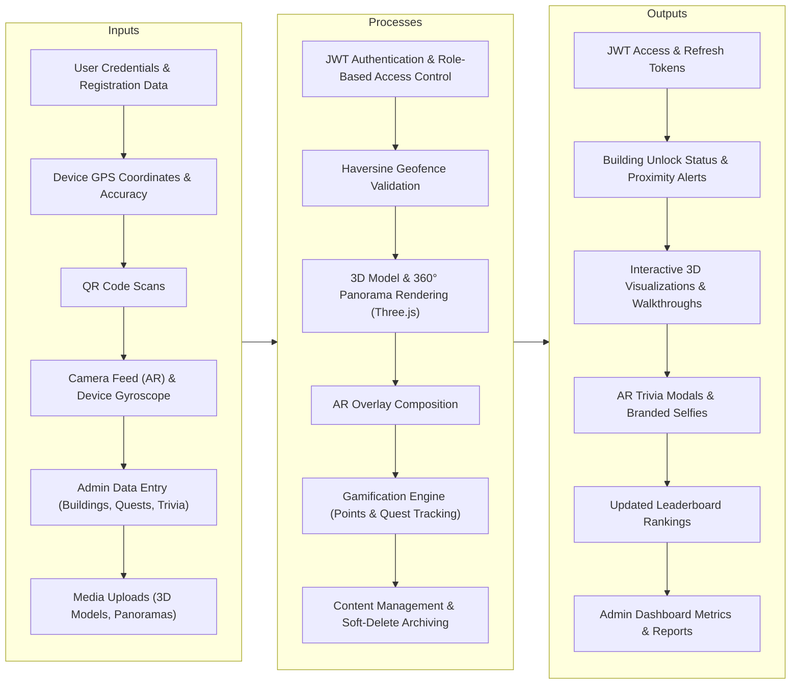

# ARQuest — Conceptual Framework

> Last updated: 2026-06-22

---

## 1. Input-Process-Output (IPO) Model

---

## Documentation

### Overview

The Conceptual Framework of ARQuest is built upon the Input-Process-Output (IPO) model. This framework illustrates how raw data and user interactions are transformed into meaningful features, immersive visualizations, and administrative insights.

### Inputs

The system ingests data from two primary sources: mobile device sensors and user input. The mobile application continuously feeds GPS coordinates, camera frames, and gyroscope telemetry to the system. Users provide authentication credentials, while administrators input structural campus data, configure geofences, and upload heavy media assets like `.glb` 3D models and panorama images.

### Processes

The core logic of ARQuest resides in its processing layer, primarily handled by the Django backend and mobile WebViews:
- **Location Processing**: The geofencing engine uses the Haversine formula to validate user proximity to building boundaries.
- **Visualization Rendering**: Three.js engines inside mobile WebViews parse 3D models and map equirectangular images into interactive 360° spheres or Magic Window VR views.
- **Gamification Logic**: The backend validates quest completions, calculates reward points, issues trivia facts, and updates user progress atomically.
- **Security & Access**: All incoming requests are routed through JWT validation and strict Role-Based Access Control (RBAC) to ensure users only access what their role (Student, Admin, Professional) permits.

### Outputs

The processed data results in tangible outputs for the user. Successful authentication yields JWT tokens. Geofence validation results in building unlocks or proximity warnings. 3D rendering processes output interactive, explorable models and immersive AR overlays. Gamification processes output increased exploration points, trivia displays, and updated leaderboard standings. For administrators, the system outputs structured dashboard metrics and configuration states.
