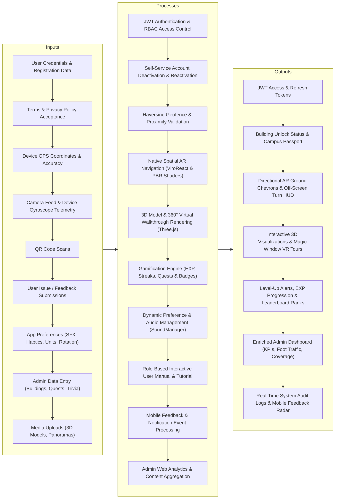

# ARQuest — Conceptual Framework

> Last updated: 2026-08-28

---

## 1. Input-Process-Output (IPO) Model

---

## Documentation

### Overview

The Conceptual Framework of ARQuest is built upon the classic Input-Process-Output (IPO) model. It illustrates how raw sensor telemetry, user interactions, and administrative management data are systematically transformed into location-aware spatial navigation, immersive 3D/VR visualizations, gamified campus learning, and administrative operational intelligence.

### Inputs

The system ingests data from mobile device sensors, end-user submissions, and administrative content managers:
- **Mobile Telemetry**: Continuous high-accuracy GPS coordinates, compass heading (azimuth), camera frames, and gyroscope orientation.
- **User Inputs**: Registration credentials, customizable WMSU avatar selections, mandatory Terms & Conditions / Privacy Policy agreements, password change inputs, account deactivation confirmations, user preferences (SFX audio, haptic vibrations, distance units, map rotation), and in-app bug reports/feedback.
- **Administrative Content**: Structural campus data, college department groupings, polygon/circular geofence boundaries, 3D glTF/GLB models, 360° equirectangular panoramas with interactive navigation hotspots, quest objectives, and quiz trivia banks.

### Processes

Core business logic is partitioned across the Django REST backend and native/webview mobile execution layers:
- **Authentication & Self-Service Account Lifecycle**: Enforces JWT token rotation, OTP email verification, secure password hashing (PBKDF2/SHA256), and soft account deactivation (`is_active = False`) with seamless self-service restoration on subsequent login (`reactivate = True`).
- **Location & Spatial AR Navigation**: Evaluates user coordinates using the Haversine formula against campus geofences. The native spatial AR engine (powered by ViroReact) projects 3D directional ground chevrons with glowing wings, calculates real-time vector distances, applies Exponential Moving Average (EMA) smoothing to eliminate compass jitter, and displays 2D off-screen HUD indicators (`◀ TURN LEFT` / `TURN RIGHT ▶`) when destinations fall outside the camera's 45° field of view.
- **Visualization & Virtual Walkthroughs**: Three.js WebViews render 3D architectural models with PBR metallic-roughness materials and map equirectangular images into interactive 360° virtual tours with gyroscope-controlled Magic Window VR inspection for Accreditors.
- **Gamification & Role Separation (RBAC)**: Gated strictly to students, the gamification engine calculates EXP awards, daily login streaks, badge trigger conditions, and global leaderboard rankings, while isolating Accreditors (Professionals) and Visitors from student gamification popups.
- **Interactive User Manual & Preferences**: Dynamically guides users through role-specific walkthroughs (Students, Accreditors, Visitors) and persists user device preferences locally in `AsyncStorage` with real-time `SoundManager` audio muting.
- **Feedback & Admin Analytics Aggregation**: Real-time aggregation of building visits, user role compositions, content deployment coverage, foot traffic trends over time (Daily/Weekly/Monthly/Yearly), and open bug reports.

### Outputs

- **Student / User Outputs**: Verified authentication sessions, building unlock confirmations, campus passport stamps, live spatial AR wayfinding, 3D building inspection, EXP progress, daily streak rewards, and custom avatar profiles.
- **Professional / Accreditor Outputs**: Unrestricted 360° virtual walkthroughs, Magic Window VR inspection modes, and visited building evaluation checklists.
- **Administrator Outputs**: Comprehensive Web Dashboard with live operational status, foot traffic charts (Bar & Area), content coverage matrix (Panoramas, Quests, Geofences), role distribution analytics, and real-time audit logs.
