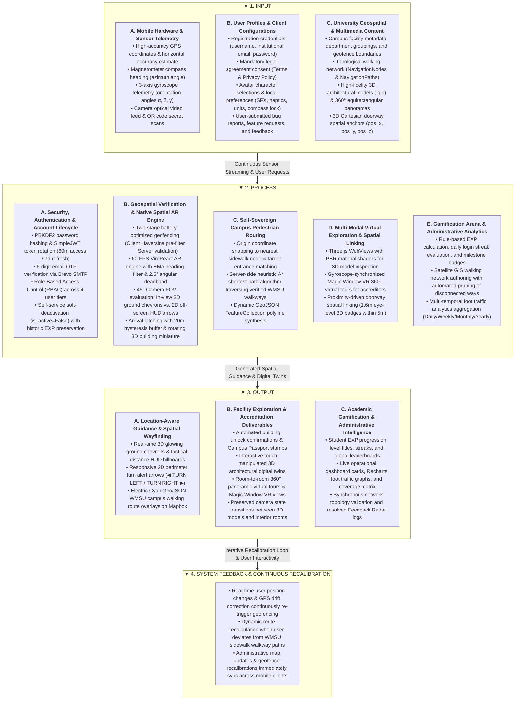

# ARQuest — Conceptual Framework (IPO Model)

> **Research Paper Component:** Chapter 1 / Chapter 3 — Conceptual Framework of the Study  
> **System:** ARQuest: A Sensor-Assisted Campus Exploration and Accreditation Support System  
> **Institution:** Western Mindanao State University (WMSU)  
> **Document Format:** Standard A4 Bond Paper (Portrait Orientation: 210mm × 297mm)

---

## 1. Conceptual Framework Diagram
The conceptual framework of **ARQuest** is grounded on the classic **Input-Process-Output (IPO)** model with a continuous feedback and recalibration mechanism. 

The diagram is organized in a strict **Top-to-Bottom (Vertical Portrait)** sequence (**INPUT** $\rightarrow$ **PROCESS** $\rightarrow$ **OUTPUT** $\rightarrow$ **FEEDBACK**) specifically formatted to maximize printable page width on standard A4 bond paper without horizontal scaling distortion.

```mermaid
flowchart TD
    %% ==========================================
    %% 1. INPUT (TOP TIER)
    %% ==========================================
    subgraph INPUT ["▼ 1. INPUT"]
        direction TB
        IN_1["<b>A. Mobile Hardware & Sensor Telemetry</b><br/>• High-accuracy GPS coordinates & horizontal accuracy estimate<br/>• Magnetometer compass heading (azimuth angle)<br/>• 3-axis gyroscope telemetry (orientation angles α, β, γ)<br/>• Camera optical video feed & QR code secret scans"]
        IN_2["<b>B. User Profiles & Client Configurations</b><br/>• Registration credentials (username, institutional email, password)<br/>• Mandatory legal agreement consent (Terms & Privacy Policy)<br/>• Avatar character selections & local preferences (SFX, haptics, units, compass lock)<br/>• User-submitted bug reports, feature requests, and feedback"]
        IN_3["<b>C. University Geospatial & Multimedia Content</b><br/>• Campus facility metadata, department groupings, and geofence boundaries<br/>• Topological walking network (NavigationNodes & NavigationPaths)<br/>• High-fidelity 3D architectural models (.glb) & 360° equirectangular panoramas<br/>• 3D Cartesian doorway spatial anchors (pos_x, pos_y, pos_z)"]
    end

    %% ==========================================
    %% 2. PROCESS (MIDDLE TIER)
    %% ==========================================
    subgraph PROCESS ["▼ 2. PROCESS"]
        direction TB
        PR_1["<b>A. Security, Authentication & Account Lifecycle</b><br/>• PBKDF2 password hashing & SimpleJWT token rotation (60m access / 7d refresh)<br/>• 6-digit email OTP verification via Brevo SMTP<br/>• Role-Based Access Control (RBAC) across 4 user tiers<br/>• Self-service soft-deactivation (is_active=False) with historic EXP preservation"]
        PR_2["<b>B. Geospatial Verification & Native Spatial AR Engine</b><br/>• Two-stage battery-optimized geofencing (Client Haversine pre-filter + Server validation)<br/>• 60 FPS ViroReact AR engine with EMA heading filter & 2.5° angular deadband<br/>• 45° Camera FOV evaluation: In-view 3D ground chevrons vs. 2D off-screen HUD arrows<br/>• Arrival latching with 20m hysteresis buffer & rotating 3D building miniature"]
        PR_3["<b>C. Self-Sovereign Campus Pedestrian Routing</b><br/>• Origin coordinate snapping to nearest sidewalk node & target entrance matching<br/>• Server-side heuristic A* shortest-path algorithm traversing verified WMSU walkways<br/>• Dynamic GeoJSON FeatureCollection polyline synthesis"]
        PR_4["<b>D. Multi-Modal Virtual Exploration & Spatial Linking</b><br/>• Three.js WebViews with PBR material shaders for 3D model inspection<br/>• Gyroscope-synchronized Magic Window VR 360° virtual tours for accreditors<br/>• Proximity-driven doorway spatial linking (1.6m eye-level 3D badges within 5m)"]
        PR_5["<b>E. Gamification Arena & Administrative Analytics</b><br/>• Rule-based EXP calculation, daily login streak evaluation, and milestone badges<br/>• Satellite GIS walking network authoring with automated pruning of disconnected ways<br/>• Multi-temporal foot traffic analytics aggregation (Daily/Weekly/Monthly/Yearly)"]
    end

    %% ==========================================
    %% 3. OUTPUT (LOWER TIER)
    %% ==========================================
    subgraph OUTPUT ["▼ 3. OUTPUT"]
        direction TB
        OUT_1["<b>A. Location-Aware Guidance & Spatial Wayfinding</b><br/>• Real-time 3D glowing ground chevrons & tactical distance HUD billboards<br/>• Responsive 2D perimeter turn alert arrows (◀ TURN LEFT / TURN RIGHT ▶)<br/>• Electric Cyan GeoJSON WMSU campus walking route overlays on Mapbox"]
        OUT_2["<b>B. Facility Exploration & Accreditation Deliverables</b><br/>• Automated building unlock confirmations & Campus Passport stamps<br/>• Interactive touch-manipulated 3D architectural digital twins<br/>• Room-to-room 360° panoramic virtual tours & Magic Window VR views<br/>• Preserved camera state transitions between 3D models and interior rooms"]
        OUT_3["<b>C. Academic Gamification & Administrative Intelligence</b><br/>• Student EXP progression, level titles, streaks, and global leaderboards<br/>• Live operational dashboard cards, Recharts foot traffic graphs, and coverage matrix<br/>• Synchronous network topology validation and resolved Feedback Radar logs"]
    end

    %% ==========================================
    %% 4. FEEDBACK (BOTTOM TIER)
    %% ==========================================
    subgraph FEEDBACK ["▼ 4. SYSTEM FEEDBACK & CONTINUOUS RECALIBRATION"]
        direction TB
        FB_1["• Real-time user position changes & GPS drift correction continuously re-trigger geofencing<br/>• Dynamic route recalculation when user deviates from WMSU sidewalk walkway paths<br/>• Administrative map updates & geofence recalibrations immediately sync across mobile clients"]
    end

    %% Downward Transitions (Strict Top-to-Bottom Flow)
    INPUT ==>|"Continuous Sensor Streaming & User Requests"| PROCESS
    PROCESS ==>|"Generated Spatial Guidance & Digital Twins"| OUTPUT
    OUTPUT ==>|"Iterative Recalibration Loop & User Interactivity"| FEEDBACK
```

---

## 2. Input-Process-Output Specification Matrix

| Dimension | Domain Category | Specific Technical Elements | Operational Function in the Study |
|:---|:---|:---|:---|
| **INPUT** | **Sensor Telemetry** | GPS coordinates, accuracy radius, magnetometer azimuth, 3-axis gyroscope telemetry, optical camera stream, QR codes. | Supplies dynamic real-world spatial positioning, orientation, and optical data required for AR projection and location validation. |
| | **User Profiles** | Registration credentials, mandatory legal agreements, avatar choices, client preferences (SFX, haptics, units), bug reports. | Governs user identity, legal compliance, customizable local preferences, and in-app diagnostics. |
| | **Geospatial Assets** | Facility data, geofences, 3D glTF/GLB models, equirectangular 360° photo spheres, 3D doorway anchors $(X, Y, Z)$, walking graph. | Supplies physical digital twin data, 3D models, navigation topology, and institutional metadata. |
| **PROCESS** | **Security & Auth** | PBKDF2 hashing, SimpleJWT token rotation, email OTP verification, soft-deactivation flags, 4-tier RBAC guards. | Enforces security and role isolation while enabling self-service account restoration. |
| | **Geospatial & AR** | Client Haversine pre-filter, server Haversine check, EMA compass smoothing ($2.5^\circ$ deadband), ViroReact 6DoF AR, FOV branching. | Converts raw sensor telemetry into stable 3D visual wayfinding overlays and automated facility unlock triggers. |
| | **Campus Routing** | Nearest-node snapping, adjacency graph generation, heuristic $A^*$ graph search over verified walkways, GeoJSON compilation. | Computes optimal walking paths along real WMSU sidewalks without external third-party routing dependencies. |
| | **Virtual Exploration** | Three.js WebViews, PBR shaders, equirectangular mapping, gyroscope binding, doorway proximity detection ($\le 5\text{m}$). | Renders 3D architectural models, enables Magic Window VR, and bridges 3D spaces with 360° interior photo spheres. |
| | **Gamification & GIS** | Rule-based EXP distribution, login streaks, building quizzes, badge triggers, satellite GIS editor, disconnected way pruning. | Promotes spatial campus learning and equips administrators with self-healing tools to maintain campus network topology. |
| **OUTPUT** | **Spatial Guidance** | 3D ground chevrons, 2D off-screen perimeter arrows (`◀ LEFT` / `RIGHT ▶`), Electric Cyan walking routes, unlock alerts. | Guides users to campus destinations through real-time visual and sensor-assisted cues. |
| | **Virtual Models** | Interactive 3D building viewer, first-person tours, Magic Window VR walkthroughs, eye-level doorway portal badges ($Y \approx 1.6\text{m}$). | Enables remote and on-site facility evaluation for students, visitors, and institutional accreditors. |
| | **Gamification & Ops** | Campus Passport stamps, EXP levels, streak badges, global leaderboards, Recharts foot traffic charts, Feedback Radar tickets. | Rewards student exploration milestones and provides university administrators with real-time institutional analytics. |
| **FEEDBACK** | **Recalibration Loop** | Dynamic GPS polling, continuous heading re-alignment, route re-calculation upon deviation, real-time administrative GIS sync. | Closes the cyber-physical control loop, ensuring dynamic adaptation to physical movement and administrative network edits. |

---

## 3. Narrative Discussion of the Framework

### 3.1 The Input-Process-Output with Feedback Model
The conceptual framework of ARQuest follows the Input-Process-Output (IPO) model with a continuous feedback and recalibration loop. Unlike static transactional software, location-aware AR platforms operate as continuous cyber-physical control loops:
1. **Inputs (Top Tier)**: The system ingests physical hardware telemetry (GPS coordinates, heading, gyroscope angles, optical feed), user profile data (credentials, preferences, feedback), and administrative spatial data (facilities, geofences, 3D models, 360° panoramas, walking graphs).
2. **Processes (Middle Tier)**: These inputs are transformed by specialized computational engines: identity verification via PBKDF2 and SimpleJWT; battery-efficient two-stage geofencing; 60 FPS ViroReact spatial AR projection with EMA sensor smoothing; server-side heuristic $A^*$ pedestrian pathfinding; Three.js multi-modal 3D/360° rendering with spatial doorway bridging; and gamification rule processing.
3. **Outputs (Lower Tier)**: The system produces actionable spatial artifacts: glowing 3D ground arrows, 2D off-screen turn indicators, Electric Cyan campus walking paths, interactive 3D digital twins, Magic Window VR walkthroughs, Campus Passport stamps, and administrative operational intelligence.
4. **Feedback & Recalibration (Bottom Tier)**: As the user navigates the campus, dynamic changes in user coordinates and sensor telemetry feed into the system to recalculate AR chevrons and geofence proximities. Furthermore, administrative edits in the web GIS editor immediately update the topological graph, refreshing future route outputs without requiring client rebuilds.

---

## 4. Microsoft Word & Bond Paper Formatting Guide

When transferring this framework into your final Capstone manuscript (e.g., in Microsoft Word or Google Docs):

1. **Page Setup**:
   - Paper Size: **A4** ($210\text{ mm} \times 297\text{ mm}$) or **Letter** ($8.5'' \times 11''$).
   - Orientation: **Portrait**.
   - Margins: Standard Academic Margins (**1.5 inches Left** for binding, **1.0 inch Top, Right, and Bottom**).
2. **Figure Positioning**:
   - Title: **Figure 3.1. Conceptual Framework of the System (IPO Model)** centered above or below the diagram according to your institutional thesis guidelines.
   - Text Size in Diagram: When pasted as an image or recreated as Word shapes, maintain **10 pt to 11 pt font size** for bullet points and **12 pt Bold** for domain headers to ensure high legibility.
   - Flow Direction: Strict top-to-bottom vertical progression (**INPUT** $\rightarrow$ **PROCESS** $\rightarrow$ **OUTPUT** $\rightarrow$ **FEEDBACK**).
