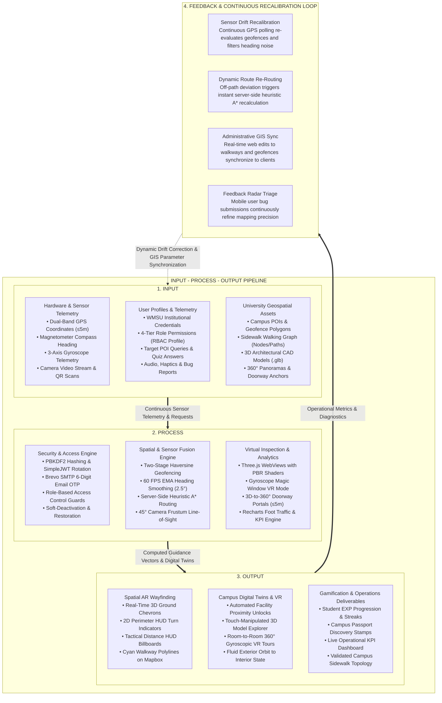

# ARQuest — Conceptual Framework (IPO Model)

> **Research Paper Component:** Chapter 1 / Chapter 3 — Conceptual Framework of the Study  
> **System:** ARQuest: A Sensor-Assisted Campus Exploration and Accreditation Support System  
> **Institution:** Western Mindanao State University (WMSU)  
> **Document Format:** Standard A4 Bond Paper (Balanced Full-Width 3-Column Layout)  
> **Model Paradigm:** Input-Process-Output (IPO) Model with Continuous Closed-Loop Recalibration

---

## 1. Conceptual Framework Diagram (IPO Model)

The conceptual framework of **ARQuest** is grounded on the classic **Input-Process-Output (IPO)** model, augmented by **Cyber-Physical Systems (CPS)** theory. The architecture is organized across three horizontal pipeline stages spanning the full width of the system (**INPUT** $\rightarrow$ **PROCESS** $\rightarrow$ **OUTPUT**), closed at the bottom by an active **Feedback and Recalibration Loop** that continually synchronizes spatial telemetry, sidewalk deviations, and administrative GIS updates.

```mermaid
flowchart TB
    %% ==========================================
    %% 3-COLUMN FULL-WIDTH IPO PIPELINE
    %% ==========================================
    subgraph IPO_PIPELINE ["INPUT - PROCESS - OUTPUT PIPELINE"]
        direction LR

        subgraph INPUT ["1. INPUT"]
            direction TB
            IN_1["Hardware & Sensor Telemetry<br/>• Dual-Band GPS Coordinates (≤5m)<br/>• Magnetometer Compass Heading<br/>• 3-Axis Gyroscope Telemetry<br/>• Camera Video Stream & QR Scans"]
            IN_2["User Profiles & Telemetry<br/>• WMSU Institutional Credentials<br/>• 4-Tier Role Permissions (RBAC Profile)<br/>• Target POI Queries & Quiz Answers<br/>• Audio, Haptics & Bug Reports"]
            IN_3["University Geospatial Assets<br/>• Campus POIs & Geofence Polygons<br/>• Sidewalk Walking Graph (Nodes/Paths)<br/>• 3D Architectural CAD Models (.glb)<br/>• 360° Panoramas & Doorway Anchors"]
        end

        subgraph PROCESS ["2. PROCESS"]
            direction TB
            PR_1["Security & Access Engine<br/>• PBKDF2 Hashing & SimpleJWT Rotation<br/>• Brevo SMTP 6-Digit Email OTP<br/>• Role-Based Access Control Guards<br/>• Soft-Deactivation & Restoration"]
            PR_2["Spatial & Sensor Fusion Engine<br/>• Two-Stage Haversine Geofencing<br/>• 60 FPS EMA Heading Smoothing (2.5°)<br/>• Server-Side Heuristic A* Routing<br/>• 45° Camera Frustum Line-of-Sight"]
            PR_3["Virtual Inspection & Analytics<br/>• Three.js WebViews with PBR Shaders<br/>• Gyroscope Magic Window VR Mode<br/>• 3D-to-360° Doorway Portals (≤5m)<br/>• Recharts Foot Traffic & KPI Engine"]
        end

        subgraph OUTPUT ["3. OUTPUT"]
            direction TB
            OUT_1["Spatial AR Wayfinding<br/>• Real-Time 3D Ground Chevrons<br/>• 2D Perimeter HUD Turn Indicators<br/>• Tactical Distance HUD Billboards<br/>• Cyan Walkway Polylines on Mapbox"]
            OUT_2["Campus Digital Twins & VR<br/>• Automated Facility Proximity Unlocks<br/>• Touch-Manipulated 3D Model Explorer<br/>• Room-to-Room 360° Gyroscopic VR Tours<br/>• Fluid Exterior Orbit to Interior State"]
            OUT_3["Gamification & Operations Deliverables<br/>• Student EXP Progression & Streaks<br/>• Campus Passport Discovery Stamps<br/>• Live Operational KPI Dashboard<br/>• Validated Campus Sidewalk Topology"]
        end

        INPUT ==>|"Continuous Sensor Telemetry & Requests"| PROCESS
        PROCESS ==>|"Computed Guidance Vectors & Digital Twins"| OUTPUT
    end

    %% ==========================================
    %% FULL-WIDTH RECALIBRATION FEEDBACK LOOP
    %% ==========================================
    subgraph FEEDBACK ["4. FEEDBACK & CONTINUOUS RECALIBRATION LOOP"]
        direction LR
        FB_1["Sensor Drift Recalibration<br/>Continuous GPS polling re-evaluates geofences and filters heading noise"]
        FB_2["Dynamic Route Re-Routing<br/>Off-path deviation triggers instant server-side heuristic A* recalculation"]
        FB_3["Administrative GIS Sync<br/>Real-time web edits to walkways and geofences synchronize to clients"]
        FB_4["Feedback Radar Triage<br/>Mobile user bug submissions continuously refine mapping precision"]
    end

    OUTPUT ==>|"Operational Metrics & Diagnostics"| FEEDBACK
    FEEDBACK -.->|"Dynamic Drift Correction & GIS Parameter Synchronization"| INPUT
```

---

## 2. Input-Process-Output Specification Matrix

| Dimension | Domain Category | Specific Technical Elements | Operational Function in the Study |
|:---|:---|:---|:---|
| **INPUT** | **Sensor Telemetry** | Dual-band GPS coordinates $(\le 5\text{m})$, magnetometer azimuth, 3-axis gyroscope telemetry, optical camera feed, QR codes. | Supplies dynamic real-world spatial positioning, orientation, and optical data required for AR projection and on-site proximity validation. |
| | **User Profiles** | Registration credentials, mandatory legal agreements, avatar choices, client preferences (SFX, haptics, units), bug reports. | Governs user identity, security clearance, legal compliance, customizable UI preferences, and in-app diagnostic reporting. |
| | **Geospatial Assets** | Facility metadata, circular/polygon geofences, 3D CAD models (`.glb`), 360° equirectangular panoramas, 3D doorway anchors, walking graph. | Supplies authoritative physical digital twin geometry, pedestrian sidewalk network topology, and institutional metadata. |
| **PROCESS** | **Security & Access** | PBKDF2 password hashing, SimpleJWT token rotation, Brevo SMTP 6-digit email OTP, soft-deactivation flags, 4-tier RBAC guards. | Enforces role isolation (`IsStudent`, `IsAdmin`, `IsProfessional`) while enabling secure self-service account restoration. |
| | **Spatial & Sensor Fusion** | Client Haversine pre-filter ($>75\text{m}$), server Haversine check, EMA compass smoothing ($2.5^\circ$ deadband), ViroReact 6DoF AR tracking. | Converts raw sensor telemetry into jitter-free 3D ground chevrons, 60 FPS AR stability, and battery-efficient geofence proximity detection. |
| | **Campus Routing** | Nearest-node coordinate snapping, adjacency graph generation, heuristic $A^*$ graph search over verified walkways, GeoJSON compilation. | Computes optimal walking paths along real WMSU sidewalks without external third-party routing dependencies. |
| | **Virtual Inspection** | Decoupled Three.js WebViews, PBR shaders, equirectangular mapping, gyroscope binding, doorway proximity detection ($\le 5\text{m}$). | Renders lightweight 3D architectural models, enables Magic Window VR, and bridges exterior 3D models with 360° interior photo spheres. |
| | **Gamification & GIS** | Rule-based EXP distribution, login streaks, building quizzes, badge triggers, satellite GIS editor, disconnected way pruning. | Promotes spatial campus learning and equips administrators with self-healing tools to maintain campus network topology. |
| **OUTPUT** | **Spatial Guidance** | Real-time 3D ground chevrons, 2D off-screen perimeter arrows (`◀ LEFT` / `RIGHT ▶`), tactical distance billboards, Cyan walking routes. | Guides users to campus destinations through real-time visual and sensor-assisted cues directly on physical sidewalks. |
| | **Virtual Exploration** | Proximity unlock alerts, interactive touch-manipulated 3D building viewer, room-to-room 360° VR tours, seamless orbit-to-interior states. | Enables remote and on-site facility evaluation for students, campus visitors, and institutional accreditors. |
| | **Gamification & Ops** | Campus Passport stamps, EXP levels, streak badges, global leaderboards, Recharts foot traffic charts, Feedback Radar tickets. | Rewards student exploration milestones and provides university administrators with real-time institutional analytics. |
| **FEEDBACK** | **Sensor Drift Recalibration** | Dynamic continuous GPS polling, adaptive deadband heading adjustments, and gyroscope drift compensation. | Continuously realigns AR projection vectors with physical ground reality, preventing jitter and heading disorientation. |
| | **Deviation Re-Routing** | Continuous cross-track distance evaluation triggering instant server-side $A^*$ path recalculation when exceeding $15\text{m}$. | Automatically re-routes lost users back onto valid university sidewalks without requiring manual route cancellation or restart. |
| | **Administrative GIS Push** | Synchronous REST and WebSocket parameter propagation from the web GIS editor directly to mobile clients. | Ensures newly traced sidewalks, relocated gates, and modified geofences take effect immediately without requiring mobile app rebuilds. |
| | **Feedback Radar Diagnostics** | In-app bug ticket submissions, telemetry exception logs, and geofence accuracy discrepancy reporting. | Establishes a quality-assurance feedback loop where real-world operational anomalies feed into continuous administrative refinement. |

---

## 3. Narrative & Theoretical Analysis

### 3.1 Systems Theory & Cyber-Physical Operational Boundary
The Conceptual Framework models **ARQuest** as an integrated cyber-physical system using the classical Input-Process-Output (IPO) paradigm with continuous closed-loop feedback. Unlike static transactional systems, spatial augmented reality operates as an ongoing cyber-physical control loop:
1. **Dynamic Environmental Coupling**: Physical real-world coordinates, compass orientation, and device motion continuously govern what digital AR artifacts and building models are computed and rendered.
2. **Authoritative Server Validation**: All critical calculations—geofence proximity validation, heuristic $A^*$ walking route searches, and EXP transactions—are executed server-side in Django, treating mobile clients as secured spatial presentation layers.

### 3.2 Processing Pipeline & Algorithmic Engines
- **Two-Stage Battery-Optimized Geofencing**: Mobile clients execute a local Haversine pre-filter ($>75\text{m}$) to eliminate redundant network transmissions, invoking authoritative backend validation only when entering physical proximity.
- **60 FPS Spatial AR Projection & Smoothing**: The mobile client combines 6DoF camera tracking with an Exponential Moving Average (EMA, $\alpha = 0.15$) and a $2.5^\circ$ deadband azimuth filter, eliminating sensor micro-jitter and delivering smooth 3D chevrons aligned with campus sidewalks.
- **Self-Sovereign Heuristic $A^*$ Pedestrian Routing**: Custom graph engine computes walkable routes strictly along verified WMSU walkways, snapping coordinates to navigation nodes without external routing dependencies.
- **Decoupled 3D & 360° Virtual Inspection Core**: Three.js WebViews render architectural models and equirectangular photo spheres in isolated sandboxes, preventing native crashes and enabling seamless exterior orbit-to-interior panoramic state transitions.

### 3.3 Continuous Feedback & Recalibration Loops
- **GPS Drift & Azimuth Recalibration**: Dynamic sensor polling continuously recalculates spatial vectors and compensates for magnetic distortion, keeping AR chevrons locked to the physical ground.
- **Heuristic Path Deviation Re-Routing**: When a user veers more than $15\text{m}$ from the designated path, the client automatically triggers an immediate server-side $A^*$ re-calculation to guide the user back to the destination.
- **Administrative GIS Synchronization**: Tracing new sidewalks, relocating entrance nodes, or editing geofences in the web GIS editor immediately propagates to active mobile clients without app updates.
- **Feedback Radar Quality Triage**: In-app bug submissions and diagnostic logs route directly to the administrative radar queue to continuously harden system reliability and mapping accuracy.
