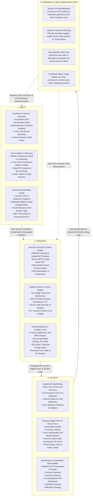

# ARQuest — Conceptual Framework (IPO Model)

> **Research Paper Component:** Chapter 1 / Chapter 3 — Conceptual Framework of the Study  
> **System:** ARQuest: A Sensor-Assisted Campus Exploration and Accreditation Support System  
> **Institution:** Western Mindanao State University (WMSU)  
> **Document Format:** Standard A4 Bond Paper (Portrait Orientation: 210mm × 297mm)  
> **Model Paradigm:** Input-Process-Output (IPO) Model with Continuous Closed-Loop Recalibration

---

## 1. Conceptual Framework Diagram (IPO Model)

The conceptual framework of **ARQuest** is anchored on the classic **Input-Process-Output (IPO)** model, augmented by modern **Cyber-Physical Systems (CPS)** theory. Unlike conventional static transactional software, location-based Augmented Reality operates as a continuous, dynamic feedback control loop where physical real-world user movements and sensor changes continually adjust computational processes and visual overlays.

```mermaid
graph TB
    subgraph INPUT ["1. INPUT"]
        IN_1["Hardware & Sensor Telemetry<br/>• Dual-Band GPS Coordinates (≤5m)<br/>• Magnetometer Compass Heading<br/>• 3-Axis Gyroscope Telemetry<br/>• Camera Stream & QR Scans"]
        IN_2["User Profiles & Telemetry<br/>• WMSU Institutional Email & Credentials<br/>• 4-Tier Role Permissions (RBAC Profile)<br/>• Target POI Queries & Quiz Answers<br/>• Audio, Haptics & Bug Reports"]
        IN_3["University Geospatial Assets<br/>• Campus POIs & Geofence Polygons<br/>• Sidewalk Walking Graph (Nodes/Paths)<br/>• 3D Architectural CAD Models (.glb)<br/>• 360° Panoramas & Doorway Anchors"]
    end

    subgraph PROCESS ["2. PROCESS"]
        PR_1["Security & Access Control Engine<br/>• PBKDF2 Hashing & SimpleJWT Rotation<br/>• Brevo SMTP 6-Digit Email OTP<br/>• Role-Based Access Control Guards<br/>• Soft-Deactivation & Restoration"]
        PR_2["Spatial & Sensor Fusion Engine<br/>• Two-Stage Haversine Geofencing<br/>• 60 FPS EMA Heading Smoothing (2.5°)<br/>• Server-Side Heuristic A* Routing<br/>• 45° Camera Frustum Line-of-Sight"]
        PR_3["Virtual Inspection & Analytics Core<br/>• Three.js WebViews with PBR Shaders<br/>• Gyroscope Magic Window VR Mode<br/>• 3D-to-360° Doorway Portals (≤5m)<br/>• Recharts Foot Traffic & KPI Engine"]
    end

    subgraph OUTPUT ["3. OUTPUT"]
        OUT_1["Spatial AR Wayfinding<br/>• Real-Time 3D Ground Chevrons<br/>• 2D Perimeter HUD Turn Indicators<br/>• Tactical Distance HUD Billboards<br/>• Cyan Walkway Polylines on Mapbox"]
        OUT_2["Campus Digital Twins & Virtual Tours<br/>• Automated Facility Proximity Unlocks<br/>• Touch-Manipulated 3D Model Explorer<br/>• Room-to-Room 360° Gyroscopic VR Tours<br/>• Fluid Exterior Orbit to Interior State"]
        OUT_3["Gamification & Operations Deliverables<br/>• Student EXP Progression & Streaks<br/>• Campus Passport Discovery Stamps<br/>• Live Operational KPI Dashboard<br/>• Validated Campus Sidewalk Topology"]
    end

    subgraph FEEDBACK ["4. FEEDBACK & RECALIBRATION LOOP"]
        FB_1["Sensor Drift Recalibration<br/>Continuous GPS polling re-evaluates geofences and filters heading noise"]
        FB_2["Dynamic Route Re-Routing<br/>Off-path deviation triggers instant server-side heuristic A* recalculation"]
        FB_3["Administrative GIS Sync<br/>Real-time web edits to sidewalks and geofences synchronize to clients"]
        FB_4["Feedback Radar Triage<br/>Mobile user bug submissions continuously refine mapping precision"]
    end

    INPUT -->|"Raw Sensor Telemetry, Credentials & Geospatial Ingestion"| PROCESS
    PROCESS -->|"Computed AR Vectors, Digital Twins & Verified Logic"| OUTPUT
    OUTPUT -->|"Operational Metrics, Movement Events & Bug Logs"| FEEDBACK
    FEEDBACK -.->|"Dynamic Drift Correction & GIS Parameter Synchronization"| INPUT
    FEEDBACK -.->|"Real-Time Heuristic Path Recalculation"| PROCESS
```

---

## 2. Input-Process-Output Specification Matrix

| Dimension | Domain Category | Specific Technical Elements & Modules | Mathematical / Algorithmic Formulation | Operational Function in the Study |
|:---|:---|:---|:---|:---|
| **INPUT** | **Sensory Telemetry** | Dual-band GPS coordinates $(\phi, \lambda)$, accuracy radius $(\pm r)$, magnetometer azimuth $(\theta)$, 3-axis gyroscope $(\omega_x, \omega_y, \omega_z)$, optical camera video stream, and decoded QR secret keys. | $S(t) = \{\phi(t), \lambda(t), r(t), \theta(t), \vec{\omega}(t), I_{\text{cam}}(t)\}$ | Supplies raw physical spatial positioning, real-time device orientation, and optical video feeds required for AR projection and on-site proximity validation. |
| | **User Profiles & Telemetry** | Registration credentials, mandatory Terms & Privacy consent, avatar selection, client preferences (audio SFX, haptic feedback, metric units), bug tickets. | $\mathcal{U} = \{u_{\text{id}}, \text{email}, \text{role}, \text{prefs}, \text{telemetry}\}$ | Governs user identity, security clearance, legal compliance, personalized UI options, and client diagnostic reporting. |
| | **Geospatial Assets** | Campus POI metadata, circular/polygon geofences, 3D glTF/GLB models, equirectangular 360° photo spheres, 3D doorway Cartesian anchors $(x, y, z)$, walking graph. | $G = (V, E), \quad V = \{\text{Nodes}\}, \quad E = \{\text{Walkways}\}$ | Supplies authoritative spatial coordinates, campus building geometry, pedestrian sidewalk network topology, and institutional metadata. |
| **PROCESS** | **Security & Access** | PBKDF2 with SHA-256 password hashing, SimpleJWT paired token rotation, Brevo SMTP 6-digit OTP delivery, soft-deactivation flags, 4-tier RBAC guards. | $T_{\text{jwt}} = \text{Sign}_{\text{HS256}}(H \parallel P, K)$ $\text{OTP} \in [100000, 999999]$ | Enforces role isolation (`IsStudent`, `IsAdmin`, `IsProfessional`), prevents unverified registrations, and allows secure self-service account restoration. |
| | **Spatial & Sensor Fusion** | Client Haversine pre-filter ($>75\text{m}$), authoritative server Haversine check, EMA compass heading filter with $2.5^\circ$ deadband, ViroReact 6DoF AR projection. | $d = 2R \arcsin \sqrt{\sin^2(\frac{\Delta \phi}{2}) + \cos \phi_1 \cos \phi_2 \sin^2(\frac{\Delta \lambda}{2})}$ $\theta_t = \alpha \theta_{\text{raw}} + (1 - \alpha)\theta_{t-1}, \quad \alpha = 0.15$ | Converts noisy hardware sensor data into jitter-free directional chevrons, 60 FPS AR stability, and battery-efficient geofence proximity detection. |
| | **Campus Routing** | Nearest-node coordinate snapping, adjacency matrix construction, heuristic $A^*$ graph search over verified walkways, GeoJSON polyline compilation. | $f(n) = g(n) + h(n)$ $h(n) = \text{Haversine}(n, n_{\text{goal}})$ | Calculates strictly walkable campus pedestrian routes without relying on generic commercial road routing services that fail on pedestrian sidewalks. |
| | **Virtual Inspection** | Decoupled Three.js WebViews, PBR physical material shaders, equirectangular sphere mapping, gyroscope device orientation binding, doorway proximity detection ($\le 5\text{m}$). | $\|\mathbf{p}_{\text{cam}} - \mathbf{p}_{\text{door}}\| \le 5\text{m}$ $Y_{\text{anchor}} \approx 1.6\text{m}$ | Renders lightweight 3D digital twins, provides Magic Window VR walkthroughs, and bridges exterior 3D models with 360° interior panoramic rooms. |
| | **Gamification & GIS** | Rule-based EXP distribution, daily check-in streak tracking, building trivia question banks, badge triggers, satellite GIS editor, disconnected way pruning. | $\text{EXP}_{\text{next}} = \lfloor 100 \times \text{Level}^{1.5} \rfloor$ $\text{Streak}_{t} = \text{Streak}_{t-1} + 1 \iff \Delta t \le 24\text{h}$ | Gamifies campus orientation, incentivizes physical exploration, and equips administrators with tools to maintain topological network integrity. |
| **OUTPUT** | **Spatial Guidance** | Real-time 3D ground chevrons, 2D off-screen edge turn indicators (`◀ LEFT` / `RIGHT ▶`), tactical distance HUD billboards, Electric Cyan walking polylines. | $\mathbf{T}_{\text{chevron}} = \mathbf{M}_{\text{proj}} \times \mathbf{M}_{\text{view}} \times \mathbf{P}_{\text{world}}$ | Provides unambiguous, multi-sensory visual wayfinding cues guiding users directly along campus sidewalks to their destination. |
| | **Virtual Exploration** | Proximity unlock confirmation modals, interactive touch-manipulated 3D building viewer, room-to-room 360° VR panoramas, seamless orbit-to-interior states. | $\mathcal{V}_{\text{tour}} = \{\text{Mesh}_{3\text{D}}, \text{Pano}_{360}, \text{Portals}\}$ | Delivers remote and on-site facility evaluation tools for students, campus visitors, and institutional CHED/AACCUP accreditors. |
| | **Gamification & Ops** | Digital Campus Passport stamps, EXP levels, streak counters, Hall of Fame leaderboards, Recharts foot traffic analytics, Feedback Radar triage queue. | $\mathcal{D}_{\text{admin}} = \{\text{KPIs}, \text{FootTraffic}(t), \text{Tickets}\}$ | Rewards student campus discoveries and provides university administration with live operational metrics on campus facility utilization. |
| **FEEDBACK** | **Sensor Drift Recalibration** | Dynamic continuous GPS polling, adaptive deadband heading adjustments, and gyro drift compensation. | $\Delta \theta = \|\theta_{\text{sensor}} - \theta_{\text{prev}}\| > \epsilon_{\text{deadband}}$ | Continuously realigns AR projection vectors with physical ground reality, preventing jitter and heading disorientation. |
| | **Deviation Re-Routing** | Per-tick cross-track distance evaluation triggering instant server-side $A^*$ path recalculation when exceeding $15\text{m}$. | $d_{\text{cross}} = \left\| (\mathbf{p}_{\text{user}} - \mathbf{v}_a) - \frac{(\mathbf{p}_{\text{user}} - \mathbf{v}_a) \cdot \vec{\mathbf{u}}}{\|\vec{\mathbf{u}}\|^2} \vec{\mathbf{u}} \right\| > 15\text{m}$ | Automatically re-routes lost users back onto valid university sidewalks without requiring manual cancellation or restart. |
| | **Live Administrative GIS Push** | Synchronous REST and WebSocket parameter propagation from the web GIS editor directly to mobile clients. | $\Delta G \to \text{CacheInvalidate}(\text{Mobile})$ | Ensures newly traced sidewalks, relocated gates, and modified geofences take effect immediately without requiring mobile app rebuilds. |
| | **Feedback Radar Diagnostics** | In-app bug ticket submissions, telemetry exception logs, and geofence accuracy discrepancy reporting. | $\mathcal{T}_{\text{radar}} = \{\text{error}, \text{device}, \mathbf{p}_{\text{user}}, \text{log}\}$ | Establishes a quality-assurance feedback loop where real-world operational anomalies feed into continuous administrative refinement. |

---

## 3. Narrative Discussion of the Framework

### 3.1 Theoretical Foundations: Systems Theory & Cyber-Physical Control Loops
The conceptual framework of **ARQuest** is rooted in Ludwig von Bertalanffy’s **General System Theory** and Norbert Wiener’s **Cybernetics**. In classical information systems, software operates as a linear, one-way pipeline: inputs are accepted, processed through business rules, and outputs are committed to a database. 

However, an Augmented Reality platform operating in an uncontrolled physical environment functions as a **Cyber-Physical Control Loop**. The physical world (the user’s geographic position, compass bearing, and physical motion) directly influences the digital computational state. In turn, the digital output (projected 3D AR chevrons, turn indicators, and proximity alerts) influences user physical movement. Closing this loop with an explicit **Feedback and Recalibration Tier** is essential to prevent drift, eliminate disorientation, and maintain spatial truth.

---

### 3.2 The Input Dimension: Multi-Modal Sensory & Geospatial Ingestion
The **Input Tier** captures three heterogeneous streams of data necessary to construct the augmented campus experience:
1. **Device Hardware Telemetry**: The system continuously samples raw hardware sensors via Expo modules. GPS latitude and longitude provide coarse global positioning; the device magnetometer delivers azimuth compass orientation; the 3-axis gyroscope tracks device pitch and roll; and the camera feed provides optical frames for AR compositing.
2. **User Profiles and Credentials**: Encompasses user identity, role clearance (`student`, `visitor`, `professional`, `admin`), mandatory legal compliance consent (Terms of Service and Privacy Policy), customizable accessibility preferences (SFX, haptics), and interactive submissions (trivia answers, POI targets).
3. **University Geospatial Assets**: Authoritative geographic and architectural data sourced from WMSU, including building coordinates, geofence polygons, CAD-derived 3D meshes (`.glb`), high-resolution equirectangular $360^\circ$ photo spheres, Cartesian doorway transition coordinates, and the pedestrian sidewalk graph.

---

### 3.3 The Process Dimension: Spatial Transformation, Graph Search & Security
The **Process Tier** encapsulates the algorithms, cryptographic protocols, and rendering engines that transform raw input data into coherent outputs:
1. **Authentication and Access Control Engine**: Enforces military-grade password hashing via PBKDF2, paired JWT token generation via SimpleJWT, single-use 6-digit email OTP dispatch via Brevo SMTP, and declarative Role-Based Access Control (RBAC) guards.
2. **Spatial Computing and Sensor Fusion Engine**: Employs a battery-saving **Two-Stage Geofencing** architecture. Mobile clients run an initial client-side Haversine pre-filter ($>75\text{m}$) to eliminate 95% of unnecessary network transmissions, invoking server-side authoritative verification only upon physical proximity. Magnetometer heading telemetry is smoothed using an Exponential Moving Average (EMA, $\alpha = 0.15$) combined with a $2.5^\circ$ deadband filter to eliminate the rapid micro-jitter characteristic of smartphone compass chips. When navigation is requested, the internal server-side heuristic $A^*$ pathfinder determines the optimal sidewalk route along verified WMSU walkways.
3. **Virtual Inspection and Analytics Core**: To guarantee zero mobile app crashes and avoid the heavy memory footprint of monolithic 3D game engines, 3D GLB model rendering and $360^\circ$ panoramas are decoupled into sandboxed Three.js WebViews with Physically Based Rendering (PBR). Proximity to Cartesian doorway anchors ($\le 5\text{m}$, eye-level $Y \approx 1.6\text{m}$) enables seamless transitions between exterior 3D models and interior $360^\circ$ photo spheres.

---

### 3.4 The Output Dimension: Multi-Sensory Spatial AR & Institutional Deliverables
The **Output Tier** presents the tangible deliverables of the ARQuest system across three distinct channels:
1. **Spatial AR Wayfinding Overlays**: Renders real-time 3D ground chevrons anchored to the sidewalk surface, floating tactical distance billboards, 2D off-screen perimeter directional turn indicators (`◀ LEFT` / `RIGHT ▶`), and Electric Cyan walkway paths overlaid onto the Mapbox 2D/satellite canvas.
2. **Campus Digital Twins & Virtual Exploration**: Provides automated building discovery alerts upon physical arrival, touch-manipulated 3D digital twins with orbit controls, and gyroscope-driven Magic Window VR walkthroughs for remote campus accreditors.
3. **Gamification & Operations Deliverables**: Encourages student exploration through EXP leveling, daily quest completions, login streaks, and digital Campus Passport stamps. For university leadership, the system outputs live operational KPI metric cards, Recharts foot traffic graphs, and a validated, self-healing campus walkway network topology.

---

### 3.5 The Feedback Dimension: Closed-Loop Recalibration Mechanisms
The **Feedback Tier** continuously monitors operational state and feeds corrective signals back into the Input and Process layers across four distinct loops:
- **Loop 1 (GPS Drift & Azimuth Recalibration)**: As the user walks, physical signal bouncing from building walls induces GPS drift. Continuous polling and adaptive heading deadbands recalculate spatial vectors, ensuring AR chevrons remain aligned with the physical sidewalk ahead.
- **Loop 2 (Dynamic Path Deviation Re-Routing)**: If a user veers more than $15\text{m}$ off the computed pedestrian path, the client automatically triggers an instant server-side $A^*$ re-calculation from the user's new snapped location.
- **Loop 3 (Live Administrative GIS Synchronization)**: When an administrator traces a new sidewalk, alters a walkway segment, or refines a geofence polygon in the web GIS editor, updates immediately synchronize to active mobile clients without requiring an application update or rebuild.
- **Loop 4 (Feedback Radar Diagnostics)**: In-app user bug reports and automated telemetry exception reports feed directly into the administrative Feedback Radar queue, allowing continuous triage and iterative system hardening.

---

### 3.6 Academic & Methodological Alignment with Study Objectives
The conceptual framework directly operationalizes the primary objectives of the capstone study:
- **Campus Wayfinding Efficiency**: Resolved by combining dual-stage Haversine validation with server-side heuristic $A^*$ sidewalk routing and 3D AR ground chevrons.
- **Accreditation and Remote Exploration Support**: Addressed through decoupled Three.js WebViews rendering 3D digital twins and $360^\circ$ interior VR photo spheres with spatial doorway bridging.
- **Institutional Sovereignty**: Realized by replacing proprietary, road-only navigation APIs (e.g., Google Maps Directions) with ARQuest's self-contained campus topological graph editor.
- **System Reliability and Performance**: Maintained through the closed-loop feedback and recalibration mechanisms, ensuring stable 60 FPS spatial tracking, zero memory-related crashes, and continuous network self-healing.

---

## 4. Microsoft Word & Bond Paper Formatting Guide

When transcribing this conceptual framework into the official Capstone Research Manuscript (e.g., Chapter 1 or Chapter 3):

### 4.1 Page Layout & Margins
- **Paper Size**: Standard **A4** ($210\text{ mm} \times 297\text{ mm}$) or **Short Letter** ($8.5'' \times 11''$), as mandated by university research guidelines.
- **Orientation**: **Portrait**.
- **Margins**: Standard Academic Research Margins:
  - **Left**: $1.5\text{ inches}$ ($38.1\text{ mm}$) — accommodates thesis binding.
  - **Top**: $1.0\text{ inch}$ ($25.4\text{ mm}$).
  - **Right**: $1.0\text{ inch}$ ($25.4\text{ mm}$).
  - **Bottom**: $1.0\text{ inch}$ ($25.4\text{ mm}$).

### 4.2 Figure Captioning & Placement
- Center the diagram on the page.
- Apply APA 7th Edition captioning:
  > **Figure 3.1**  
  > *Conceptual Framework of the System (Input-Process-Output Model with Continuous Recalibration)*
- In the narrative text, refer to the diagram formally: *"As depicted in Figure 3.1, the conceptual framework operates across four interconnected tiers..."*

### 4.3 Typography & Box Formatting Conventions
- **Domain Headers**: Set in **12 pt Bold** (e.g., Arial, Times New Roman, or Inter).
- **Bullet Items**: Set in **10 pt to 10.5 pt Regular** with clean bullet points.
- **Borders & Connectors**: Standard black / dark slate outlines ($1\text{ pt}$ to $1.5\text{ pt}$ stroke) with dashed connectors ($-\cdot\rightarrow$) for the feedback recalibration loops.
- **Flow Direction**: Strictly maintain the top-to-bottom vertical progression (**INPUT** $\rightarrow$ **PROCESS** $\rightarrow$ **OUTPUT** $\rightarrow$ **FEEDBACK**), ensuring complete readability without horizontal scaling or clipping.
