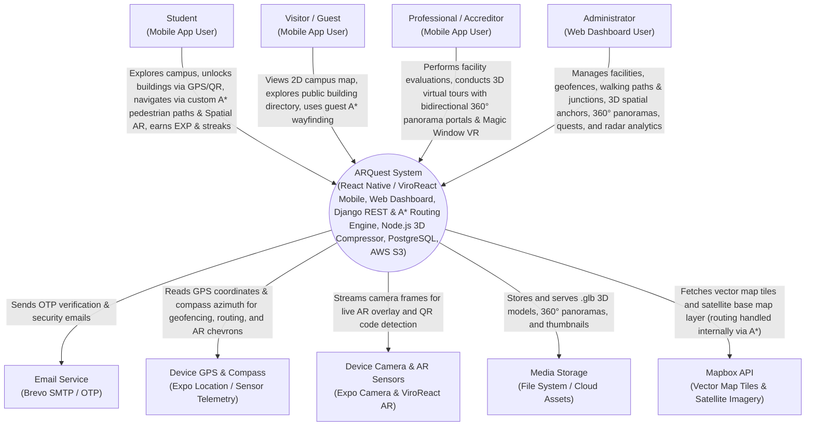

# ARQuest — Context Diagram

> Last updated: 2026-09-06

---

## 1. System Context Diagram

This diagram shows ARQuest as a central system and its interactions with external users, device hardware, and external services.

---

## Documentation

### Overview

The Context Diagram establishes the operational boundaries of the ARQuest platform. It captures how distinct user roles interact with the system and how the platform leverages device hardware sensors and external cloud services.

### Actors

- **Student**: Primary mobile users who physically explore the campus. They unlock buildings via geofences or QR codes, follow custom WMSU campus A* walking routes, navigate using native Spatial AR ground arrows, complete academic quests, maintain daily login streaks, participate in building quizzes, review their Campus Passport, and manage their avatars and account preferences.
- **Visitor / Guest**: Prospective students and campus guests who access public facility information, interactive 2D maps, and custom campus pedestrian wayfinding without mandatory registration.
- **Professional / Accreditor**: Evaluators and faculty who utilize the mobile app for institutional accreditation. They bypass student gamification constraints, accessing full campus facility directories, visited building evaluation checklists, 3D interactive virtual tours with spatially anchored 360° doorway portals, dynamic proximity HUD controls, and gyroscope-assisted Magic Window VR tours.
- **Administrator**: Institutional managers who operate the React 19 Web Dashboard to provision campus departments, author and maintain the custom WMSU walking path graph (nodes, walkway junctions, paths) with real-time disconnected way pruning, calibrate 3D model spatial anchors (`pos_x, pos_y, pos_z`), publish 3D building models, calibrate geofence boundaries, author quests and quiz trivia, resolve user bug reports, configure system feature flags, and analyze real-time foot traffic and operational KPIs.

### External Services & Device Hardware

- **Email Service (Brevo)**: Dispatches automated 6-digit One-Time Password (OTP) verification emails for student registration.
- **Device GPS & Sensor Telemetry**: Provides real-time geolocation coordinates, location accuracy estimates, and compass heading (azimuth) for geofence validation, nearest-node snapping, and AR waypoint projection.
- **Device Camera & AR Framework (ViroReact)**: Captures live optical feeds for Spatial AR ground chevron rendering and fallback QR code scanning.
- **Media Storage**: Serves optimized 3D building models (`.glb`), high-resolution equirectangular panorama scenes with spatial coordinate anchors, and department thumbnail images.
- **Mapbox API**: Powers high-performance vector map rendering, satellite tile layers, and map canvas rendering. Pathfinding and route geometry generation are executed natively by ARQuest's internal server-side A* Campus Routing Engine (`apps.navigation`), avoiding third-party routing dependencies and ensuring precise WMSU pedestrian paths.
