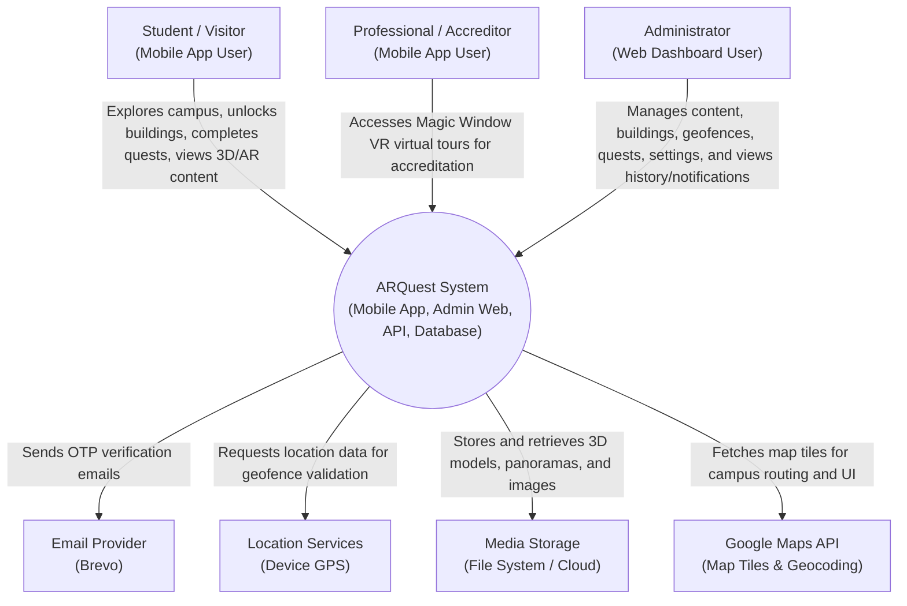

# ARQuest — Context Diagram

> Last updated: 2026-06-22

---

## 1. System Context Diagram

This diagram shows ARQuest as a central system and its interactions with external users and external systems.

---

## Documentation

### Overview

The Context Diagram provides a high-level view of the ARQuest system boundaries. It illustrates who uses the system (the actors) and which external services the system relies on to function. The central node represents the entire ARQuest ecosystem, encapsulating the mobile application, web dashboard, Django backend, and database.

### Actors

**Student / Visitor**: The primary end-users of the mobile application. They interact with the system by physically navigating the campus, triggering geofence unlocks, completing AR quests for gamification points (maintaining daily login streaks), choosing custom WMSU avatars, and exploring 3D building models and 360° panoramas.

**Professional / Accreditor**: Specialized users who use the mobile application for remote building inspection. They are granted access to Magic Window VR virtual tours without needing to physically unlock buildings via geofencing.

**Administrator**: Staff members who manage the platform through the React-based Web Dashboard. They are responsible for adding new buildings, uploading 3D models, defining geofences on the map, creating quests and trivia, toggling system-wide feature flags, and viewing system notifications, history, and logs.

### External Systems

**Email Provider (Brevo)**: Used by the backend to send One-Time Password (OTP) emails during the student registration and verification process.

**Location Services (Device GPS)**: The mobile application relies on the device's native GPS capabilities (accessed via Expo Location) to determine the user's coordinates for geofence validation.

**Media Storage**: The system stores heavy media assets like `.glb` 3D models and equirectangular panorama images. While currently managed by Django, it represents an externalized storage dependency that could be backed by a cloud provider like S3.

**Mapbox API**: Replaces default mapping services to provide highly accurate map tiles, styling, and robust point-to-point visual routing on the campus explore map.
