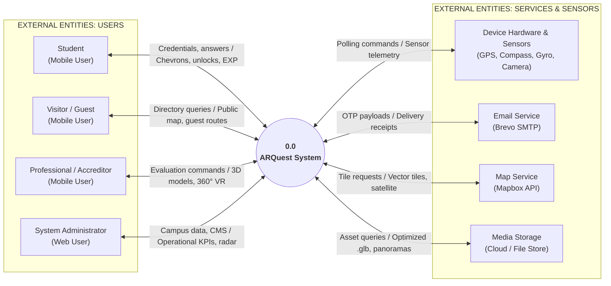

# ARQuest — System Context Diagram (Level 0 DFD)

> **Research Paper Component:** Chapter 3 — System Design / Data Flow Diagram (DFD Level 0)  
> **System:** ARQuest: A Sensor-Assisted Campus Exploration and Accreditation Support System  
> **Institution:** Western Mindanao State University (WMSU)  
> **Document Format:** Standard A4 Bond Paper (Balanced 3-Column Radial Layout)

---

## 1. System Context Diagram (DFD Level 0)

The System Context Diagram establishes the operational boundary of **ARQuest**. The platform is modeled as a centralized system process (**0.0**) interacting with four human user roles (left), physical device sensors, and external cloud services (right).

```mermaid
flowchart LR
    subgraph ACTORS ["EXTERNAL ENTITIES: USERS"]
        direction TB
        Student["Student<br/>(Mobile User)"]
        Visitor["Visitor / Guest<br/>(Mobile User)"]
        Prof["Professional / Accreditor<br/>(Mobile User)"]
        Admin["System Administrator<br/>(Web User)"]
    end

    ARQuest(("<b>0.0</b><br/><b>ARQuest System</b>"))

    subgraph SERVICES ["EXTERNAL ENTITIES: SERVICES & SENSORS"]
        direction TB
        Sensors["Device Hardware & Sensors<br/>(GPS, Compass, Gyro, Camera)"]
        EmailSvc["Email Service<br/>(Brevo SMTP)"]
        MapsSvc["Map Service<br/>(Mapbox API)"]
        MediaSvc["Media Storage<br/>(Cloud / File Store)"]
    end

    %% User Data Flows (Left to Center)
    Student <-->|"Credentials, answers / Chevrons, unlocks, EXP"| ARQuest
    Visitor <-->|"Directory queries / Public map, guest routes"| ARQuest
    Prof <-->|"Evaluation commands / 3D models, 360° VR"| ARQuest
    Admin <-->|"Campus data, CMS / Operational KPIs, radar"| ARQuest

    %% Service & Hardware Data Flows (Center to Right)
    ARQuest <-->|"Polling commands / Sensor telemetry"| Sensors
    ARQuest <-->|"OTP payloads / Delivery receipts"| EmailSvc
    ARQuest <-->|"Tile requests / Vector tiles, satellite"| MapsSvc
    ARQuest <-->|"Asset queries / Optimized .glb, panoramas"| MediaSvc
```

---

## 2. External Entities Data Flow Matrix

| External Entity | Entity Classification | Data Ingested by System (Inputs) | Data Dispatched to Entity (Outputs) |
|:---|:---|:---|:---|
| **Student** | Human Actor (Mobile) | • Account registration credentials • Mandatory legal agreement consent • 6-digit OTP verification code • Target navigation selections • Building trivia quiz answers • In-app feedback and bug reports | • Directional 3D AR ground chevrons • 2D off-screen perimeter turn indicators • Custom WMSU walking path polylines • Automated building unlock confirmations • Digital Campus Passport discovery stamps • EXP level progression and leaderboard rankings |
| **Visitor / Guest** | Human Actor (Mobile) | • Public campus directory searches • Point-to-point guest route queries | • Public facility information cards • Interactive 2D Mapbox vector map • Custom WMSU pedestrian walking paths |
| **Professional / Accreditor** | Human Actor (Mobile) | • Evaluation inspection queries • First-person virtual tour inputs • Doorway spatial portal triggers • Facility checklist toggle marks | • Complete ungated campus directory • Interactive 3D architectural models • High-resolution 360° panoramic scenes • Gyroscope-driven Magic Window VR views • Visited facility evaluation records |
| **System Administrator** | Human Actor (Web) | • Facility and department configurations • Circular and polygon geofence definitions • Walking graph nodes and walkway paths • 3D spatial doorway anchor coordinates • CMS quests and building trivia banks • User role assignments and account provisioning • Issue resolution status updates | • Live campus operational status cards • Aggregated foot traffic charts (Daily/Weekly/Monthly/Yearly) • Content deployment coverage matrix • Unresolved mobile Feedback Radar queue • System security audit logs |
| **Device Hardware & Sensors** | Hardware Telemetry | • GPS latitude, longitude, and accuracy • Magnetometer compass heading (azimuth) • 3-axis gyroscope orientation angles • Optical camera video feed • Decoded QR code secret strings | • Telemetry polling frequencies • Hardware sensor lifecycle commands (start/stop) |
| **Email Service (Brevo SMTP)** | Cloud Service | • SMTP delivery confirmation receipts • Bounced message delivery notifications | • 6-digit OTP verification email payloads • Security alerts and system dispatches |
| **Map Service (Mapbox API)** | Cloud Service | • Dynamic vector map tiles • High-resolution satellite raster imagery | • Vector tile rendering requests • Satellite imagery bounding-box queries |
| **Media Storage** | Data Store / Cloud | • Compressed `.glb` architectural models • High-resolution 360° equirectangular panoramas • Campus department thumbnail imagery | • Media file write streams (uploads) • HTTP media asset fetch requests |

---

## 3. Narrative & Boundary Analysis

### 3.1 Operational Boundary & Central System Scope
The System Context Diagram establishes the operational scope of ARQuest. The platform is treated as a unified computational entity ($0.0$) that encapsulates all client presentation logic, business rule validation, spatial calculations, and persistent data storage.

A critical design criterion is that **all authoritative validation and route calculations remain internal to ARQuest**:
1. **Self-Sovereign Pedestrian Routing**: Unlike conventional campus applications that delegate route calculations to commercial providers (such as Google Maps or Mapbox Directions API), ARQuest uses Mapbox solely as a passive basemap renderer. The optimal sidewalk route is computed entirely inside ARQuest's internal server-side $A^*$ Routing Engine (`apps.navigation`), ensuring routes strictly follow real WMSU pedestrian paths.
2. **Authoritative Geofencing**: While mobile clients perform preliminary distance checks to conserve battery, the ultimate authority for unlocking campus facilities and awarding academic EXP resides strictly within ARQuest's server-side validation engine.

### 3.2 Interaction with Human Actors
- **Students** engage in an active gamified exploration loop: physical movement verified by sensors triggers building discoveries, spatial AR overlays, academic quizzes, and passport collection.
- **Visitors** access an unauthenticated, privacy-preserving guest mode designed to provide friction-free pedestrian navigation and public facility information.
- **Professionals (Accreditors)** operate an ungated evaluation portal providing unrestricted access to 3D digital twins and immersive 360° photo spheres with gyroscope-assisted Magic Window VR inspection.
- **Administrators** utilize the web dashboard to manage the campus digital twin, author the topological walking network, calibrate geofences, and monitor institutional analytics.

### 3.3 Hardware Sensors and Cloud Integrations
- **Device Hardware**: Expo Location and Magnetometer modules stream real-time spatial telemetry to drive the 60 FPS ViroReact spatial AR projection engine, while the camera module supplies optical frames for live AR compositing.
- **External Cloud Infrastructure**: Brevo SMTP handles transactional email verification to guarantee authentic university registrations, while Mapbox supplies high-resolution vector and satellite tile layers. Media assets are maintained in a decoupled media storage architecture that allows seamless deployment to local filesystems or cloud object storage.
