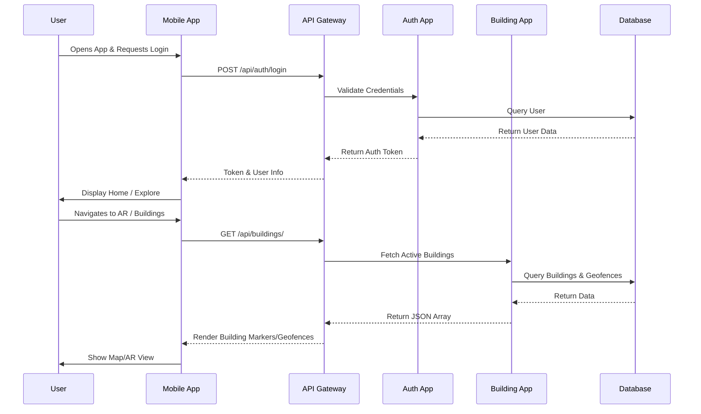

# ARQuest Data Flow

```mermaid
sequenceDiagram
    participant User
    participant MobileApp as Mobile App
    participant APIGateway as API Gateway
    participant Auth as Auth App
    participant Building as Building App
    participant Database as Database

    User->>MobileApp: Opens App & Requests Login
    MobileApp->>APIGateway: POST /api/auth/login
    APIGateway->>Auth: Validate Credentials
    Auth->>Database: Query User
    Database-->>Auth: Return User Data
    Auth-->>APIGateway: Return Auth Token
    APIGateway-->>MobileApp: Token & User Info
    MobileApp->>User: Display Home / Explore

    User->>MobileApp: Navigates to AR / Buildings
    MobileApp->>APIGateway: GET /api/buildings/
    APIGateway->>Building: Fetch Active Buildings
    Building->>Database: Query Buildings & Geofences
    Database-->>Building: Return Data
    Building-->>APIGateway: Return JSON Array
    APIGateway-->>MobileApp: Render Building Markers/Geofences
    MobileApp->>User: Show Map/AR View
```
