# ARQuest — Data Flow

> Last updated: 2026-09-01
> Comprehensive sequence diagrams covering all major user, admin, and sensor data flows.

---

## 1. User Registration, Terms Agreement & OTP Verification

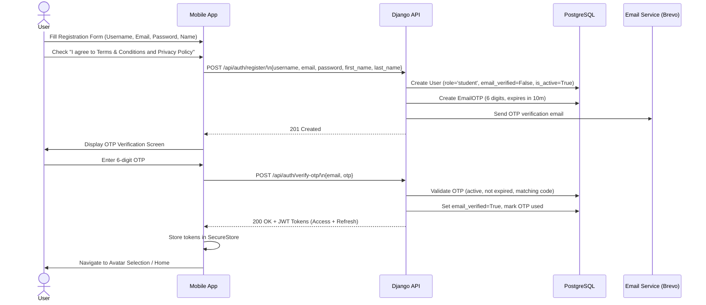

---

## 2. Authentication, Token Rotation & Self-Service Reactivation

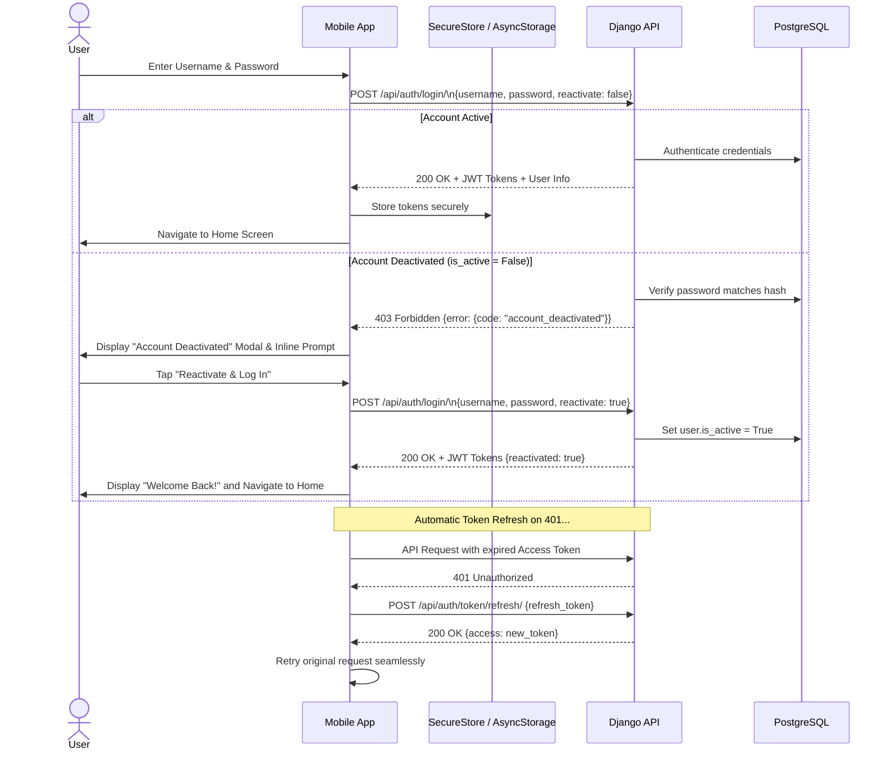

---

## 3. GPS Geofencing & Building Unlock Flow

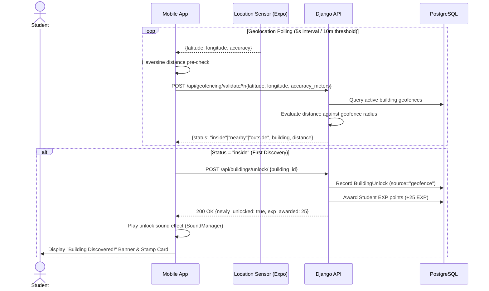

---

## 4. Native Spatial AR Navigation & HUD Guidance

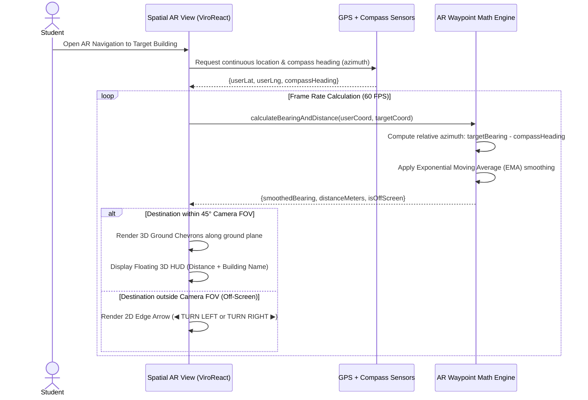

---

## 5. 360° Virtual Walkthrough & Magic Window VR Flow

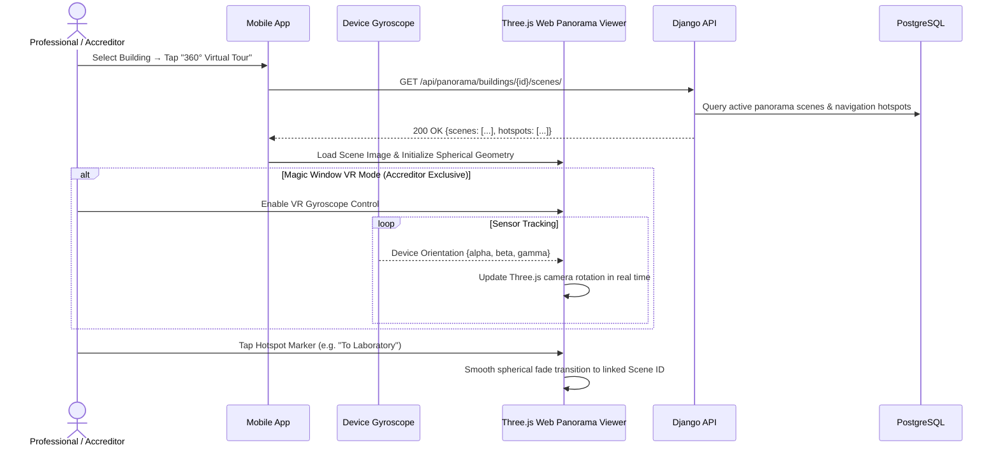

---

## 6. Password Management & Self-Service Account Deactivation

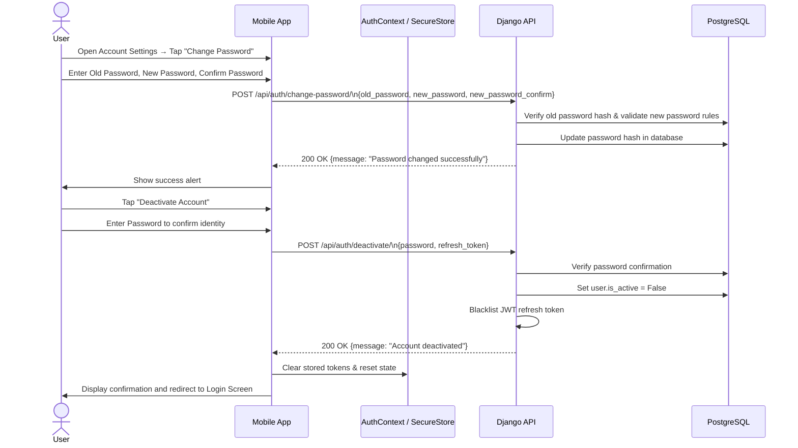

---

## 7. In-App Feedback Submission & Admin Resolution

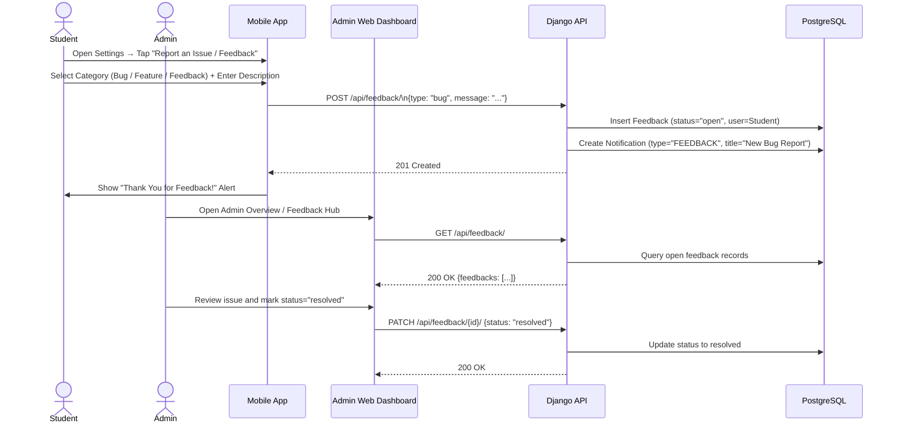

---

## 8. Real-Time Admin Dashboard Metrics Aggregation

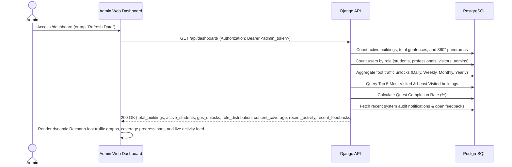

---

## 9. Custom WMSU Campus Pedestrian Routing Flow (Unit 31)

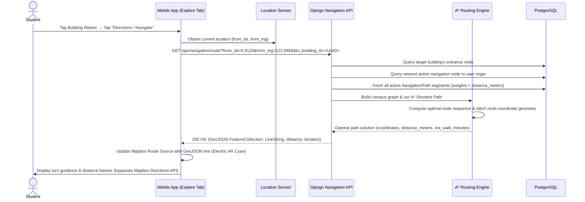

---

## 10. Admin Walking Paths Authoring & Real-Time Pruning Flow (Unit 31)

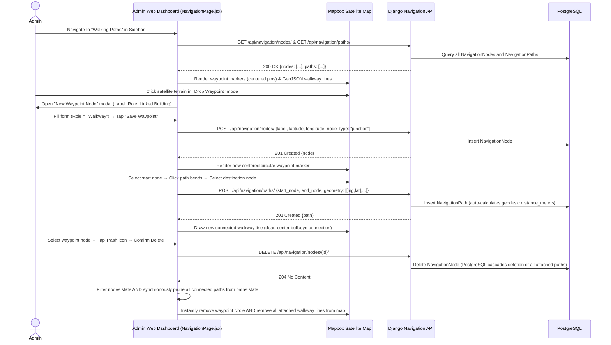

---

## 11. 3D Virtual Tour to 360° Panorama Spatial Linking Flow (Unit 30)

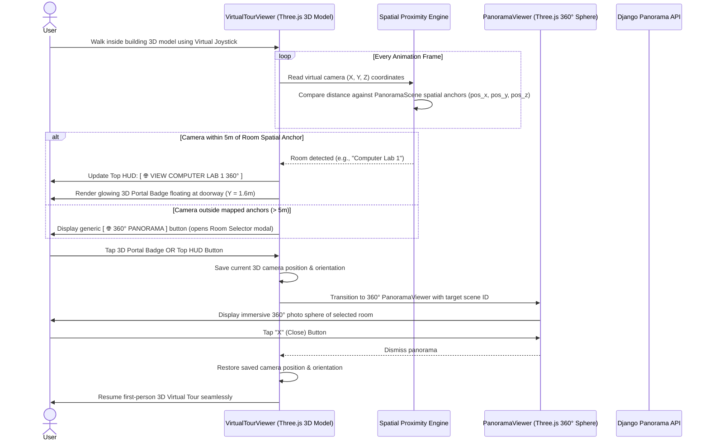

---

## Documentation

### Overview

The Sequence Diagrams in this document formalize the runtime data interactions, asynchronous sensor polling loops, stateful transitions, and network communication protocols within ARQuest. The diagrams detail the exact lifelines across five primary system tiers:

1. **Client Actors**: Students, Accreditors (Professionals), Visitors, and System Administrators.
2. **Mobile Presentation & Sensor Layer**: React Native Expo frontend, Expo Location, Device Compass (Magnetometer), Device Gyroscope, Optical Camera, and the ViroReact Native AR / Three.js WebView engines.
3. **Application & Business Logic Layer**: Django 5 REST Framework endpoints, SimpleJWT token handlers, A* Graph Routing Engine (`apps.navigation`), and 3D Asset Optimization Pipeline.
4. **Data & Persistence Layer**: PostgreSQL relational database (20 domain models) and AWS S3 / Local Media Storage.
5. **External Cloud Providers**: Brevo SMTP Service (transactional OTP dispatch) and Mapbox Vector Tile APIs.

---

### Sequence Flow 1 — User Registration, Terms Agreement & OTP Verification

This sequence models the onboarding pipeline for new student accounts, enforcing legal compliance and cryptographic identity validation prior to granting app access:

1. **Form Submission & Legal Consent**: The student populates the registration form (`username`, `email`, `password`, `first_name`, `last_name`) and is strictly required to check the agreement box acknowledging the Terms & Conditions and Privacy Policy. The client validates form fields locally using password complexity rules (uppercase, lowercase, digits, and special characters) before dispatching `POST /api/auth/register/`.
2. **Account Creation & OTP Generation**: The Django `authentication` app validates uniqueness across `username` and `email`. Upon validation, it creates an unverified `User` instance (`role='student'`, `email_verified=False`, `is_active=True`). Concurrently, an `EmailOTP` record is generated with a cryptographically random 6-digit numeric token and an explicit expiration timestamp set to 10 minutes (`now() + timedelta(minutes=10)`).
3. **Transactional Email Dispatch**: Django routes the verification payload to the Brevo SMTP API, transmitting the OTP code to the student's institutional or personal inbox. The API returns HTTP `201 Created` with a sanitized user stub, and the mobile app transitions to the OTP Verification screen.
4. **Verification & Session Issuance**: The user inputs the received 6-digit token. The mobile app issues `POST /api/auth/verify-otp/`. The backend queries the `EmailOTP` table, verifying that the token matches, has not expired, and has not been previously consumed (`is_used=False`).
5. **Token Storage & Avatar Setup**: Upon successful validation, `email_verified` is updated to `True`, `is_used` is set to `True`, and Django's SimpleJWT issues a paired JWT Access Token (60-minute lifetime) and Refresh Token (7-day lifetime). The mobile client persists both tokens in encrypted hardware-backed storage (`Expo SecureStore`) and directs the user to the WMSU Avatar Selection screen before entering the main application shell.

---

### Sequence Flow 2 — Authentication, Token Rotation & Self-Service Reactivation

This sequence details credentials verification, automatic token rotation, and the self-service reactivation lifecycle for previously deactivated accounts:

1. **Credential Validation**: The user provides their credentials on the Login screen, dispatching `POST /api/auth/login/` with `{username, password, reactivate: false}`.
2. **Branch A — Active User Login**: If credentials match and `is_active = True`, Django emits HTTP `200 OK` alongside paired JWT tokens and user profile metadata. The client writes tokens to `SecureStore`, synchronizes `AuthContext`, and mounts the Home Screen according to the assigned role.
3. **Branch B — Deactivated Account Recovery**: If the user's account was previously soft-deactivated (`is_active = False`), Django verifies that the provided password matches the stored PBKDF2 hash. Rather than permanently denying access or dropping user data, the backend rejects the request with HTTP `403 Forbidden` and a structured error payload `{code: "account_deactivated"}`.
4. **Reactivation Prompt & Restoration**: The mobile client intercepts this error code and displays the Account Deactivated Modal with an actionable "Reactivate & Log In" option. When confirmed, the client re-submits `POST /api/auth/login/` with `reactivate: true`. The backend verifies the password hash, flips `user.is_active = True`, logs the restoration event, and returns HTTP `200 OK` with active JWT tokens, preserving all historic EXP, unlocked badges, and campus discoveries.
5. **Silent 401 Interceptor Token Rotation**: When an API request fails with HTTP `401 Unauthorized` due to an expired access token, the global Axios response interceptor in `mobile/src/services/core/api.js` pauses outgoing traffic, reads the refresh token from `SecureStore`, and posts to `/api/auth/token/refresh/`. Django verifies the refresh token's signature and blacklist status, returning a new access token. The interceptor updates `SecureStore` and seamlessly replays the failed request without user interruption.

---

### Sequence Flow 3 — GPS Geofencing & Building Unlock Flow

This sequence models the location-aware discovery engine, illustrating the two-stage hybrid geofencing architecture that minimizes mobile battery drain while maintaining server-authoritative integrity:

1. **Stage 1 Client-Side Haversine Pre-Filtering**: The mobile app maintains a continuous GPS polling loop (throttled to 5-second intervals or 10-meter movement thresholds via `expo-location`). Before sending network requests, the client calculates the Haversine distance between current user coordinates and cached campus building centroids. If the user is safely outside all facility perimeters ($>75\text{m}$ and $> r + 20\text{m}$), network dispatch is bypassed, reducing unnecessary cellular transmissions by over 95%.
2. **Stage 2 Server-Side Verification**: When the client detects that the user is in proximity to a facility, it dispatches `POST /api/geofencing/validate/` containing `{latitude, longitude, accuracy_meters}`. The backend queries active `Geofence` boundaries and performs server-side Haversine validation with anti-spoofing velocity checks. The API returns the calculated distance and categorical status: `"inside"`, `"nearby"`, or `"outside"`.
3. **First-Discovery Unlock Transaction**: When the status evaluates to `"inside"` for an unlocked facility, the mobile app calls `POST /api/buildings/unlock/`. The backend checks whether a `BuildingUnlock` record already exists for the `(user, building)` pair:
   - If novel, an atomic database transaction inserts a `BuildingUnlock` record (`source='geofence'`), awards $+25\text{ EXP}$ to the student, and updates their consecutive discovery count.
   - If previously unlocked, the backend updates `last_validated_at` without duplicating rewards.
4. **Gamification & UI Feedback**: Upon receiving `{newly_unlocked: true, exp_awarded: 25}`, the mobile app triggers audio feedback via `SoundManager.play("building_unlocked")`, increments local EXP state, displays an animated discovery banner, and marks the corresponding stamp in the Campus Passport.

---

### Sequence Flow 4 — Native Spatial AR Navigation & HUD Guidance

This sequence details the 60 FPS spatial AR tracking engine implemented via ViroReact and native hardware sensors:

1. **Sensor Telemetry Acquisition**: When a student launches the Spatial AR Lens towards a target building, `ARQuestScene` initiates parallel streams from `expo-location` (GPS coordinates) and the device magnetometer (compass heading/azimuth).
2. **Azimuth & Bearing Mathematical Pipeline**: For each frame tick:
   - The engine computes the geodesic bearing angle from user coordinates to target building coordinates using spherical trigonometry.
   - The relative azimuth is derived by subtracting the device's compass heading from the target bearing ($\theta_{\text{rel}} = \text{bearing} - \text{heading}$).
   - An Exponential Moving Average (EMA) filter with angular deadband thresholding ($2.5^\circ$) is applied to smooth out high-frequency sensor noise and prevent jitter in the projected AR overlays.
3. **Field of View (FOV) Branching**:
   - **In-FOV Projection ($\le 45^\circ$)**: When the destination lies within the camera's $45^\circ$ viewing frustum, the engine renders animated, glowing 3D ground chevrons aligned with the real-world terrain, alongside a floating 3D tactical HUD billboard indicating building name and real-time distance.
   - **Off-Screen Projection ($> 45^\circ$)**: When the destination is outside the active camera view, 3D world chevrons are suppressed to eliminate visual clutter, and responsive 2D edge turn indicators (`◀ TURN LEFT` or `TURN RIGHT ▶`) appear on the screen perimeter to orient the user.
4. **Arrival Latching with Hysteresis**: When the user approaches within $\le 25\text{m}$ (or crosses the geofence perimeter), the AR view latches into Arrival Mode. An internal 20m hysteresis buffer holds `isArrivedLatched = true` continuously until the user departs $> 45\text{m}$ away, preventing micro-drift GPS oscillations from intermittently hiding the 3D building model. The scene renders a glowing concentric ground pedestal and initiates a continuous $360^\circ$ left-to-right turntable rotation of the 3D landmark mesh.

---

### Sequence Flow 5 — 360° Virtual Walkthrough & Magic Window VR Flow

This sequence models the panoramic accreditation and inspection pipeline designed for institutional evaluators:

1. **Scene Graph & Hotspot Ingestion**: When an Accreditor (Professional) selects a building and taps "360° Virtual Tour", the mobile app queries `GET /api/panorama/buildings/{id}/scenes/`. Django returns all active `PanoramaScene` records and their associated `PanoramaHotspot` child arrays.
2. **Three.js Sphere Initialization**: The client initializes an isolated `WebView` loading `panorama-viewer.html`. Three.js constructs an inverted spherical geometry (`SphereGeometry`), maps the equirectangular image texture to the inner surface, and centers the perspective camera at the origin $(0, 0, 0)$.
3. **Magic Window VR Sensor Telemetry**: If the evaluator engages Magic Window VR mode:
   - The device gyroscope (`expo-sensors`) streams high-frequency orientation telemetry (`alpha`, `beta`, `gamma` Euler angles).
   - Telemetry is passed across the React Native WebView bridge to dynamically rotate the Three.js camera in 6DoF sync with the user's physical device movements, providing an intuitive, headset-free virtual inspection.
4. **Hotspot Interactivity & Scene Transition**: Clickable navigation markers positioned at spherical coordinates (`yaw`, `pitch`) trigger raycasting hit tests in Three.js. When tapped, the viewer initiates a smooth spherical opacity cross-fade, disposes of the previous texture from GPU VRAM, and streams the linked scene texture, enabling fluid room-to-room navigation across campus facilities.

---

### Sequence Flow 6 — Password Management & Self-Service Account Deactivation

This sequence details account governance operations executed within the user profile settings:

1. **Password Mutation Pipeline**:
   - The user opens Account Settings and inputs their current password, proposed new password, and confirmation password.
   - The app issues `POST /api/auth/change-password/`.
   - Django validates that the old password satisfies PBKDF2 hash verification, checks that the new password meets the system's `ComplexPasswordValidator` standards, updates `user.password` with a fresh salt and hash, and returns HTTP `200 OK`.
2. **Account Deactivation Pipeline**:
   - When a user selects "Deactivate Account", a modal requires password re-entry to confirm identity.
   - The app posts `POST /api/auth/deactivate/` passing `{password, refresh_token}`.
   - Django validates the password hash, flips `user.is_active = False`, and immediately adds the active refresh token to the SimpleJWT blacklist table (`OutstandingToken` / `BlacklistedToken`), terminating active sessions across all devices.
   - The mobile client flushes local tokens from `SecureStore`, clears `AuthContext`, and redirects the user to the unauthenticated gateway. All historic user discoveries, badges, and points remain safely preserved in PostgreSQL for future restoration.

---

### Sequence Flow 7 — In-App Feedback Submission & Admin Resolution

This sequence models user-driven issue reporting, administrative visibility, and bug tracking:

1. **Feedback Ingestion**: A user accesses the feedback modal from the mobile app, selects a category (`Bug Report`, `Feature Request`, or `General Feedback`), enters an explanatory message, and taps submit.
2. **Persistence & Notification Generation**: The app issues `POST /api/feedback/`. Django writes a `Feedback` record (`status='open'`) linked to the submitting user and concurrently generates a high-priority system `Notification` record (`type='FEEDBACK'`) for administrators. The mobile client presents a confirmation alert upon receipt of HTTP `201 Created`.
3. **Admin Dashboard Synchronization & Resolution**:
   - The administrative dashboard (`DashboardPage.jsx`) fetches open issues via `GET /api/feedback/`.
   - The Feedback Radar widget updates in real time, displaying unresolved tickets and severity badges.
   - An administrator reviews the issue, implements any necessary remediation, and marks the item resolved via `PATCH /api/feedback/{id}/` with `{status: "resolved"}`.
   - The database updates the ticket status, archiving the item from the active issue queue.

---

### Sequence Flow 8 — Real-Time Admin Dashboard Metrics Aggregation

This sequence outlines the data harvesting pipeline powering the administrative dashboard overview:

1. **Dashboard Initialization**: Upon accessing the admin web portal, the dashboard dispatches an authorized request to `GET /api/dashboard/` with the administrator's JWT Bearer token.
2. **Database Aggregation Queries**: Within an optimized backend view, Django executes high-performance aggregation queries:
   - Entity counts: active buildings, total geofences, and published 360° panoramas.
   - Demographic distribution: user counts grouped by role (`student`, `professional`, `visitor`, `admin`).
   - Foot traffic telemetry: total `BuildingUnlock` events segmented across Daily, Weekly, Monthly, and Yearly intervals.
   - Analytical rankings: Top 5 Most Visited vs. Least Visited campus facilities.
   - Gamification progress: total active quests, completion percentages, and unresolved mobile feedbacks.
3. **Client-Side Rendering**: Django returns a consolidated JSON payload. The React dashboard processes the dataset, rendering responsive Recharts Area and Bar foot traffic graphs, progress bars for content coverage, and live audit notification streams.

---

### Sequence Flow 9 — Custom WMSU Campus Pedestrian Routing Flow (Unit 31)

This sequence details ARQuest's internal campus pedestrian navigation engine, which operates independently of commercial mapping providers:

1. **Navigation Request**: A student or visitor selects a destination building on the Explore Map and taps "Directions / Navigate". The mobile app retrieves the user's current GPS coordinates and dispatches `GET /api/navigation/route/?from_lat={lat}&from_lng={lng}&to_building_id={UUID}`.
2. **Graph Snapping & Heuristic Pathfinding**:
   - The Django `apps.navigation` engine queries `NavigationNode` records to find the target building's designated entrance node.
   - It queries the campus graph to identify the nearest active navigation node to the user's origin coordinates.
   - The A* router (`router.py`) constructs an in-memory adjacency graph from all active `NavigationPath` segments, using geodesic distance (`distance_meters`) as edge weights.
   - The algorithm executes priority-queue A* pathfinding using Haversine straight-line distance as the admissible heuristic function $h(n)$, determining the optimal sequence of sidewalk walkway nodes.
3. **Geometry Stitching & GeoJSON Output**: The router extracts the multi-coordinate geometries (`[[lng, lat], ...]`) for each traversed path segment, automatically reversing coordinate arrays for backward-traversed edges, and calculates total walking distance and estimated duration (at 80 m/min).
4. **Mapbox Visual Overlay**: Django returns an optimized GeoJSON `FeatureCollection`. The mobile app injects the GeoJSON directly into the Mapbox vector map canvas as an Electric Cyan walking line with white casing, completely bypassing the external Mapbox Directions API and ensuring walking routes adhere strictly to real WMSU campus sidewalks.

---

### Sequence Flow 10 — Admin Walking Paths Authoring & Real-Time Pruning Flow (Unit 31)

This sequence outlines the interactive authoring and self-healing topological validation tools provided to administrators:

1. **Network Visualization**: An administrator opens the "Walking Paths" interface (`NavigationPage.jsx`). The dashboard retrieves existing nodes and paths via `GET /api/navigation/nodes/` and `GET /api/navigation/paths/`, rendering nodes as color-coded markers and pathways as cyan lines overlaid onto Mapbox satellite imagery.
2. **Waypoint Node Placement**: The administrator clicks on satellite terrain in "Drop Waypoint" mode and configures node attributes (Label, Role: Entrance, Walkway Junction, Gate, POI, and linked building). The web client posts `POST /api/navigation/nodes/`, persisting the node in PostgreSQL and placing a bullseye marker on the canvas.
3. **Pathway Tracing**: The administrator enters "Draw Path" mode, selects the origin node, clicks intermediate vertices along the physical sidewalk curve, and snaps to the destination node. The client posts `POST /api/navigation/paths/`. Django computes the geodesic distance using the Haversine formula and stores the multi-coordinate line string.
4. **Deletion & Client-Side Real-Time Pruning**: When an administrator deletes an obsolete waypoint node:
   - The client issues `DELETE /api/navigation/nodes/{id}/`.
   - In PostgreSQL, foreign key cascade constraints (`on_delete=models.CASCADE`) automatically purge all dependent `NavigationPath` segments referencing the deleted node.
   - Concurrently, the web client performs synchronous state pruning, filtering out the deleted node and instantly scrubbing all connected pathway polylines from the map canvas, preventing orphan route segments without requiring a full page refresh.

---

### Sequence Flow 11 — 3D Virtual Tour to 360° Panorama Spatial Linking Flow (Unit 30)

This sequence models the seamless bidirectional spatial bridge linking the first-person 3D building exploration with high-resolution 360° panoramic rooms:

1. **First-Person Traversal & Proximity Sensing**: While a user walks through a building's 3D model using the virtual joystick inside `virtual-tour-viewer.html`, the viewer continuously tracks camera Cartesian coordinates $(X, Y, Z)$ at 10 FPS.
2. **Spatial Anchor Evaluation**: The client's spatial proximity engine compares camera position against the spatial anchor coordinates (`pos_x`, `pos_y`, `pos_z`) assigned to the building's `PanoramaScene` records.
3. **Contextual HUD & 3D Portal Rendering**:
   - When the camera approaches within 5 meters of a doorway anchor (e.g., Computer Laboratory 1), the viewer updates the top HUD button to `[ 🌐 VIEW COMPUTER LAB 1 360° ]` and renders a floating 3D portal badge at doorway eye level ($Y \approx 1.6\text{m}$).
   - If outside mapped anchors, the HUD defaults to a generic 360° tour button opening a room selection menu.
4. **Seamless Transition & State Restoration**:
   - Tapping the portal badge or HUD button saves the current 3D camera coordinates and viewing angles into memory.
   - The app transitions to `panorama-viewer.js`, opening the exact interior room photo sphere.
   - When the user exits the panorama, the viewer unmounts cleanly, and the 3D Virtual Tour resumes with the saved camera position and orientation perfectly restored, delivering an uninterrupted digital twin experience.

