# ARQuest — Data Flow

> Last updated: 2026-06-20
> All major user journeys documented as sequence diagrams.

---

## 1. User Registration & Email Verification

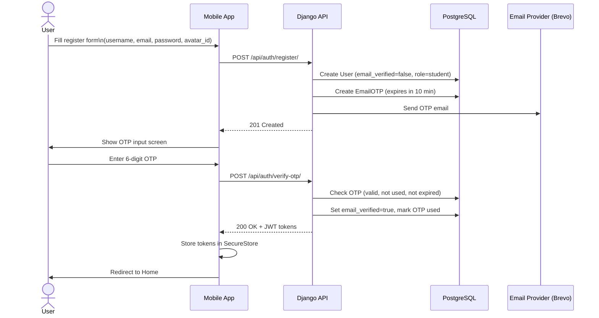

---

## 2. Login & Token Flow

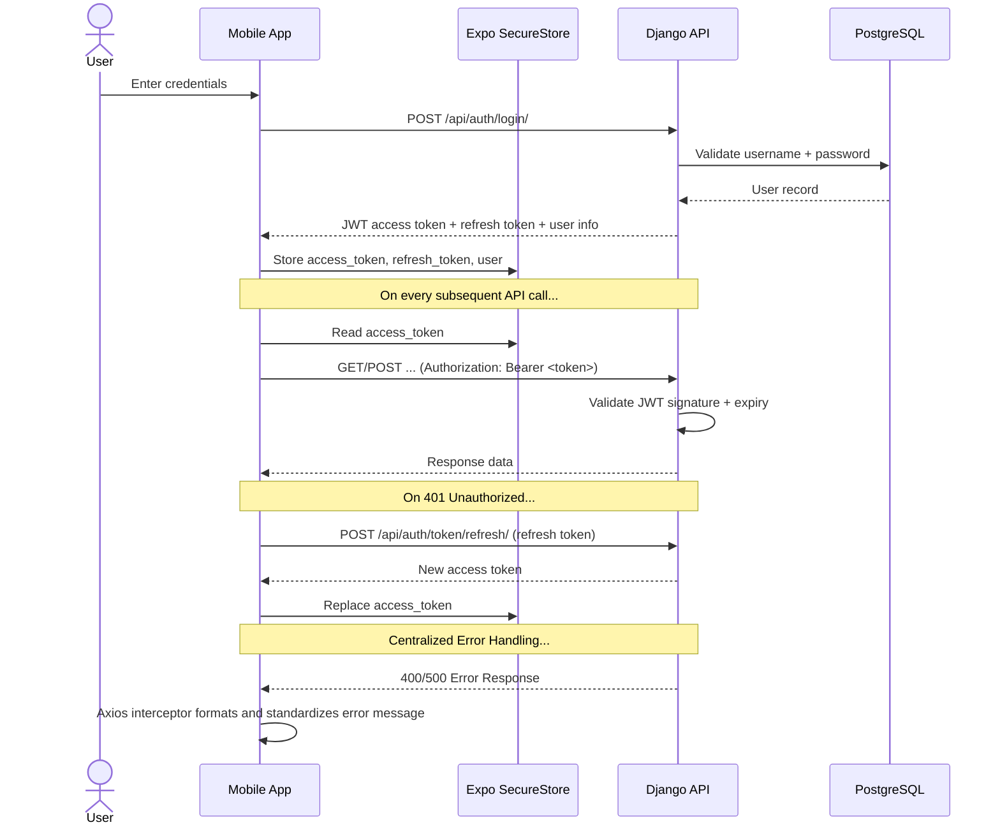

---

## 3. GPS Geofence Detection & Building Unlock

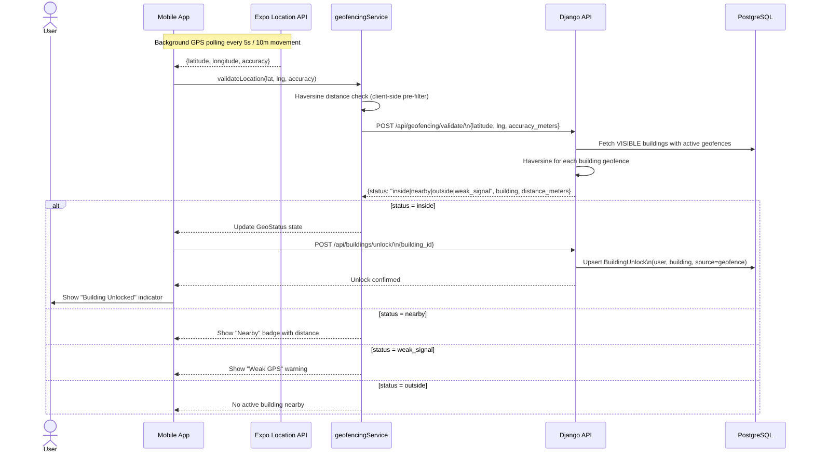

---

## 4. QR Code Unlock (Fallback)

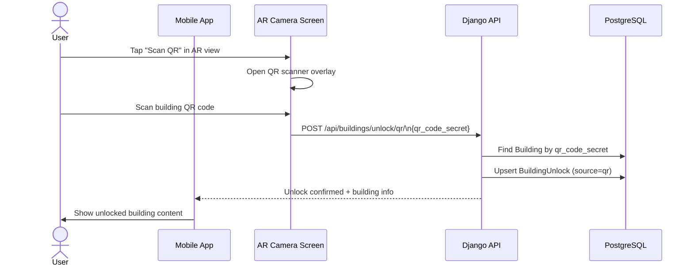

---

## 5. 3D Building Visualization

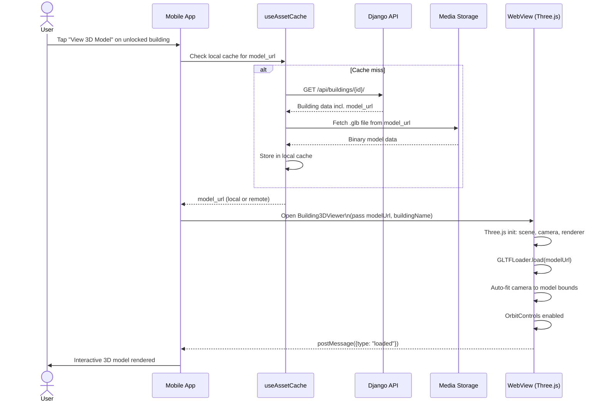

---

## 6. 360° Panorama Walkthrough (All Roles)

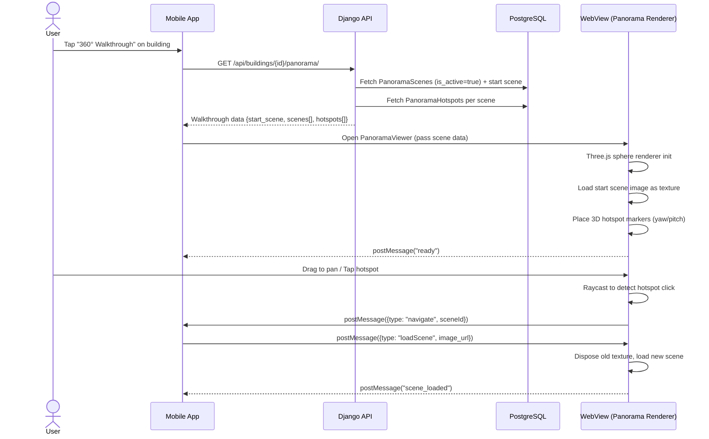

---

## 7. Professional Virtual Tour (Magic Window VR)

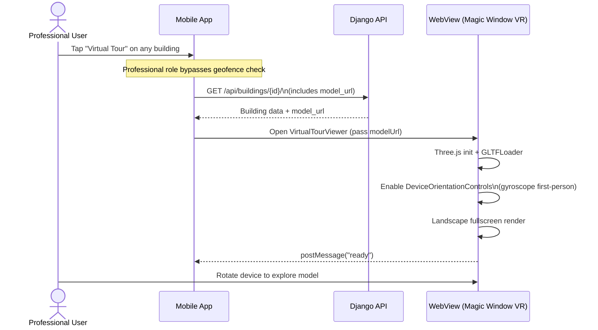

---

## 8. AR Camera View & Quest Completion

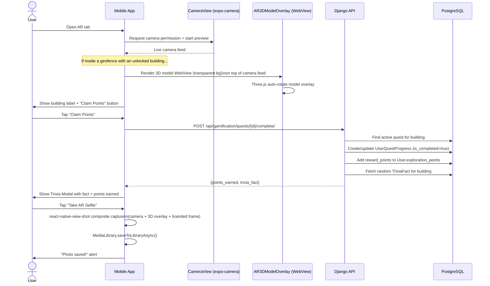

---

## 9. Admin: Building & Geofence Management

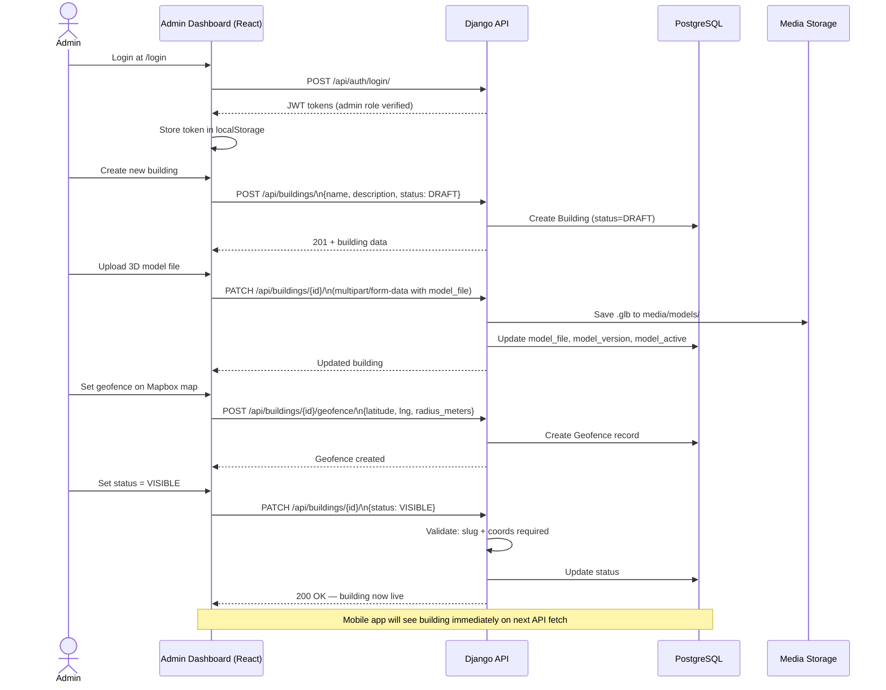

---

## 10. System Settings & Feature Toggles

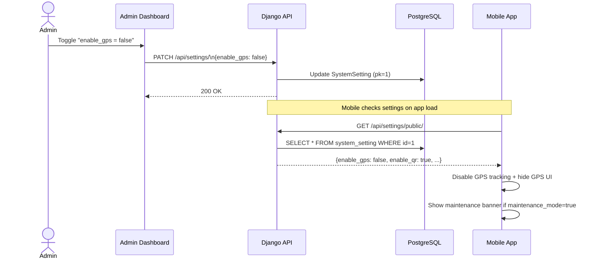

---

## 11. Soft Delete & Archive Flow

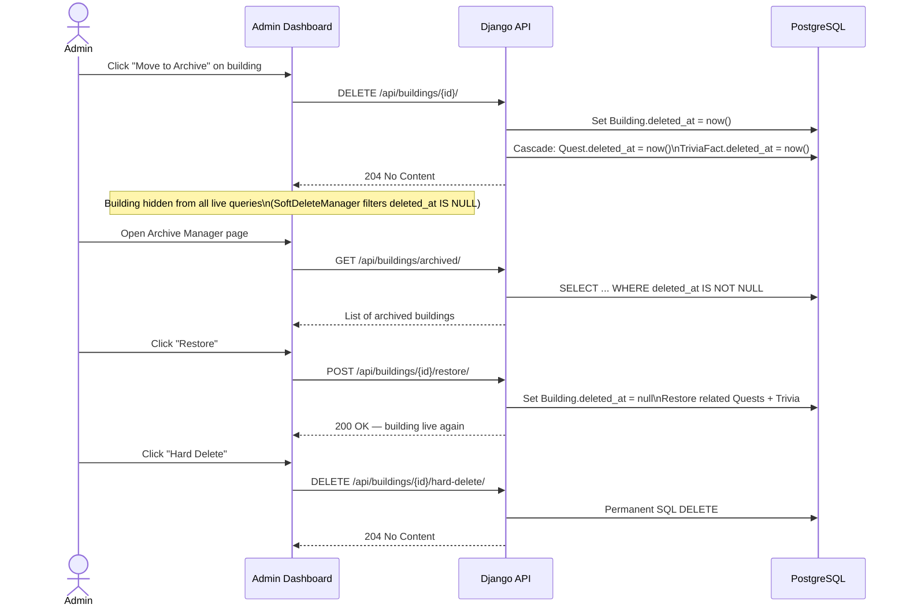

---

## 12. Admin: History, Logs & Notifications

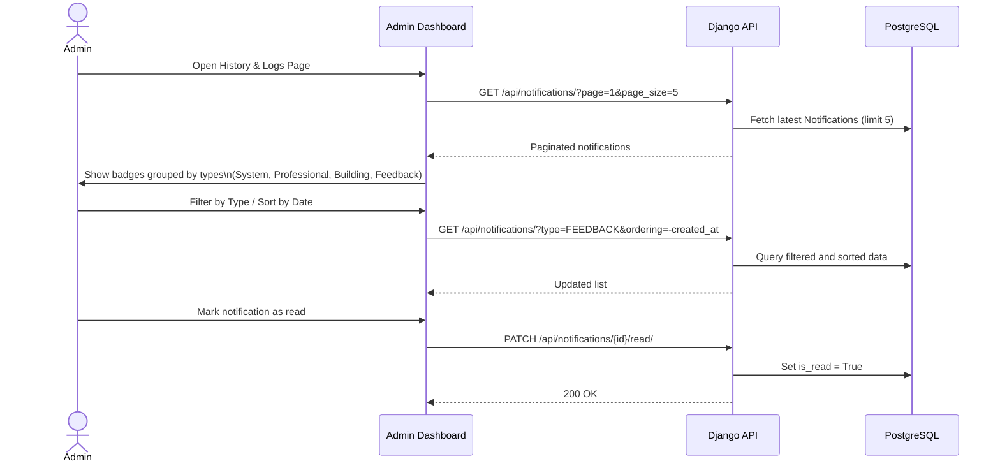

---

## Documentation

### Overview

The data flow diagrams in this document trace the complete lifecycle of every major user action and system event in ARQuest. Each sequence diagram covers a specific interaction: user registration, GPS geofence detection, building unlock, 3D visualization, 360 degree walkthrough, AR camera, admin content management, and notification processing. These flows are useful for understanding how the layers connect, debugging API integration issues, and validating that role-based access control is enforced at the right points.

All flows follow one rule: the Django backend is always the authoritative decision-maker. The mobile app and admin dashboard submit requests and display results. They never determine access rights, validate geofence boundaries, or calculate gamification rewards on their own.

---

### Flow 1 - User Registration and Email Verification

This flow covers onboarding for new student accounts. When a user submits the registration form, the backend creates a `User` record with `email_verified=false` and generates an `EmailOTP` record with a six-digit code that expires ten minutes later. The OTP is sent to the user's email through Brevo SMTP.

The mobile app moves to an OTP input screen. When the user enters the code, the backend checks that the OTP exists for that email, has not been used, and has not expired. If all three conditions pass, `email_verified` is set to `true`, the OTP is marked as used, and a JWT token pair is issued so the user goes directly to the home screen without a separate login step.

This flow only applies to students. Professional accounts are created by administrators through the admin dashboard using a separate endpoint that skips the OTP requirement. Professional users are managed accounts, not self-registered ones.

---

### Flow 2 - Login and Token Lifecycle

ARQuest uses JWT tokens managed by SimpleJWT. After a successful login, the backend returns an access token (valid for 60 minutes) and a refresh token (valid for 7 days). The mobile app stores both in Expo SecureStore, which is an encrypted storage area on the Android device, and attaches the access token as a Bearer header on every API call.

When an API call returns 401 Unauthorized, the Axios interceptor automatically sends a refresh request using the stored refresh token. If the refresh works, the new access token replaces the old one in SecureStore and the original request is retried. If the refresh fails because the token has expired or was blacklisted, the user is sent to the login screen. Additionally, the centralized API interceptor in `core/api.js` intercepts all 400 and 500 error responses and standardizes their format, preventing crashes from unexpected payload structures.

On logout, the refresh token is sent to the backend and added to the JWT blacklist table. This prevents the token from being reused even if a copy of it were obtained after logout.

---

### Flow 3 - GPS Geofence Detection and Building Unlock

This is the core location-aware mechanism of ARQuest. The `LocationContext` acts as a centralized global state provider. The `useLocationTracking` hook starts a background GPS watcher when the user is on a relevant screen (like the Explore tab). Updates are throttled to a minimum of five seconds and ten meters to reduce battery usage. Furthermore, to save battery, screens use `useFocusEffect` to automatically pause GPS tracking and the AR camera when the tab loses focus, and resume instantly upon return.

Each location update goes to `geofencingService`, which runs a quick client-side Haversine estimate against cached geofence data. If the result suggests proximity, a validation request is sent to the backend. The backend runs its own Haversine calculation across all visible buildings with active geofences and returns one of four statuses: inside, nearby, outside, or weak signal.

When the status is `inside`, the mobile app sends a building unlock request. The backend creates or updates a `BuildingUnlock` record for the `(user, building)` pair. If the record already exists, only `last_validated_at` is updated. This means the mobile app can send unlock requests on every GPS cycle without creating duplicates.

The `weak_signal` status is returned when GPS accuracy is worse than 50 meters. The system shows a warning indicator instead of blocking access, because strict GPS enforcement would cause problems in real-world campus conditions where tree cover, tall buildings, and indoor positioning can reduce signal quality.

---

### Flow 4 - QR Code Unlock

The QR unlock flow is a fallback for situations where GPS is insufficient, such as enclosed indoor spaces or areas with strong interference. Each building gets a unique UUID assigned to its `qr_code_secret` field on creation.

When a user scans a QR code through the AR camera screen, the UUID from the code is sent to the QR unlock endpoint. The backend finds the building by that secret and creates a `BuildingUnlock` record with `source=qr`. Because the UUID is non-sequential and long, it cannot be guessed by enumeration. No additional authentication is needed beyond the JWT token already on the request.

---

### Flow 5 - 3D Building Visualization

This flow starts when a user taps the "View 3D Model" button on an unlocked building. The mobile app checks its local asset cache first. If the cache is empty or the stored checksum does not match the server's current version, the model file is fetched from the URL in the building's API response.

The model URL and the JSON `hotspots` array are passed to the `Building3DViewer` screen, which opens a fullscreen `WebView` running a standalone HTML page. This page sets up a Three.js scene, camera, and WebGL renderer. The `GLTFLoader` fetches and parses the `.glb` file, and the viewer auto-fits the camera to the model's bounding box so the full building is visible regardless of its original scale. `OrbitControls` are then enabled for touch-based rotation and zoom, while the `hotspots` array is iterated to spawn 3D interactive spherical waypoints using a see-through X-Ray material shader.

The WebView sends `postMessage` events back to React Native to report load progress, confirm a successful render, or surface errors the native UI can handle.

---

### Flow 6 - 360 Degree Panorama Walkthrough

This flow provides a structured virtual tour of a building's spaces. When the user opens a walkthrough, the mobile app fetches the building's complete panorama data from the backend: the start scene, all active scenes, and all active hotspots.

This data is passed to a `WebView` running a Three.js panorama viewer. The viewer places the panorama image as a texture on the inside of a large sphere and positions the camera at the center so the user appears to be standing inside the space. Hotspots are placed as 3D mesh objects at their `yaw` and `pitch` coordinates.

When the user taps a hotspot, the WebView uses Three.js raycasting to detect the selection and sends a `navigate` message to React Native with the target scene's ID. React Native sends back a `loadScene` message with the target image URL. The viewer disposes of the old texture, loads the new image, and renders the next scene without any page reloads.

---

### Flow 7 - Professional Virtual Tour (Magic Window VR)

The professional virtual tour is an alternate 3D exploration mode for accreditors who need to inspect building layouts for evaluation. Unlike the standard 3D viewer which uses touch-based orbit controls, this mode uses the device gyroscope to drive the camera, pointing it in whatever direction the user physically faces.

Professionals skip the geofence check and can access any building's virtual tour regardless of where they are. This is enforced through the `IsProfessionalRole` permission class, which grants access to building data without requiring a `BuildingUnlock` record. The viewer runs in landscape fullscreen, which works well for remote accreditation review.

---

### Flow 8 - AR Camera View and Quest Completion

The AR camera view runs three layers simultaneously: the live camera feed from `expo-camera`, a transparent Three.js WebView overlay showing a slowly rotating 3D building model, and native React Native UI for labels, status indicators, and buttons.

When a user is inside a building's geofence and has the building unlocked, the AR screen loads the building's 3D model into the overlay WebView. The model rotates to indicate it is interactive. A "Claim Points" button appears and triggers a quest completion request to the backend.

The backend finds the active quest for that building, confirms the user has not already completed it, updates `UserQuestProgress`, adds `reward_points` to the user's `exploration_points`, and picks a random `TriviaFact` for that building. All of this comes back in a single API response. The app shows a trivia modal with the fact and points earned.

The branded selfie feature uses `react-native-view-shot` to combine the camera feed, the 3D overlay snapshot, and a branded frame into one image saved to the device gallery through `expo-media-library`. The frame includes the ARQuest logo, the building name, and the current date.

---

### Flow 9 - Admin Building and Geofence Management

This flow covers the full lifecycle of a building record managed through the web dashboard. An administrator starts by creating a building in DRAFT status, which does not require coordinates or a slug, so incomplete records can be saved at any stage.

When the metadata is ready, the administrator uploads a 3D model file via multipart form. The backend saves the file to `media/models/` and updates the building record with the path, version, and size. The `model_active` flag controls whether the mobile app shows the "View 3D Model" button.

The geofence is set through an interactive Mapbox map. The administrator clicks to place the center marker and adjusts the radius input. The map is restricted to WMSU campus bounds to prevent placement outside the campus.

Once coordinates, slug, and content are complete, the administrator sets status to `VISIBLE`. The backend validates that all required fields are present. The building then appears in the mobile app's building list and geofence validation pool immediately, with no app update or cache invalidation needed.

---

### Flow 10 - System Settings and Feature Toggles

The `SystemSetting` model is a remote configuration store for the whole application. The mobile app reads its values on startup and caches them for the session. This lets the administrator enable or disable features without pushing a code update to either the mobile app or the backend.

The most important toggle is `maintenance_mode`. When on, the backend returns a maintenance response to all non-admin API requests and the mobile app shows a maintenance banner. This lets the team run migrations or server work without leaving users with broken screens.

Feature flags like `enable_gps`, `enable_qr`, `enable_trivia`, and `enable_accreditation` let individual subsystems be turned off independently. The `default_quest_reward` value is pre-filled into the reward points field when creating new quests in the admin dashboard.

---

### Flow 11 - Soft Delete and Archive

The soft delete flow protects against accidental permanent data loss when an administrator removes a building. Instead of a SQL DELETE, the backend sets `deleted_at` to the current timestamp on the building and cascades this to related quests and trivia facts. The `SoftDeleteManager` hides these records from all standard queries. They are absent from the mobile building list, excluded from geofence validation, and not returned by any API endpoint, but they remain in the database and can be recovered.

The Archive Manager page in the admin dashboard lists all soft-deleted buildings. An administrator can restore a building, which clears the `deleted_at` timestamp on the building and its cascaded records. The administrator can also hard delete, which permanently removes the record and all its database relationships. The two-step process means permanent deletion is always a deliberate choice, always a deliberate, conscious action rather than an accidental outcome.

---

### Flow 12 - Admin: History, Logs & Notifications

The history and logs page provides a centralized tracking mechanism for the system. As events occur (e.g. professional accounts added, feedback submitted, or maintenance toggled), the system automatically generates notifications.

When an administrator visits the History & Logs page, the Web Dashboard issues paginated requests to `/api/notifications/` with a limit of 5 items per page. The interface allows the administrator to sort by date or filter notifications by categories (`System`, `Professional`, `Building`, `Feedback`), visually indicated by distinct color badges. The administrator can acknowledge logs by marking them as read via a PATCH request, ensuring continuous awareness of system operations.
