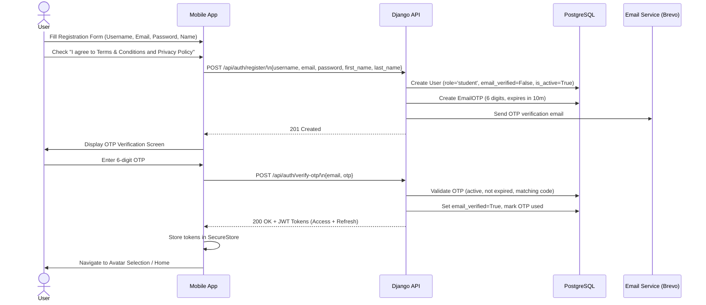
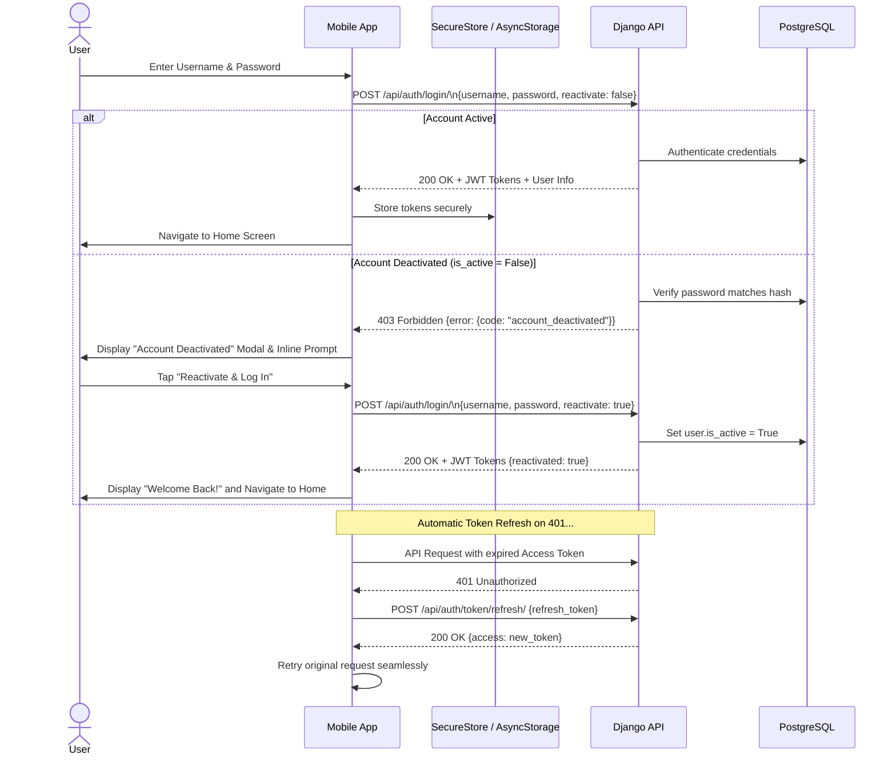
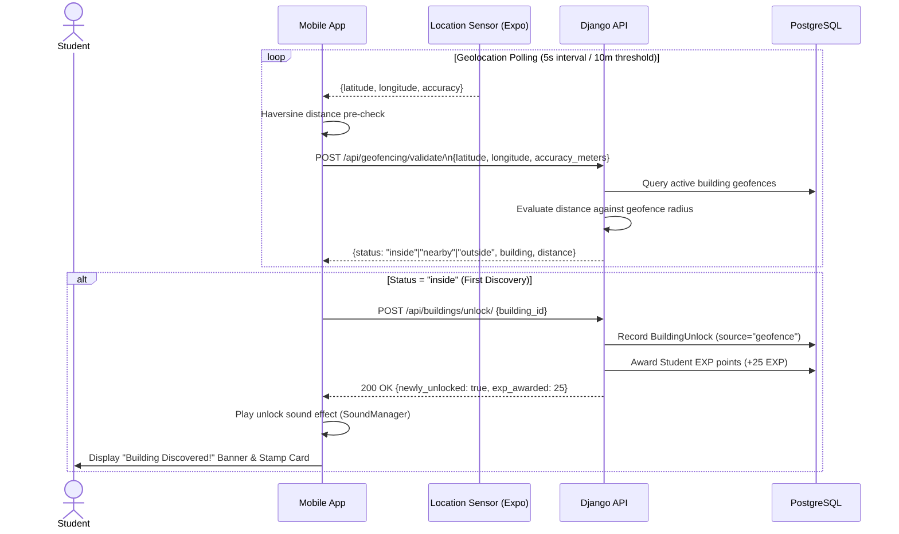
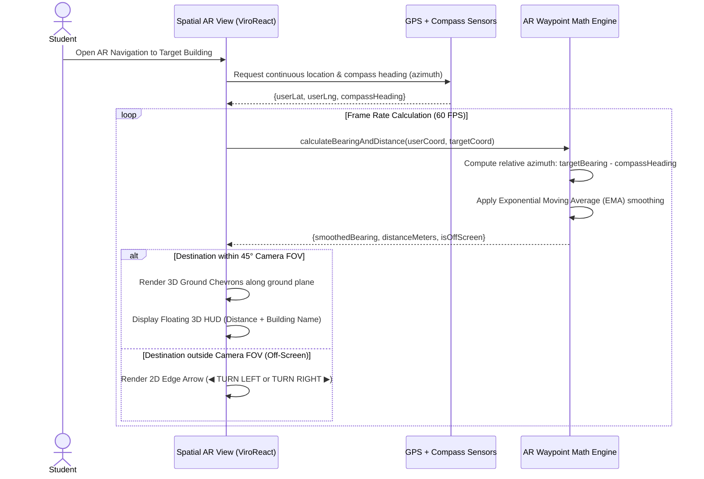
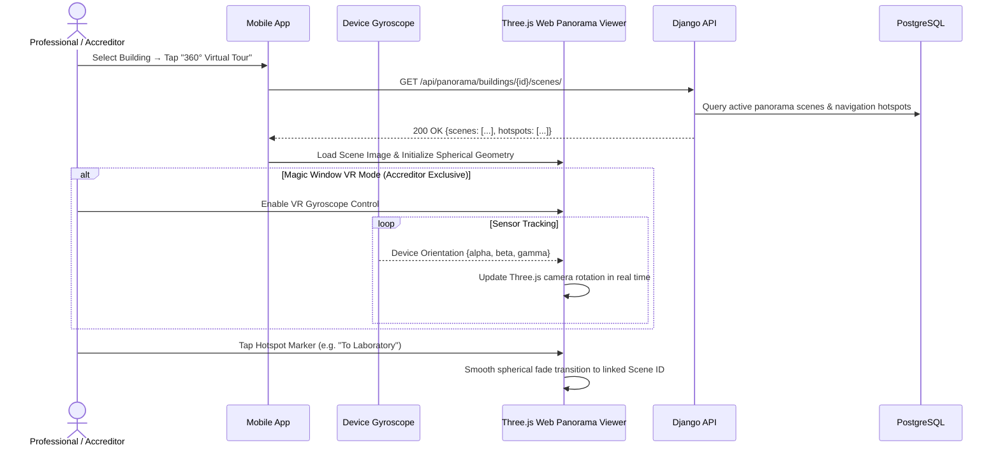
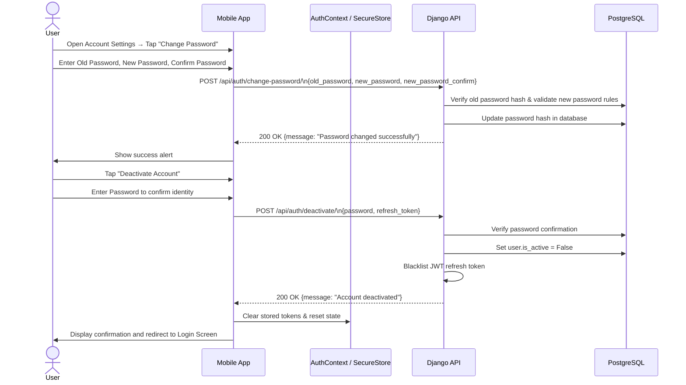
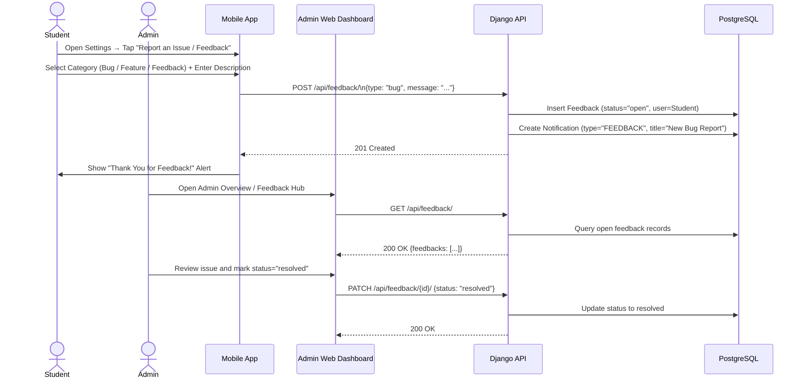
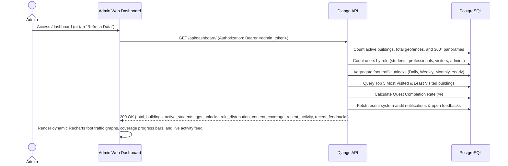

# ARQuest — Data Flow

> Last updated: 2026-09-01
> Comprehensive sequence diagrams covering all major user, admin, and sensor data flows.

---

## 1. User Registration, Terms Agreement & OTP Verification

---

## 2. Authentication, Token Rotation & Self-Service Reactivation

---

## 3. GPS Geofencing & Building Unlock Flow

---

## 4. Native Spatial AR Navigation & HUD Guidance

---

## 5. 360° Virtual Walkthrough & Magic Window VR Flow

---

## 6. Password Management & Self-Service Account Deactivation

---

## 7. In-App Feedback Submission & Admin Resolution

---

## 8. Real-Time Admin Dashboard Metrics Aggregation

