# ARQuest — Dynamic Behavioral Modeling & Sequence Diagrams

> **Research Paper Component:** Chapter 3 — Dynamic Modeling / UML Sequence Diagrams  
> **System:** ARQuest: A Sensor-Assisted Campus Exploration and Accreditation Support System  
> **Institution:** Western Mindanao State University (WMSU)

---

## 1. Sequence 1: User Registration, Legal Onboarding & OTP Email Verification

Models the onboarding lifecycle for new student accounts, enforcing legal compliance and cryptographic email identity verification before granting application access.

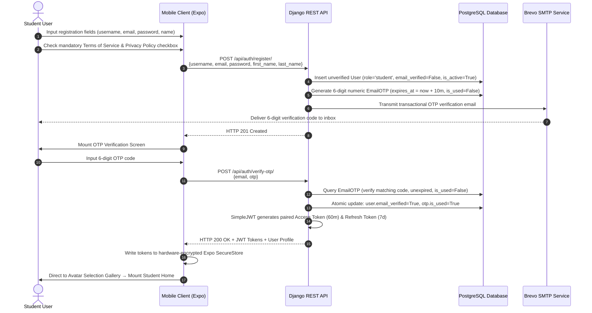
```mermaid
sequenceDiagram
    autonumber
    actor Student as Student User
    participant App as Mobile Client (Expo)
    participant API as Django REST API
    participant DB as PostgreSQL Database
    participant Email as Brevo SMTP Service

    Student->>App: Input registration fields (username, email, password, name)
    Student->>App: Check mandatory Terms of Service & Privacy Policy checkbox
    App->>API: POST /api/auth/register/<br/>{username, email, password, first_name, last_name}
    API->>DB: Insert unverified User (role='student', email_verified=False, is_active=True)
    API->>DB: Generate 6-digit numeric EmailOTP (expires_at = now + 10m, is_used=False)
    API->>Email: Transmit transactional OTP verification email
    Email-->>Student: Deliver 6-digit verification code to inbox
    API-->>App: HTTP 201 Created
    App->>Student: Mount OTP Verification Screen

    Student->>App: Input 6-digit OTP code
    App->>API: POST /api/auth/verify-otp/<br/>{email, otp}
    API->>DB: Query EmailOTP (verify matching code, unexpired, is_used=False)
    API->>DB: Atomic update: user.email_verified=True, otp.is_used=True
    API->>API: SimpleJWT generates paired Access Token (60m) & Refresh Token (7d)
    API-->>App: HTTP 200 OK + JWT Tokens + User Profile
    App->>App: Write tokens to hardware-encrypted Expo SecureStore
    App->>Student: Direct to Avatar Selection Gallery → Mount Student Home
```

---

## 2. Sequence 2: Authentication, Silent Token Rotation & Self-Service Reactivation

Illustrates credential validation, automatic silent token rotation via Axios interceptors, and self-service account reactivation for previously soft-deactivated accounts.

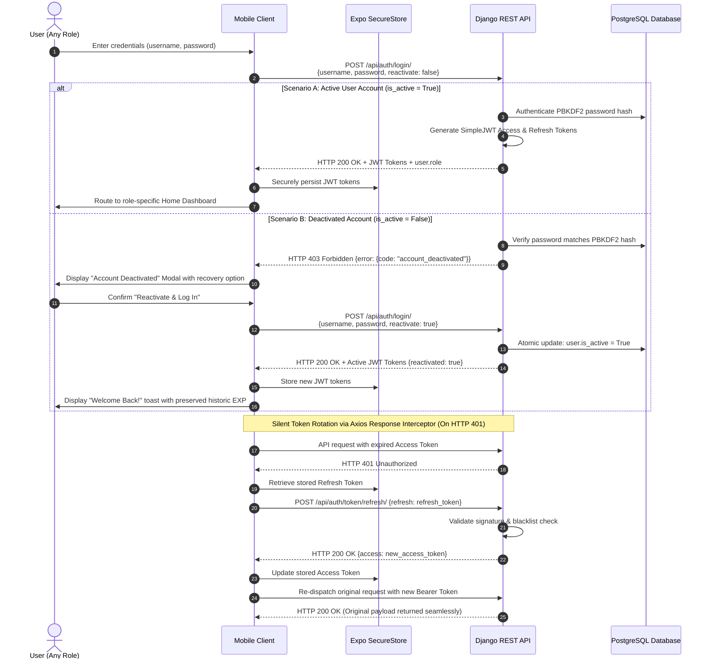
```mermaid
sequenceDiagram
    autonumber
    actor User as User (Any Role)
    participant App as Mobile Client
    participant SecureStore as Expo SecureStore
    participant API as Django REST API
    participant DB as PostgreSQL Database

    User->>App: Enter credentials (username, password)
    App->>API: POST /api/auth/login/<br/>{username, password, reactivate: false}

    alt Scenario A: Active User Account (is_active = True)
        API->>DB: Authenticate PBKDF2 password hash
        API->>API: Generate SimpleJWT Access & Refresh Tokens
        API-->>App: HTTP 200 OK + JWT Tokens + user.role
        App->>SecureStore: Securely persist JWT tokens
        App->>User: Route to role-specific Home Dashboard
    else Scenario B: Deactivated Account (is_active = False)
        API->>DB: Verify password matches PBKDF2 hash
        API-->>App: HTTP 403 Forbidden {error: {code: "account_deactivated"}}
        App->>User: Display "Account Deactivated" Modal with recovery option
        User->>App: Confirm "Reactivate & Log In"
        App->>API: POST /api/auth/login/<br/>{username, password, reactivate: true}
        API->>DB: Atomic update: user.is_active = True
        API-->>App: HTTP 200 OK + Active JWT Tokens {reactivated: true}
        App->>SecureStore: Store new JWT tokens
        App->>User: Display "Welcome Back!" toast with preserved historic EXP
    end

    Note over App,API: Silent Token Rotation via Axios Response Interceptor (On HTTP 401)
    App->>API: API request with expired Access Token
    API-->>App: HTTP 401 Unauthorized
    App->>SecureStore: Retrieve stored Refresh Token
    App->>API: POST /api/auth/token/refresh/ {refresh: refresh_token}
    API->>API: Validate signature & blacklist check
    API-->>App: HTTP 200 OK {access: new_access_token}
    App->>SecureStore: Update stored Access Token
    App->>API: Re-dispatch original request with new Bearer Token
    API-->>App: HTTP 200 OK (Original payload returned seamlessly)
```

---

## 3. Sequence 3: Two-Stage GPS Geofencing & Building Discovery Transaction

Models the location-aware discovery engine, showing the two-stage hybrid geofencing architecture that cuts mobile cellular traffic by over 95% while preserving server-side authority.

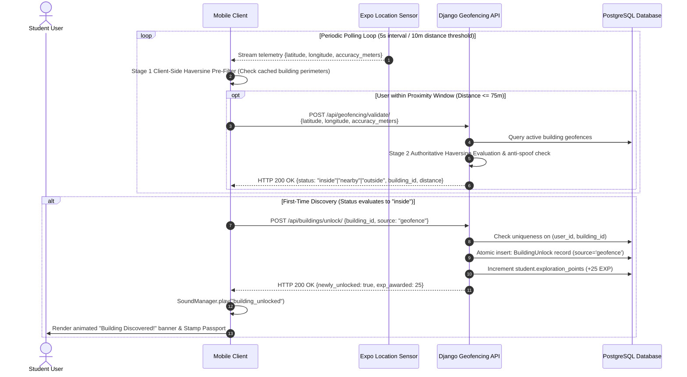
```mermaid
sequenceDiagram
    autonumber
    actor Student as Student User
    participant App as Mobile Client
    participant GPS as Expo Location Sensor
    participant API as Django Geofencing API
    participant DB as PostgreSQL Database

    loop Periodic Polling Loop (5s interval / 10m distance threshold)
        GPS-->>App: Stream telemetry {latitude, longitude, accuracy_meters}
        App->>App: Stage 1 Client-Side Haversine Pre-Filter (Check cached building perimeters)
        
        opt User within Proximity Window (Distance <= 75m)
            App->>API: POST /api/geofencing/validate/<br/>{latitude, longitude, accuracy_meters}
            API->>DB: Query active building geofences
            API->>API: Stage 2 Authoritative Haversine Evaluation & anti-spoof check
            API-->>App: HTTP 200 OK {status: "inside"|"nearby"|"outside", building_id, distance}
        end
    end

    alt First-Time Discovery (Status evaluates to "inside")
        App->>API: POST /api/buildings/unlock/ {building_id, source: "geofence"}
        API->>DB: Check uniqueness on (user_id, building_id)
        API->>DB: Atomic insert: BuildingUnlock record (source='geofence')
        API->>DB: Increment student.exploration_points (+25 EXP)
        API-->>App: HTTP 200 OK {newly_unlocked: true, exp_awarded: 25}
        App->>App: SoundManager.play("building_unlocked")
        App->>Student: Render animated "Building Discovered!" banner & Stamp Passport
    end
```

---

## 4. Sequence 4: Native Spatial AR Wayfinding & HUD Projection (60 FPS)

Details the 60 FPS spatial augmented reality rendering engine powered by ViroReact, sensor smoothing filters, and off-screen perimeter indicators.

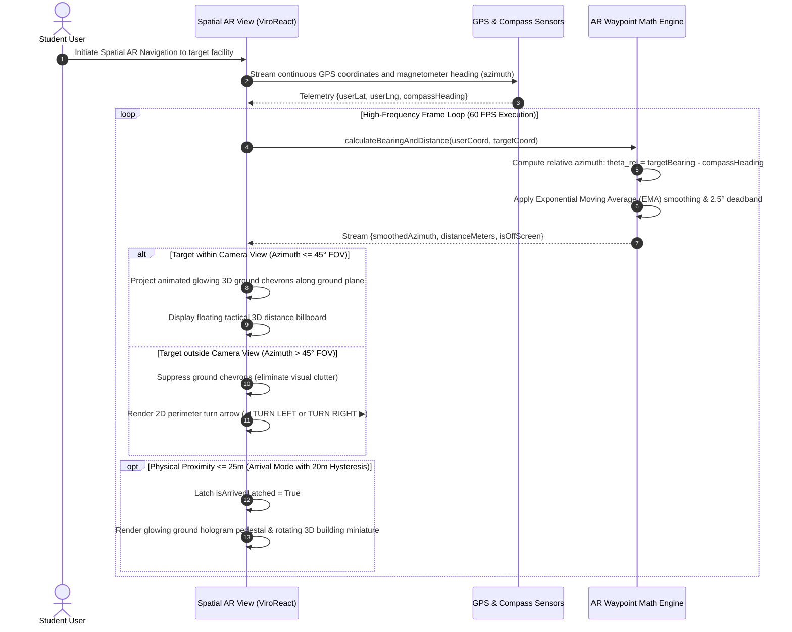
```mermaid
sequenceDiagram
    autonumber
    actor Student as Student User
    participant ARView as Spatial AR View (ViroReact)
    participant Sensors as GPS & Compass Sensors
    participant MathEngine as AR Waypoint Math Engine

    Student->>ARView: Initiate Spatial AR Navigation to target facility
    ARView->>Sensors: Stream continuous GPS coordinates and magnetometer heading (azimuth)
    Sensors-->>ARView: Telemetry {userLat, userLng, compassHeading}

    loop High-Frequency Frame Loop (60 FPS Execution)
        ARView->>MathEngine: calculateBearingAndDistance(userCoord, targetCoord)
        MathEngine->>MathEngine: Compute relative azimuth: theta_rel = targetBearing - compassHeading
        MathEngine->>MathEngine: Apply Exponential Moving Average (EMA) smoothing & 2.5° deadband
        MathEngine-->>ARView: Stream {smoothedAzimuth, distanceMeters, isOffScreen}

        alt Target within Camera View (Azimuth <= 45° FOV)
            ARView->>ARView: Project animated glowing 3D ground chevrons along ground plane
            ARView->>ARView: Display floating tactical 3D distance billboard
        else Target outside Camera View (Azimuth > 45° FOV)
            ARView->>ARView: Suppress ground chevrons (eliminate visual clutter)
            ARView->>ARView: Render 2D perimeter turn arrow (◀ TURN LEFT or TURN RIGHT ▶)
        end

        opt Physical Proximity <= 25m (Arrival Mode with 20m Hysteresis)
            ARView->>ARView: Latch isArrivedLatched = True
            ARView->>ARView: Render glowing ground hologram pedestal & rotating 3D building miniature
        end
    end
```

---

## 5. Sequence 5: 360° Virtual Walkthrough & Gyroscopic Magic Window VR

Illustrates the high-resolution indoor panoramic walkthrough and the gyroscope-assisted Magic Window VR inspection mode used by institutional accreditors.

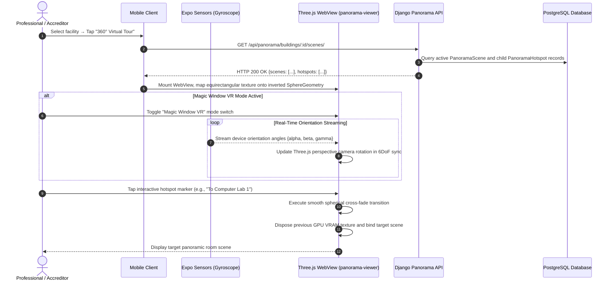
```mermaid
sequenceDiagram
    autonumber
    actor Prof as Professional / Accreditor
    participant App as Mobile Client
    participant Gyro as Expo Sensors (Gyroscope)
    participant ThreeJS as Three.js WebView (panorama-viewer)
    participant API as Django Panorama API
    participant DB as PostgreSQL Database

    Prof->>App: Select facility → Tap "360° Virtual Tour"
    App->>API: GET /api/panorama/buildings/:id/scenes/
    API->>DB: Query active PanoramaScene and child PanoramaHotspot records
    API-->>App: HTTP 200 OK {scenes: [...], hotspots: [...]}
    App->>ThreeJS: Mount WebView, map equirectangular texture onto inverted SphereGeometry

    alt Magic Window VR Mode Active
        Prof->>ThreeJS: Toggle "Magic Window VR" mode switch
        loop Real-Time Orientation Streaming
            Gyro-->>ThreeJS: Stream device orientation angles {alpha, beta, gamma}
            ThreeJS->>ThreeJS: Update Three.js perspective camera rotation in 6DoF sync
        end
    end

    Prof->>ThreeJS: Tap interactive hotspot marker (e.g., "To Computer Lab 1")
    ThreeJS->>ThreeJS: Execute smooth spherical cross-fade transition
    ThreeJS->>ThreeJS: Dispose previous GPU VRAM texture and bind target scene
    ThreeJS-->>Prof: Display target panoramic room scene
```

---

## 6. Sequence 6: Profile Governance, Password Mutation & Soft-Deactivation

Models the cryptographic password update flow and soft-deactivation transaction with SimpleJWT token blacklisting.

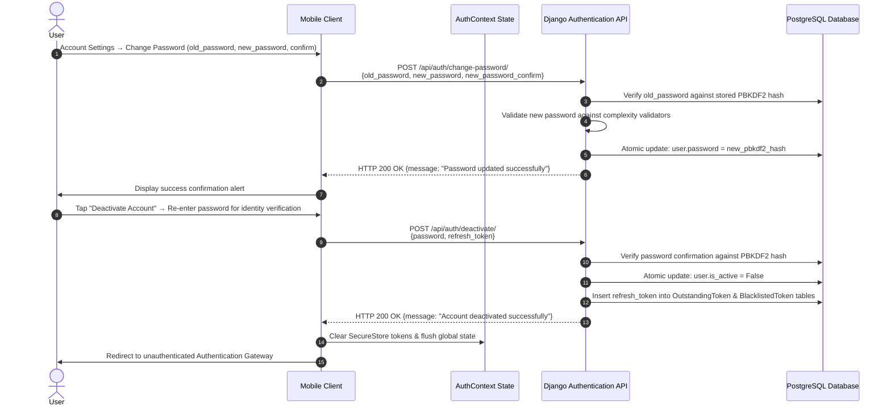
```mermaid
sequenceDiagram
    autonumber
    actor User as User
    participant App as Mobile Client
    participant AuthContext as AuthContext State
    participant API as Django Authentication API
    participant DB as PostgreSQL Database

    %% Password Change Sub-flow
    User->>App: Account Settings → Change Password (old_password, new_password, confirm)
    App->>API: POST /api/auth/change-password/<br/>{old_password, new_password, new_password_confirm}
    API->>DB: Verify old_password against stored PBKDF2 hash
    API->>API: Validate new password against complexity validators
    API->>DB: Atomic update: user.password = new_pbkdf2_hash
    API-->>App: HTTP 200 OK {message: "Password updated successfully"}
    App->>User: Display success confirmation alert

    %% Account Deactivation Sub-flow
    User->>App: Tap "Deactivate Account" → Re-enter password for identity verification
    App->>API: POST /api/auth/deactivate/<br/>{password, refresh_token}
    API->>DB: Verify password confirmation against PBKDF2 hash
    API->>DB: Atomic update: user.is_active = False
    API->>DB: Insert refresh_token into OutstandingToken & BlacklistedToken tables
    API-->>App: HTTP 200 OK {message: "Account deactivated successfully"}
    App->>AuthContext: Clear SecureStore tokens & flush global state
    App->>User: Redirect to unauthenticated Authentication Gateway
```

---

## 7. Sequence 7: In-App User Issue Reporting & Administrative Triage

Models mobile bug reporting, automated system notification creation, and administrative issue resolution on the Web Dashboard Feedback Radar.

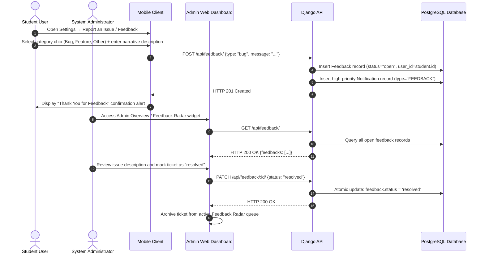
```mermaid
sequenceDiagram
    autonumber
    actor Student as Student User
    actor Admin as System Administrator
    participant App as Mobile Client
    participant Web as Admin Web Dashboard
    participant API as Django API
    participant DB as PostgreSQL Database

    Student->>App: Open Settings → Report an Issue / Feedback
    Student->>App: Select category chip (Bug, Feature, Other) + enter narrative description
    App->>API: POST /api/feedback/ {type: "bug", message: "..."}
    API->>DB: Insert Feedback record (status="open", user_id=student.id)
    API->>DB: Insert high-priority Notification record (type="FEEDBACK")
    API-->>App: HTTP 201 Created
    App->>Student: Display "Thank You for Feedback" confirmation alert

    Admin->>Web: Access Admin Overview / Feedback Radar widget
    Web->>API: GET /api/feedback/
    API->>DB: Query all open feedback records
    API-->>Web: HTTP 200 OK {feedbacks: [...]}
    Admin->>Web: Review issue description and mark ticket as "resolved"
    Web->>API: PATCH /api/feedback/:id/ {status: "resolved"}
    API->>DB: Atomic update: feedback.status = 'resolved'
    API-->>Web: HTTP 200 OK
    Web->>Web: Archive ticket from active Feedback Radar queue
```

---

## 8. Sequence 8: Real-Time Administrative Metrics Aggregation

Outlines the administrative data-harvesting pipeline that queries facility counts, user distributions, and multi-temporal foot traffic metrics.

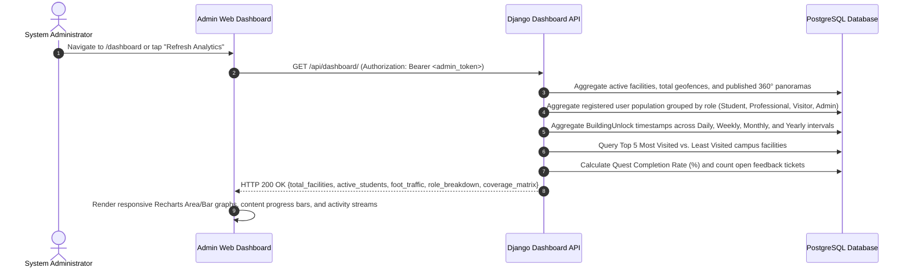
```mermaid
sequenceDiagram
    autonumber
    actor Admin as System Administrator
    participant Web as Admin Web Dashboard
    participant API as Django Dashboard API
    participant DB as PostgreSQL Database

    Admin->>Web: Navigate to /dashboard or tap "Refresh Analytics"
    Web->>API: GET /api/dashboard/ (Authorization: Bearer <admin_token>)
    API->>DB: Aggregate active facilities, total geofences, and published 360° panoramas
    API->>DB: Aggregate registered user population grouped by role (Student, Professional, Visitor, Admin)
    API->>DB: Aggregate BuildingUnlock timestamps across Daily, Weekly, Monthly, and Yearly intervals
    API->>DB: Query Top 5 Most Visited vs. Least Visited campus facilities
    API->>DB: Calculate Quest Completion Rate (%) and count open feedback tickets
    API-->>Web: HTTP 200 OK {total_facilities, active_students, foot_traffic, role_breakdown, coverage_matrix}
    Web->>Web: Render responsive Recharts Area/Bar graphs, content progress bars, and activity streams
```

---

## 9. Sequence 9: Self-Sovereign Campus Pedestrian Navigation (A* Routing Engine)

Details ARQuest's internal server-side campus pedestrian navigation engine, which operates independently of third-party routing APIs.

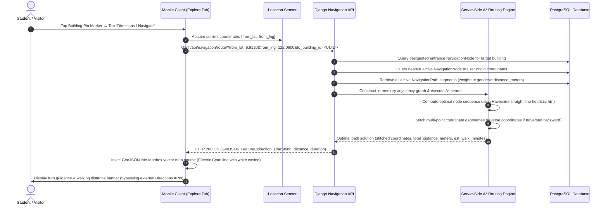
```mermaid
sequenceDiagram
    autonumber
    actor Student as Student / Visitor
    participant App as Mobile Client (Explore Tab)
    participant GPS as Location Sensor
    participant API as Django Navigation API
    participant Router as Server-Side A* Routing Engine
    participant DB as PostgreSQL Database

    Student->>App: Tap Building Pin Marker → Tap "Directions / Navigate"
    App->>GPS: Acquire current coordinates {from_lat, from_lng}
    App->>API: GET /api/navigation/route/?from_lat=6.9120&from_lng=122.0600&to_building_id=<UUID>
    
    API->>DB: Query designated entrance NavigationNode for target building
    API->>DB: Query nearest active NavigationNode to user origin coordinates
    API->>DB: Retrieve all active NavigationPath segments (weights = geodesic distance_meters)
    API->>Router: Construct in-memory adjacency graph & execute A* search
    Router->>Router: Compute optimal node sequence using Haversine straight-line heuristic h(n)
    Router->>Router: Stitch multi-point coordinate geometries (reverse coordinates if traversed backward)
    Router-->>API: Optimal path solution (stitched coordinates, total_distance_meters, est_walk_minutes)
    
    API-->>App: HTTP 200 OK (GeoJSON FeatureCollection: LineString, distance, duration)
    App->>App: Inject GeoJSON into Mapbox vector map source (Electric Cyan line with white casing)
    App->>Student: Display turn guidance & walking distance banner (bypassing external Directions APIs)
```

---

## 10. Sequence 10: Administrative Walking Network Authoring & Disconnected Way Pruning

Outlines the interactive GIS authoring tool and the self-healing topological validation system that prevents broken routes in the walking network graph.

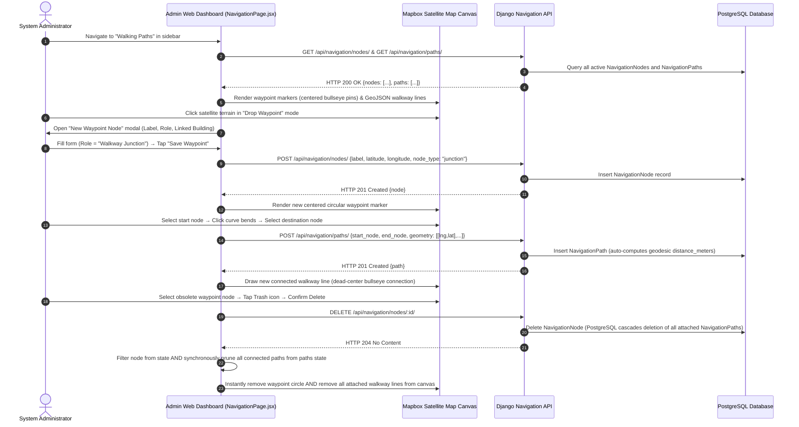
```mermaid
sequenceDiagram
    autonumber
    actor Admin as System Administrator
    participant Web as Admin Web Dashboard (NavigationPage.jsx)
    participant Map as Mapbox Satellite Map Canvas
    participant API as Django Navigation API
    participant DB as PostgreSQL Database

    Admin->>Web: Navigate to "Walking Paths" in sidebar
    Web->>API: GET /api/navigation/nodes/ & GET /api/navigation/paths/
    API->>DB: Query all active NavigationNodes and NavigationPaths
    API-->>Web: HTTP 200 OK {nodes: [...], paths: [...]}
    Web->>Map: Render waypoint markers (centered bullseye pins) & GeoJSON walkway lines

    %% Waypoint Creation
    Admin->>Map: Click satellite terrain in "Drop Waypoint" mode
    Web->>Admin: Open "New Waypoint Node" modal (Label, Role, Linked Building)
    Admin->>Web: Fill form (Role = "Walkway Junction") → Tap "Save Waypoint"
    Web->>API: POST /api/navigation/nodes/ {label, latitude, longitude, node_type: "junction"}
    API->>DB: Insert NavigationNode record
    API-->>Web: HTTP 201 Created {node}
    Web->>Map: Render new centered circular waypoint marker

    %% Pathway Drawing
    Admin->>Map: Select start node → Click curve bends → Select destination node
    Web->>API: POST /api/navigation/paths/ {start_node, end_node, geometry: [[lng,lat],...]}
    API->>DB: Insert NavigationPath (auto-computes geodesic distance_meters)
    API-->>Web: HTTP 201 Created {path}
    Web->>Map: Draw new connected walkway line (dead-center bullseye connection)

    %% Waypoint Deletion & Auto-Pruning
    Admin->>Map: Select obsolete waypoint node → Tap Trash icon → Confirm Delete
    Web->>API: DELETE /api/navigation/nodes/:id/
    API->>DB: Delete NavigationNode (PostgreSQL cascades deletion of all attached NavigationPaths)
    API-->>Web: HTTP 204 No Content
    Web->>Web: Filter node from state AND synchronously prune all connected paths from paths state
    Web->>Map: Instantly remove waypoint circle AND remove all attached walkway lines from canvas
```

---

## 11. Sequence 11: Bidirectional 3D Virtual Tour to 360° Panorama Spatial Linking

Models the seamless bidirectional spatial bridge linking first-person 3D building exploration with high-resolution 360° interior panoramic rooms.

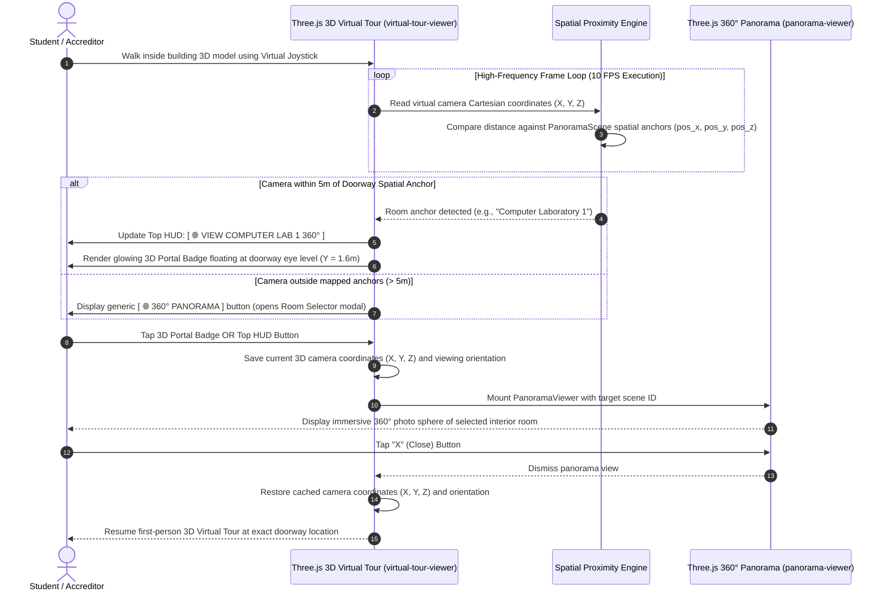
```mermaid
sequenceDiagram
    autonumber
    actor User as Student / Accreditor
    participant VT as Three.js 3D Virtual Tour (virtual-tour-viewer)
    participant Proximity as Spatial Proximity Engine
    participant Pano as Three.js 360° Panorama (panorama-viewer)

    User->>VT: Walk inside building 3D model using Virtual Joystick
    loop High-Frequency Frame Loop (10 FPS Execution)
        VT->>Proximity: Read virtual camera Cartesian coordinates (X, Y, Z)
        Proximity->>Proximity: Compare distance against PanoramaScene spatial anchors (pos_x, pos_y, pos_z)
    end

    alt Camera within 5m of Doorway Spatial Anchor
        Proximity-->>VT: Room anchor detected (e.g., "Computer Laboratory 1")
        VT->>User: Update Top HUD: [ 🌐 VIEW COMPUTER LAB 1 360° ]
        VT->>User: Render glowing 3D Portal Badge floating at doorway eye level (Y = 1.6m)
    else Camera outside mapped anchors (> 5m)
        VT->>User: Display generic [ 🌐 360° PANORAMA ] button (opens Room Selector modal)
    end

    User->>VT: Tap 3D Portal Badge OR Top HUD Button
    VT->>VT: Save current 3D camera coordinates (X, Y, Z) and viewing orientation
    VT->>Pano: Mount PanoramaViewer with target scene ID
    Pano-->>User: Display immersive 360° photo sphere of selected interior room

    User->>Pano: Tap "X" (Close) Button
    Pano-->>VT: Dismiss panorama view
    VT->>VT: Restore cached camera coordinates (X, Y, Z) and orientation
    VT-->>User: Resume first-person 3D Virtual Tour at exact doorway location
```

---

## 12. Methodological Narrative on Dynamic Modeling

The 11 sequence diagrams formalize the runtime messaging protocols across client presentation layers, device sensors, and backend business logic:
1. **Mathematical Precision**: Explicit algorithmic formulations (Haversine distance, Exponential Moving Average smoothing with $2.5^\circ$ deadband, and priority-queue $A^*$ graph search) guarantee that system behaviors are repeatable and academically defensible.
2. **Security & State Resilience**: The authentication and deactivation workflows enforce strict cryptographic integrity (PBKDF2 hashing, SimpleJWT blacklisting, and hardware-backed SecureStore persistence) while supporting user-friendly self-service reactivation.
3. **Data Integrity & Topological Soundness**: Administrative GIS workflows feature automated cascading deletions and synchronous client-side pruning, preventing broken route calculations across the WMSU campus.
