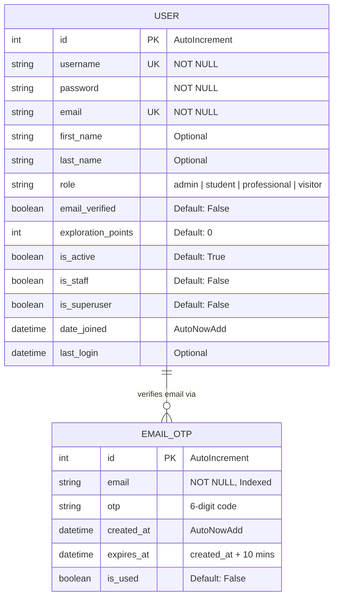
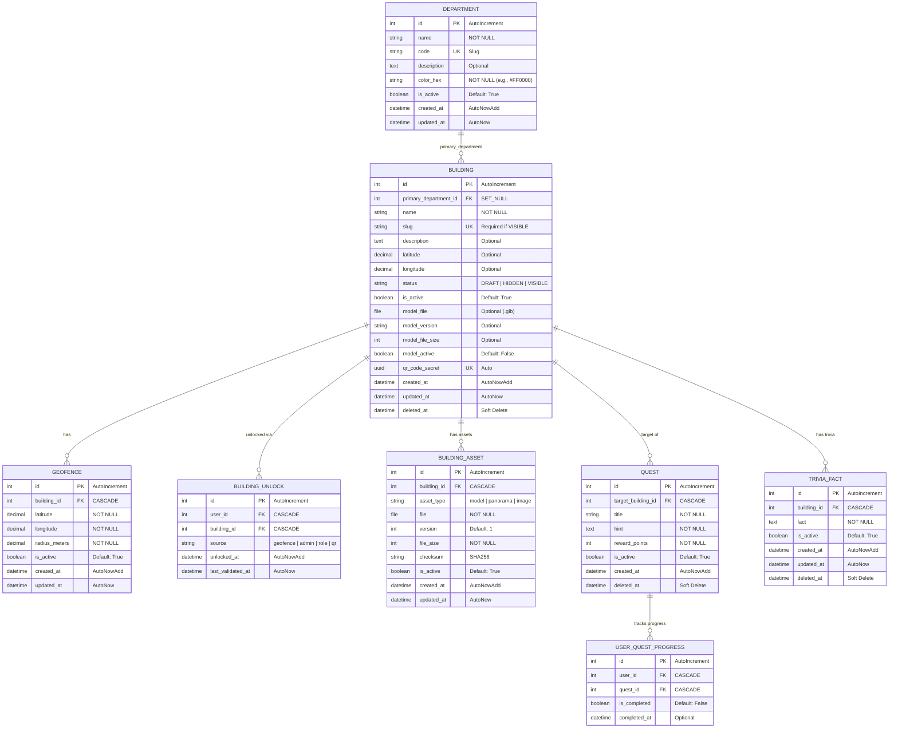
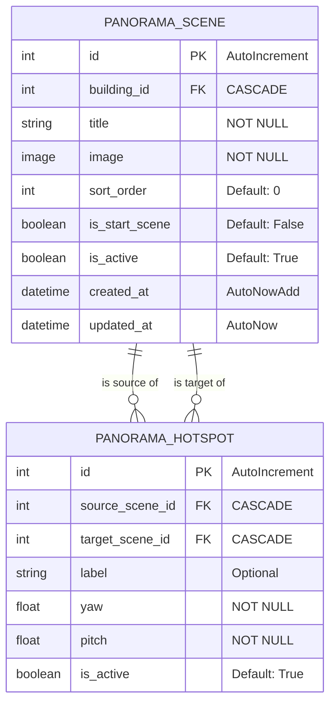
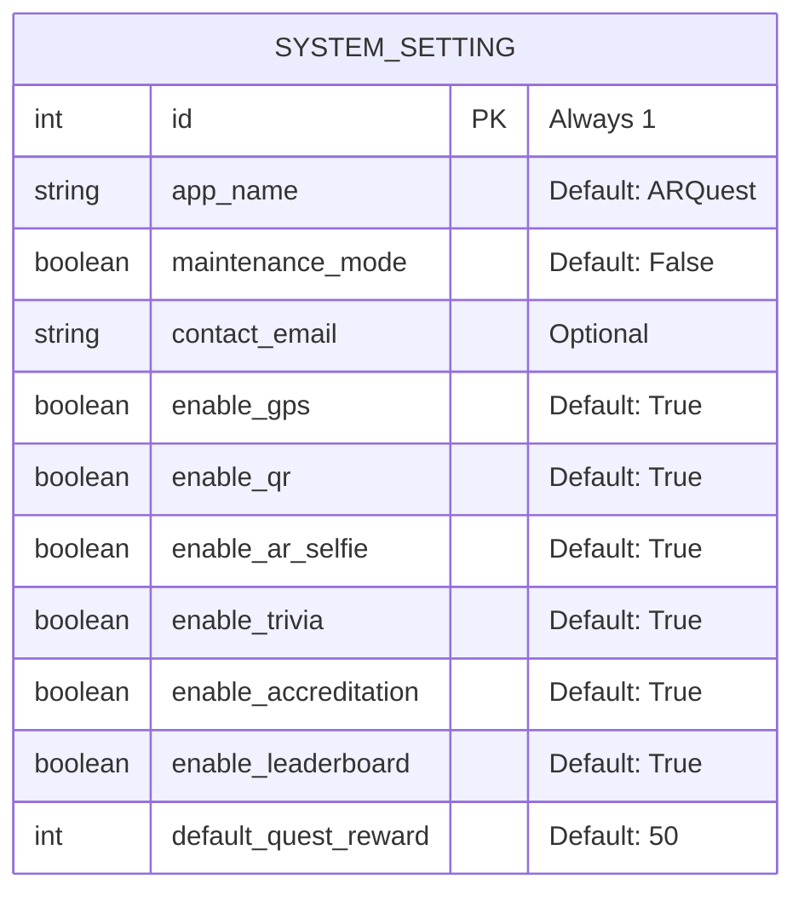

# ARQuest — ERD Model

> Last updated: 2026-06-22

This document provides the visual structural models for all Django applications in ARQuest.

## 1. Authentication App Model

## 2. Buildings & Gamification App Model

## 3. Panorama Walkthrough App Model

## 4. API & System Setting Model

