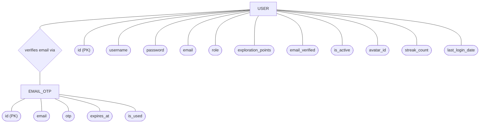
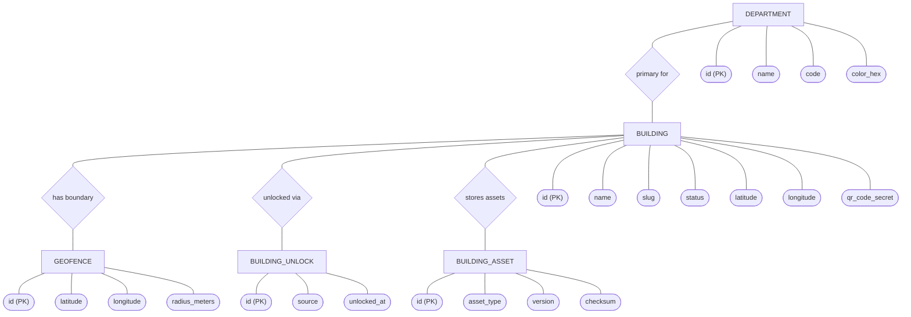
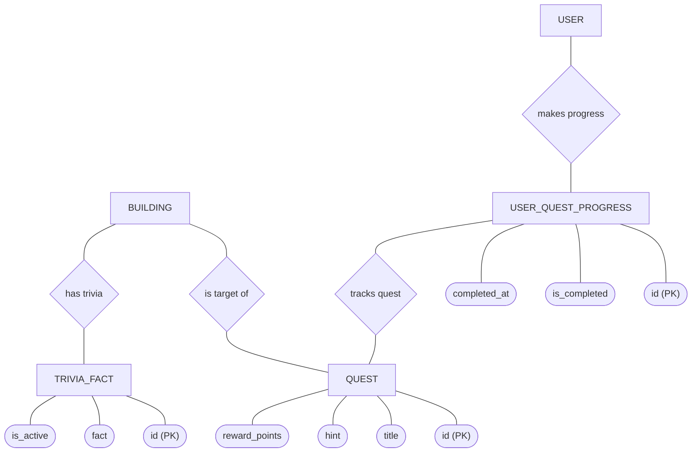
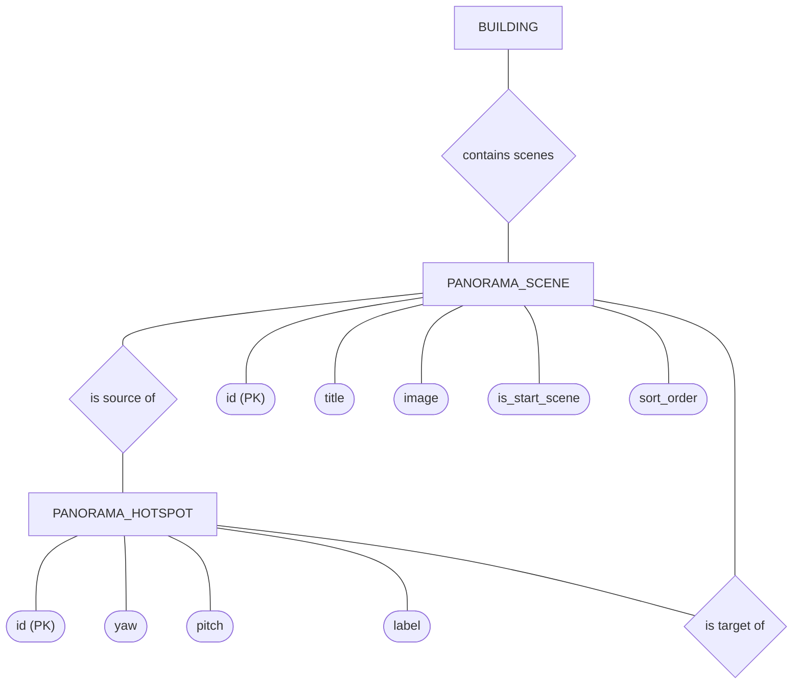
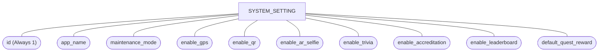

# ARQuest — Conceptual ERD Model (Chen's Notation)

> Last updated: 2026-06-22

This document illustrates the database schema using classic **Chen's Entity-Relationship notation**, where:
- **Rectangles** represent Entities (Tables)
- **Ovals** represent Attributes (Columns)
- **Diamonds** represent Relationships between Entities

To prevent the diagram from becoming an unreadable web, the models are grouped logically by domain.

---

## 1. Authentication Domain

---

## 2. Buildings & Geofencing Domain

---

## 3. Gamification Domain (Quests & Trivia)

---

## 4. Panorama Walkthrough Domain

---

## 5. API & System Setting Domain

