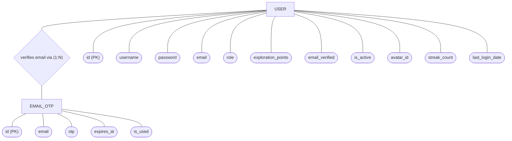
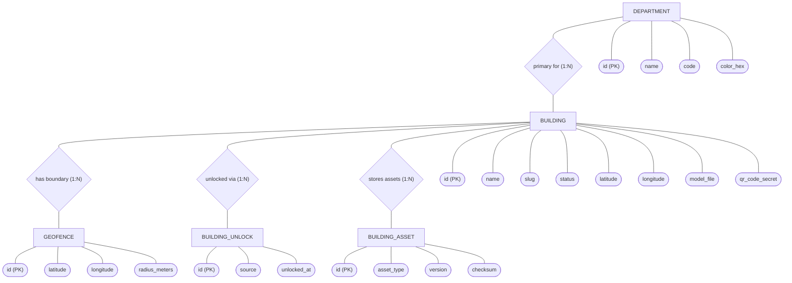
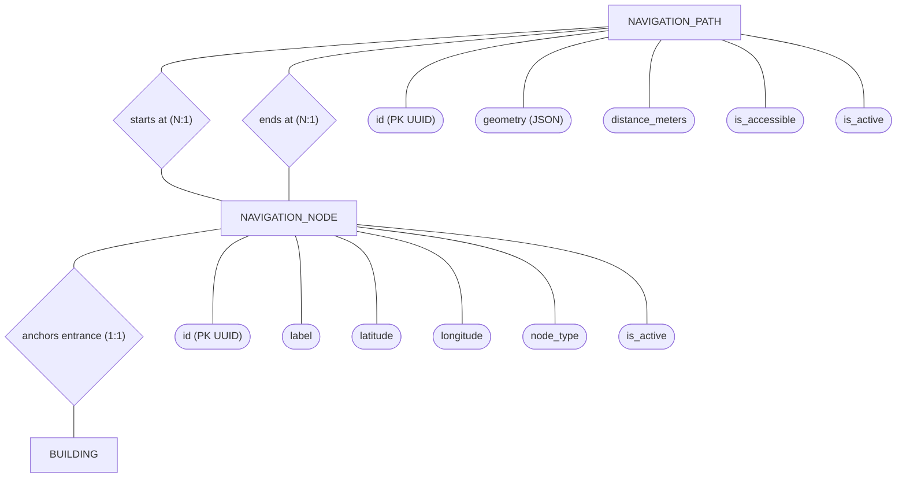
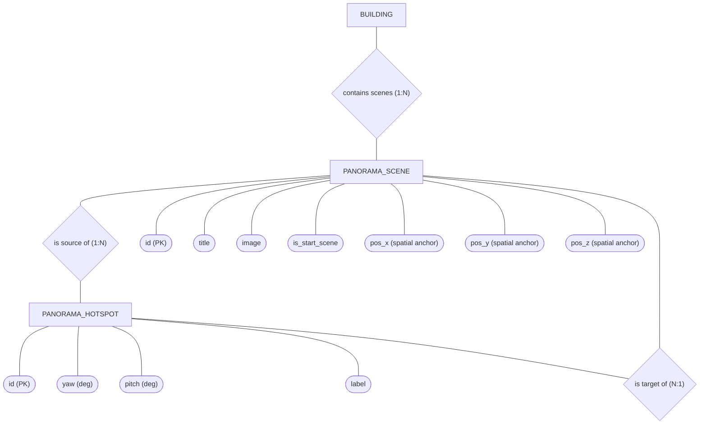
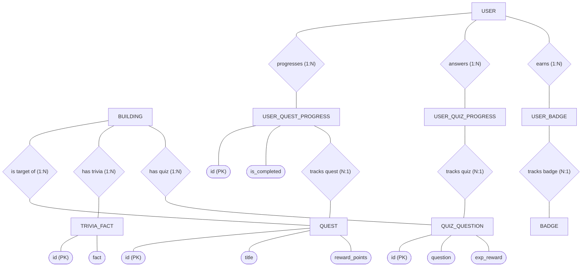
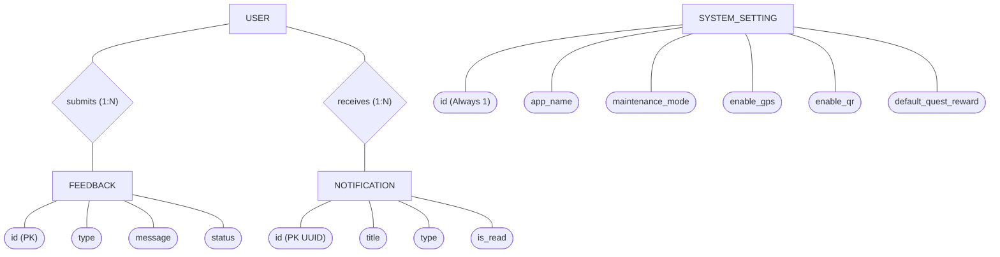

# ARQuest — Conceptual Entity Relationship Model (Chen's Notation)

> **Research Paper Component:** Chapter 3 — Database Design / Conceptual Data Model (Chen's Notation)  
> **System:** ARQuest: A Sensor-Assisted Campus Exploration and Accreditation Support System  
> **Institution:** Western Mindanao State University (WMSU)

---

## 1. Overview of Conceptual Data Modeling

The Conceptual Data Model formalizes the structural information requirements of **ARQuest** using classic **Chen's Entity-Relationship notation**:
- **Rectangles** represent independent and weak Entities (Information classes).
- **Ovals** represent descriptive Attributes (Columns and properties).
- **Diamonds** represent Relationships and associative actions binding entities.

To maintain clarity and prevent visual congestion in the research manuscript, the conceptual schema is modularized across six distinct functional domains.

---

## 2. Authentication & Identity Domain

This domain captures user identity, role classification, gamification totals, and single-use email verification tokens.

```mermaid
flowchart TD
    %% Entities
    USER["USER"]
    EMAIL_OTP["EMAIL_OTP"]

    %% Relationship
    verifies{"verifies email via (1:N)"}

    %% Attributes for USER
    u_id(["id (PK)"])
    u_user(["username"])
    u_pass(["password"])
    u_email(["email"])
    u_role(["role"])
    u_pts(["exploration_points"])
    u_ver(["email_verified"])
    u_act(["is_active"])
    u_av(["avatar_id"])
    u_strk(["streak_count"])
    u_ld(["last_login_date"])
    
    USER --- u_id
    USER --- u_user
    USER --- u_pass
    USER --- u_email
    USER --- u_role
    USER --- u_pts
    USER --- u_ver
    USER --- u_act
    USER --- u_av
    USER --- u_strk
    USER --- u_ld

    %% Attributes for EMAIL_OTP
    o_id(["id (PK)"])
    o_email(["email"])
    o_otp(["otp"])
    o_exp(["expires_at"])
    o_used(["is_used"])
    
    EMAIL_OTP --- o_id
    EMAIL_OTP --- o_email
    EMAIL_OTP --- o_otp
    EMAIL_OTP --- o_exp
    EMAIL_OTP --- o_used

    %% Connectivity
    USER --- verifies
    verifies --- EMAIL_OTP
```

---

## 3. Campus Facilities & Geofencing Domain

Governs the physical digital twins of campus buildings, college groupings, circular GPS geofence perimeters, verified user unlock milestones, and media asset versioning.

```mermaid
flowchart TD
    %% Entities
    DEPT["DEPARTMENT"]
    BLDG["BUILDING"]
    GEO["GEOFENCE"]
    UNLOCK["BUILDING_UNLOCK"]
    ASSET["BUILDING_ASSET"]

    %% Relationships
    primary{"primary for (1:N)"}
    boundary{"has boundary (1:N)"}
    access{"unlocked via (1:N)"}
    holds{"stores assets (1:N)"}

    %% Attributes - Department
    d_id(["id (PK)"])
    d_name(["name"])
    d_code(["code"])
    d_col(["color_hex"])
    
    DEPT --- d_id
    DEPT --- d_name
    DEPT --- d_code
    DEPT --- d_col

    %% Attributes - Building
    b_id(["id (PK)"])
    b_name(["name"])
    b_slug(["slug"])
    b_stat(["status"])
    b_lat(["latitude"])
    b_lng(["longitude"])
    b_mod(["model_file"])
    b_qr(["qr_code_secret"])
    
    BLDG --- b_id
    BLDG --- b_name
    BLDG --- b_slug
    BLDG --- b_stat
    BLDG --- b_lat
    BLDG --- b_lng
    BLDG --- b_mod
    BLDG --- b_qr

    %% Attributes - Geofence
    g_id(["id (PK)"])
    g_lat(["latitude"])
    g_lng(["longitude"])
    g_rad(["radius_meters"])
    
    GEO --- g_id
    GEO --- g_lat
    GEO --- g_lng
    GEO --- g_rad

    %% Attributes - Unlock
    u_id(["id (PK)"])
    u_src(["source"])
    u_at(["unlocked_at"])
    
    UNLOCK --- u_id
    UNLOCK --- u_src
    UNLOCK --- u_at

    %% Attributes - Asset
    a_id(["id (PK)"])
    a_type(["asset_type"])
    a_ver(["version"])
    a_chk(["checksum"])
    
    ASSET --- a_id
    ASSET --- a_type
    ASSET --- a_ver
    ASSET --- a_chk

    %% Structure
    DEPT --- primary --- BLDG
    BLDG --- boundary --- GEO
    BLDG --- access --- UNLOCK
    BLDG --- holds --- ASSET
```

---

## 4. Campus Pedestrian Navigation Domain

Models the topological walking network, supporting server-side $A^*$ heuristic pathfinding over verified WMSU campus sidewalks.

```mermaid
flowchart TD
    %% Entities
    BLDG["BUILDING"]
    NODE["NAVIGATION_NODE"]
    PATH["NAVIGATION_PATH"]

    %% Relationships
    entrance{"anchors entrance (1:1)"}
    start_pt{"starts at (N:1)"}
    end_pt{"ends at (N:1)"}

    %% Attributes for NAVIGATION_NODE
    nn_id(["id (PK UUID)"])
    nn_lbl(["label"])
    nn_lat(["latitude"])
    nn_lng(["longitude"])
    nn_type(["node_type"])
    nn_act(["is_active"])

    NODE --- nn_id
    NODE --- nn_lbl
    NODE --- nn_lat
    NODE --- nn_lng
    NODE --- nn_type
    NODE --- nn_act

    %% Attributes for NAVIGATION_PATH
    np_id(["id (PK UUID)"])
    np_geo(["geometry (JSON)"])
    np_dist(["distance_meters"])
    np_acc(["is_accessible"])
    np_act(["is_active"])

    PATH --- np_id
    PATH --- np_geo
    PATH --- np_dist
    PATH --- np_acc
    PATH --- np_act

    %% Connections
    NODE --- entrance --- BLDG
    PATH --- start_pt --- NODE
    PATH --- end_pt --- NODE
```

---

## 5. Panorama Walkthrough & Spatial Linking Domain

Encapsulates equirectangular indoor photo spheres, interactive room-to-room navigation hotspots, and 3D Cartesian doorway spatial anchors $(X, Y, Z)$ bridging 3D models with panoramic scenes.

```mermaid
flowchart TD
    %% External Entity
    BLDG["BUILDING"]

    %% Entities
    SCENE["PANORAMA_SCENE"]
    HOTSPOT["PANORAMA_HOTSPOT"]

    %% Relationships
    contains{"contains scenes (1:N)"}
    source{"is source of (1:N)"}
    target{"is target of (N:1)"}

    %% Attributes - Scene
    s_id(["id (PK)"])
    s_title(["title"])
    s_img(["image"])
    s_start(["is_start_scene"])
    s_px(["pos_x (spatial anchor)"])
    s_py(["pos_y (spatial anchor)"])
    s_pz(["pos_z (spatial anchor)"])

    SCENE --- s_id
    SCENE --- s_title
    SCENE --- s_img
    SCENE --- s_start
    SCENE --- s_px
    SCENE --- s_py
    SCENE --- s_pz

    %% Attributes - Hotspot
    h_id(["id (PK)"])
    h_yaw(["yaw (deg)"])
    h_pitch(["pitch (deg)"])
    h_lbl(["label"])

    HOTSPOT --- h_id
    HOTSPOT --- h_yaw
    HOTSPOT --- h_pitch
    HOTSPOT --- h_lbl

    %% Structure
    BLDG --- contains --- SCENE
    SCENE --- source --- HOTSPOT
    HOTSPOT --- target --- SCENE
```

---

## 6. Gamification & Academic Assessment Domain

Tracks student motivation mechanics: building discovery quests, educational trivia facts, facility quizzes, and milestone achievement badges.

```mermaid
flowchart TD
    %% External Entities
    USER["USER"]
    BLDG["BUILDING"]

    %% Entities
    QUEST["QUEST"]
    PROG["USER_QUEST_PROGRESS"]
    TRIVIA["TRIVIA_FACT"]
    QUIZ["QUIZ_QUESTION"]
    Q_PROG["USER_QUIZ_PROGRESS"]
    BADGE["BADGE"]
    B_PROG["USER_BADGE"]

    %% Relationships
    target{"is target of (1:N)"}
    hosts{"has trivia (1:N)"}
    hosts_quiz{"has quiz (1:N)"}
    makes{"progresses (1:N)"}
    tracks{"tracks quest (N:1)"}
    makes_q{"answers (1:N)"}
    tracks_q{"tracks quiz (N:1)"}
    earns{"earns (1:N)"}
    tracks_b{"tracks badge (N:1)"}

    %% Attributes - Quest
    q_id(["id (PK)"])
    q_title(["title"])
    q_pts(["reward_points"])
    QUEST --- q_id
    QUEST --- q_title
    QUEST --- q_pts

    %% Attributes - Progress
    p_id(["id (PK)"])
    p_comp(["is_completed"])
    PROG --- p_id
    PROG --- p_comp

    %% Attributes - Trivia
    t_id(["id (PK)"])
    t_fact(["fact"])
    TRIVIA --- t_id
    TRIVIA --- t_fact

    %% Attributes - Quiz
    qz_id(["id (PK)"])
    qz_q(["question"])
    qz_exp(["exp_reward"])
    QUIZ --- qz_id
    QUIZ --- qz_q
    QUIZ --- qz_exp

    %% Structure
    BLDG --- target --- QUEST
    BLDG --- hosts --- TRIVIA
    BLDG --- hosts_quiz --- QUIZ
    USER --- makes --- PROG
    PROG --- tracks --- QUEST
    USER --- makes_q --- Q_PROG
    Q_PROG --- tracks_q --- QUIZ
    USER --- earns --- B_PROG
    B_PROG --- tracks_b --- BADGE
```

---

## 7. System Settings & Operational Governance Domain

Provides singleton platform configuration management, mobile feedback logging, and administrative audit streams.

```mermaid
flowchart TD
    %% External Entity
    USER["USER"]

    %% Entities
    SYS["SYSTEM_SETTING"]
    FDBK["FEEDBACK"]
    NOTIF["NOTIFICATION"]

    %% Relationships
    submits{"submits (1:N)"}
    receives{"receives (1:N)"}

    %% Attributes - System Setting
    s_id(["id (Always 1)"])
    s_app(["app_name"])
    s_maint(["maintenance_mode"])
    s_gps(["enable_gps"])
    s_qr(["enable_qr"])
    s_pts(["default_quest_reward"])

    SYS --- s_id
    SYS --- s_app
    SYS --- s_maint
    SYS --- s_gps
    SYS --- s_qr
    SYS --- s_pts

    %% Attributes - Feedback
    f_id(["id (PK)"])
    f_type(["type"])
    f_msg(["message"])
    f_stat(["status"])

    FDBK --- f_id
    FDBK --- f_type
    FDBK --- f_msg
    FDBK --- f_stat

    %% Attributes - Notification
    n_id(["id (PK UUID)"])
    n_title(["title"])
    n_type(["type"])
    n_read(["is_read"])

    NOTIF --- n_id
    NOTIF --- n_title
    NOTIF --- n_type
    NOTIF --- n_read

    %% Structure
    USER --- submits --- FDBK
    USER --- receives --- NOTIF
```

---

## 8. Methodological Discussion

The Conceptual ERD model translates the business rules of the ARQuest digital twin into formal semantic primitives:
1. **Normalization & Cardinality Integrity**: Entities adhere to 3rd Normal Form (3NF). Many-to-Many associations (e.g., users to quests, users to quizzes, and users to badges) are resolved through associative entities (`USER_QUEST_PROGRESS`, `USER_QUIZ_PROGRESS`, `USER_BADGE`) tracking completion states and audit timestamps.
2. **Topological Graph Representation**: Pedestrian pathways are decoupled into discrete geometric vertices (`NAVIGATION_NODE`) and directed/bidirectional edges (`NAVIGATION_PATH`), enabling fast graph parsing for Dijkstra and $A^*$ algorithms.
3. **Cross-Dimensional Spatial Anchoring**: The integration of Cartesian coordinates (`pos_x`, `pos_y`, `pos_z`) within `PANORAMA_SCENE` establishes a formal geometric relationship connecting discrete 2D equirectangular photo spheres to continuous 3D digital twin spaces.
