# ARQuest — Entity Relationship Diagram (ERD)

> Last updated: 2026-09-01
> Reflects all Django models across `authentication`, `buildings`, `panorama`, `geofencing`, and `api` apps.

---

## ERD Diagram

```mermaid
erDiagram

    USER {
        int         id                  PK
        string      username
        string      password
        string      email
        string      first_name
        string      last_name
        string      role                "admin | student | professional | visitor"
        boolean     email_verified
        int         exploration_points
        boolean     is_active
        boolean     is_staff
        boolean     is_superuser
        string      avatar_id           "e.g. explorer_1"
        int         streak_count
        date        last_login_date
        datetime    date_joined
        datetime    last_login
    }

    EMAIL_OTP {
        int         id          PK
        string      email
        string      otp         "6-digit code"
        datetime    created_at
        datetime    expires_at  "10 min from created_at"
        boolean     is_used
    }

    DEPARTMENT {
        uuid        id          PK
        string      name
        string      code        "unique slug"
        text        description
        string      color_hex   "hex color for map pins"
        boolean     is_active
        datetime    created_at
        datetime    updated_at
    }

    BUILDING {
        uuid        id                  PK
        string      name
        string      slug                "unique; required for publish"
        text        description
        decimal     latitude            "nullable; required for publish"
        decimal     longitude           "nullable; required for publish"
        string      status              "DRAFT | HIDDEN | VISIBLE | MAINTENANCE"
        boolean     is_active
        file        model_file          "path to .glb/.gltf"
        string      model_version
        int         model_file_size     "bytes"
        boolean     model_active
        image       image               "Auto-generated 2D thumbnail"
        json        hotspots            "[]"
        uuid        qr_code_secret      "unique; for QR unlock"
        datetime    created_at
        datetime    updated_at
        datetime    deleted_at          "null = not deleted"
    }

    GEOFENCE {
        uuid        id              PK
        uuid        building_id     FK
        decimal     latitude
        decimal     longitude
        decimal     radius_meters
        boolean     is_active
        datetime    created_at
        datetime    updated_at
    }

    BUILDING_UNLOCK {
        uuid        id                  PK
        int         user_id             FK
        uuid        building_id         FK
        string      source              "geofence | admin | role_access | qr"
        datetime    unlocked_at
        datetime    last_validated_at
    }

    BUILDING_ASSET {
        uuid        id          PK
        uuid        building_id FK
        string      asset_type  "model | panorama | image"
        file        file
        int         version
        int         file_size   "bytes"
        string      checksum    "SHA256 for cache invalidation"
        boolean     is_active
        datetime    created_at
        datetime    updated_at
    }

    QUEST {
        uuid        id                  PK
        uuid        target_building_id  FK
        string      title
        text        hint
        int         reward_points
        boolean     is_active
        datetime    expires_at          "nullable"
        datetime    created_at
        datetime    deleted_at          "null = not deleted"
    }

    USER_QUEST_PROGRESS {
        uuid        id              PK
        int         user_id         FK
        uuid        quest_id        FK
        boolean     is_completed
        datetime    completed_at    "nullable"
    }

    TRIVIA_FACT {
        uuid        id          PK
        uuid        building_id FK
        text        fact
        boolean     is_active
        datetime    created_at
        datetime    updated_at
        datetime    deleted_at  "null = not deleted"
    }

    QUIZ_QUESTION {
        uuid        id              PK
        uuid        building_id     FK
        string      question
        string      option_a
        string      option_b
        string      option_c
        string      option_d
        string      correct_option  "A | B | C | D"
        int         exp_reward
        boolean     is_active
        datetime    created_at
    }

    USER_QUIZ_PROGRESS {
        int         id              PK
        int         user_id         FK
        uuid        question_id     FK
        boolean     is_correct
        datetime    answered_at
    }

    BADGE {
        uuid        id          PK
        string      name
        text        description
        string      icon
        string      color_hex
        string      trigger
        boolean     is_active
        datetime    created_at
    }

    USER_BADGE {
        uuid        id          PK
        int         user_id     FK
        uuid        badge_id    FK
        datetime    earned_at
    }

    PANORAMA_SCENE {
        int         id              PK
        uuid        building_id     FK
        string      title
        image       image           "upload_to: panoramas/"
        int         sort_order
        boolean     is_start_scene  "one per building"
        boolean     is_active
        datetime    created_at
        datetime    updated_at
    }

    PANORAMA_HOTSPOT {
        int         id              PK
        int         source_scene_id FK
        int         target_scene_id FK
        string      label
        float       yaw             "horizontal rotation in degrees"
        float       pitch           "vertical rotation in degrees"
        boolean     is_active
    }

    SYSTEM_SETTING {
        int         id                      PK  "always 1 singleton"
        string      app_name
        boolean     maintenance_mode
        string      contact_email
        boolean     enable_gps
        boolean     enable_qr
        boolean     enable_ar_selfie
        boolean     enable_trivia
        boolean     enable_accreditation
        boolean     enable_leaderboard
        int         default_quest_reward
    }

    FEEDBACK {
        int         id          PK
        int         user_id     FK "nullable"
        string      type        "bug | feature | other"
        text        message
        string      status      "open | in_progress | resolved"
        datetime    created_at
    }

    NOTIFICATION {
        uuid        id          PK
        int         recipient_id FK "nullable"
        string      title
        text        message
        string      type        "SYSTEM | PROFESSIONAL | BUILDING | FEEDBACK"
        boolean     is_read
        datetime    created_at
    }

    USER                ||--o{ EMAIL_OTP              : "verifies email via"
    USER                ||--o{ BUILDING_UNLOCK        : "unlocks"
    USER                ||--o{ USER_QUEST_PROGRESS    : "tracks progress via"
    USER                ||--o{ USER_QUIZ_PROGRESS     : "answers"
    USER                ||--o{ USER_BADGE             : "earns"
    USER                ||--o{ FEEDBACK               : "submits"
    USER                ||--o{ NOTIFICATION           : "receives"

    DEPARTMENT          ||--o{ BUILDING               : "is primary_department of"
    DEPARTMENT          }o--o{ BUILDING               : "is associated with M2M"

    BUILDING            ||--o{ GEOFENCE               : "has"
    BUILDING            ||--o{ BUILDING_UNLOCK        : "is unlocked via"
    BUILDING            ||--o{ BUILDING_ASSET         : "stores assets via"
    BUILDING            ||--o{ QUEST                  : "is target of"
    BUILDING            ||--o{ TRIVIA_FACT            : "has"
    BUILDING            ||--o{ QUIZ_QUESTION          : "has"
    BUILDING            ||--o{ PANORAMA_SCENE         : "has"

    PANORAMA_SCENE      ||--o{ PANORAMA_HOTSPOT       : "is source of"
    PANORAMA_SCENE      ||--o{ PANORAMA_HOTSPOT       : "is target of"

    QUEST               ||--o{ USER_QUEST_PROGRESS    : "is tracked via"
    QUIZ_QUESTION       ||--o{ USER_QUIZ_PROGRESS     : "is tracked via"
    BADGE               ||--o{ USER_BADGE             : "is tracked via"
```

---

## Entity Summaries

### `USER` — `authentication` app
Django custom user (`AbstractUser`). Stores credentials, role, email verification state, and gamification points.

| Field | Notes |
|---|---|
| `role` | Enum: `admin`, `student`, `professional`, `visitor` |
| `email_verified` | Set to `true` after OTP confirmation |
| `exploration_points` | Incremented on quest completion |
| `avatar_id` | String ID mapping to a local asset |
| `streak_count` | Number of consecutive daily logins |
| `last_login_date` | Date of last login for streak tracking |

---

### `EMAIL_OTP` — `authentication` app
Stores one-time passwords sent via email for account verification. Expires after 10 minutes and is single-use.

---

### `DEPARTMENT` — `buildings` app
Organizational grouping for buildings (e.g., College of Computer Studies). Used for map pin color and building categorization. Building FKs use `SET_NULL` on department deletion to preserve records.

| Field | Notes |
|---|---|
| `color_hex` | Hex string used as map pin color for primary buildings |
| `code` | Unique slug identifier |

---

### `BUILDING` — `buildings` app
Central entity. Supports soft-delete via `SoftDeleteModel`. Soft-deleting a building cascades to its `Quest` and `TriviaFact` records.

| Field | Notes |
|---|---|
| `status` | `DRAFT` = no coordinates required; `HIDDEN`/`VISIBLE`/`MAINTENANCE` = lat/lng/slug required |
| `model_file` | Uploaded `.glb/.gltf` served to mobile WebView |
| `qr_code_secret` | UUID used for QR-based unlock fallback |
| `deleted_at` | `null` = live record; non-null = soft-deleted |

**Dual department relationship:**
- `primary_department` → FK → `DEPARTMENT` (drives map pin color)
- `departments` → M2M → `DEPARTMENT` (associated colleges)

---

### `GEOFENCE` — `buildings` app
Defines a GPS boundary zone for a building. Geofencing validates coordinates server-side (Haversine) and optionally client-side. One building can have multiple geofences; only active ones are evaluated.

---

### `BUILDING_UNLOCK` — `buildings` app
Records that a user has gained access to a building. Unique per `(user, building)` pair. Re-entry updates `last_validated_at` without creating duplicates.

| `source` | Meaning |
|---|---|
| `geofence` | User physically entered the GPS zone |
| `admin` | Manually granted by admin |
| `role_access` | Auto-granted to Professional role |
| `qr` | Unlocked via QR code scan |

---

### `BUILDING_ASSET` — `buildings` app
Versioned file metadata for media assets (3D models, panoramas, images). SHA256 `checksum` enables cache invalidation on mobile.

---

### `QUEST` — `gamification` app
Gamification quest targeting a specific building. Soft-deleted when the parent building is archived. Students earn `reward_points` on completion.

---

### `USER_QUEST_PROGRESS` — `gamification` app
Join table tracking per-user quest completion. Unique per `(user, quest)` pair.

---

### `TRIVIA_FACT` — `gamification` app
Building-specific trivia facts surfaced in the AR camera overlay on quest completion. Soft-delete cascades from parent building.

---

### `QUIZ_QUESTION` — `quizzes` app
Building-specific quiz questions surfaced in the AR UI to reward players with extra points upon answering correctly.

---

### `USER_QUIZ_PROGRESS` — `quizzes` app
Records a user answering a quiz question and whether they got it right. Unique per `(user, question)` pair.

---

### `BADGE` — `gamification` app
Achievement badges unlocked via predefined triggers (e.g., number of buildings unlocked, total quests completed, etc.).

---

### `USER_BADGE` — `gamification` app
Records a badge earned by a user along with the timestamp it was awarded. Unique per `(user, badge)`.

---

### `PANORAMA_SCENE` — `panorama` app
One 360° panoramic image within a building's virtual walkthrough. Exactly one scene per building may be `is_start_scene=true` at a time.

---

### `PANORAMA_HOTSPOT` — `panorama` app
Navigation marker inside a `PanoramaScene`. Links a source scene to a target scene using `yaw`/`pitch` spherical coordinates. Cross-building links are blocked by model-level validation.

---

### `SYSTEM_SETTING` — `api` app
Singleton model (`pk` always `1`). Global feature flags and system config consumed by mobile and admin dashboard.

| Flag | Purpose |
|---|---|
| `maintenance_mode` | Blocks all non-admin API access |
| `enable_gps` / `enable_qr` | Feature toggles for campus features |
| `enable_accreditation` | Shows/hides Professional-only features |
| `default_quest_reward` | Auto-fills reward points for new quests |

---

### `FEEDBACK` — `api` app
Stores user-submitted feedback, bug reports, and feature requests. Can be submitted anonymously (nullable user).

---

### `NOTIFICATION` — `api` app
System notifications sent to users regarding various events (e.g., feedback updates, building status changes). Uses UUID as primary key.

---

## Constraints & Invariants

| Constraint | Enforced in |
|---|---|
| One active start scene per building | `PanoramaScene.clean()` |
| Hotspots cannot cross buildings | `PanoramaHotspot.clean()` |
| DRAFT buildings skip coordinate/slug validation | `Building.clean()` |
| Soft-deleted buildings cascade to Quests + Trivia | `Building.cascade_soft_delete()` |
| `BuildingUnlock` unique per `(user, building)` | `Meta.unique_together` |
| `UserQuestProgress` unique per `(user, quest)` | `Meta.unique_together` |
| `SystemSetting` always `pk=1` | `save()` override |
| Inactive building cannot be unlocked | `BuildingUnlock.clean()` |
| Geofence radius must be > 0 | `Geofence.clean()` |
| Lat: -90 to 90 / Lng: -180 to 180 | `Building.clean()`, `Geofence.clean()` |

---

## Soft Delete Scope

Only these models support soft-delete (`SoftDeleteModel`):

| Model | Cascades to |
|---|---|
| `Building` | `Quest`, `TriviaFact` |
| `Quest` | — |
| `TriviaFact` | — |

All other models use standard **hard delete**.

---

## Django App → Model Map

| App | Models |
|---|---|
| `authentication` | `User`, `EmailOTP` |
| `buildings` | `Department`, `Building`, `Geofence`, `BuildingUnlock`, `BuildingAsset` |
| `gamification` | `Quest`, `UserQuestProgress`, `TriviaFact`, `Badge`, `UserBadge` |
| `quizzes` | `QuizQuestion`, `UserQuizProgress` |
| `panorama` | `PanoramaScene`, `PanoramaHotspot` |
| `geofencing` | _(no models; logic is utility-only via Haversine utils)_ |
| `api` | `SystemSetting`, `Feedback`, `Notification` |
