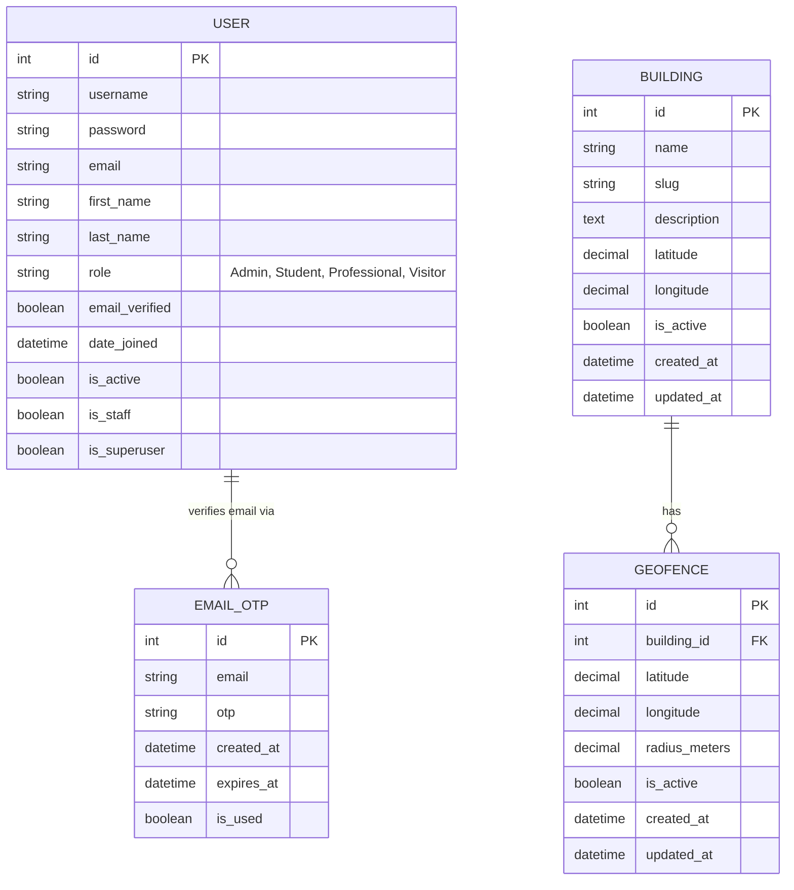

# ARQuest Entity-Relationship Diagram (ERD)

```mermaid
erDiagram
    USER {
        int id PK
        string username
        string password
        string email
        string first_name
        string last_name
        string role "Admin, Student, Professional, Visitor"
        boolean email_verified
        datetime date_joined
        boolean is_active
        boolean is_staff
        boolean is_superuser
    }

    EMAIL_OTP {
        int id PK
        string email
        string otp
        datetime created_at
        datetime expires_at
        boolean is_used
    }

    BUILDING {
        int id PK
        string name
        string slug
        text description
        decimal latitude
        decimal longitude
        boolean is_active
        datetime created_at
        datetime updated_at
    }

    GEOFENCE {
        int id PK
        int building_id FK
        decimal latitude
        decimal longitude
        decimal radius_meters
        boolean is_active
        datetime created_at
        datetime updated_at
    }

    USER ||--o{ EMAIL_OTP : "verifies email via"
    BUILDING ||--o{ GEOFENCE : "has"
```
