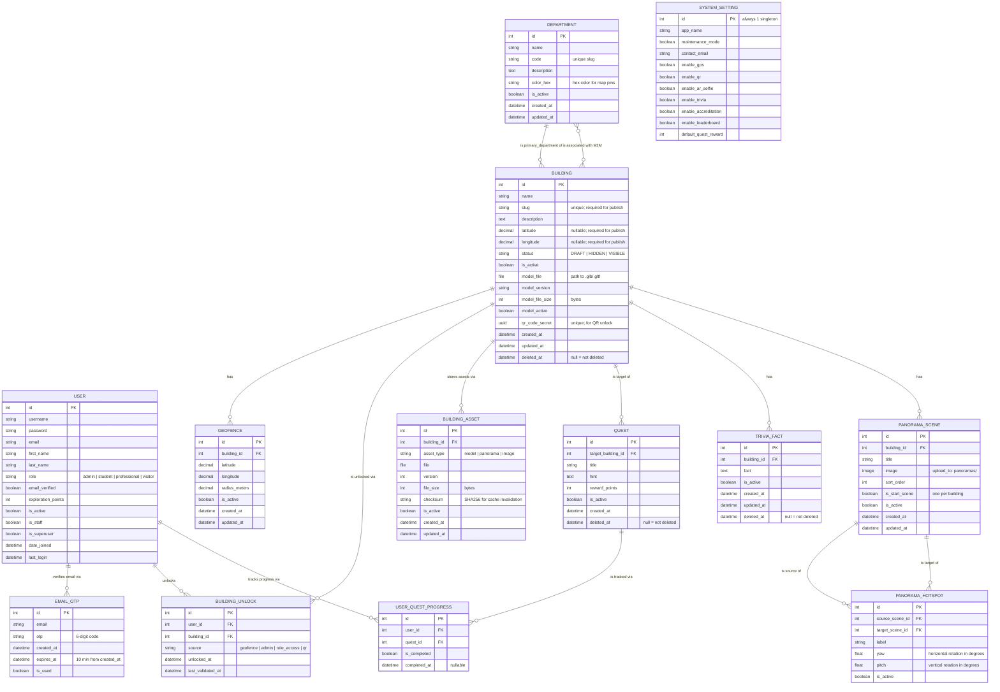

# ARQuest — Entity Relationship Diagram (ERD)

> Last updated: 2026-06-20
> Reflects all Django models across `authentication`, `buildings`, `panorama`, `geofencing`, and `api` apps.

---

## ERD Diagram

---

## Entity Summaries

### `USER` — `authentication` app
Django custom user (`AbstractUser`). Stores credentials, role, email verification state, and gamification points.

| Field | Notes |
|---|---|
| `role` | Enum: `admin`, `student`, `professional`, `visitor` |
| `email_verified` | Set to `true` after OTP confirmation |
| `exploration_points` | Incremented on quest completion |

---

### `EMAIL_OTP` — `authentication` app
Stores one-time passwords sent via email for account verification. Expires after 10 minutes and is single-use.

---

### `DEPARTMENT` — `buildings` app
Organizational grouping for buildings (e.g., College of Computer Studies). Used for map pin color and building categorization. Building FKs use `SET_NULL` on department deletion to preserve records.

| Field | Notes |
|---|---|
| `color_hex` | Hex string used as map pin color for primary buildings |
| `code` | Unique slug identifier |

---

### `BUILDING` — `buildings` app
Central entity. Supports soft-delete via `SoftDeleteModel`. Soft-deleting a building cascades to its `Quest` and `TriviaFact` records.

| Field | Notes |
|---|---|
| `status` | `DRAFT` = no coordinates required; `HIDDEN`/`VISIBLE` = lat/lng/slug required |
| `model_file` | Uploaded `.glb/.gltf` served to mobile WebView |
| `qr_code_secret` | UUID used for QR-based unlock fallback |
| `deleted_at` | `null` = live record; non-null = soft-deleted |

**Dual department relationship:**
- `primary_department` → FK → `DEPARTMENT` (drives map pin color)
- `departments` → M2M → `DEPARTMENT` (associated colleges)

---

### `GEOFENCE` — `buildings` app
Defines a GPS boundary zone for a building. Geofencing validates coordinates server-side (Haversine) and optionally client-side. One building can have multiple geofences; only active ones are evaluated.

---

### `BUILDING_UNLOCK` — `buildings` app
Records that a user has gained access to a building. Unique per `(user, building)` pair. Re-entry updates `last_validated_at` without creating duplicates.

| `source` | Meaning |
|---|---|
| `geofence` | User physically entered the GPS zone |
| `admin` | Manually granted by admin |
| `role_access` | Auto-granted to Professional role |
| `qr` | Unlocked via QR code scan |

---

### `BUILDING_ASSET` — `buildings` app
Versioned file metadata for media assets (3D models, panoramas, images). SHA256 `checksum` enables cache invalidation on mobile.

---

### `QUEST` — `buildings` app
Gamification quest targeting a specific building. Soft-deleted when the parent building is archived. Students earn `reward_points` on completion.

---

### `USER_QUEST_PROGRESS` — `buildings` app
Join table tracking per-user quest completion. Unique per `(user, quest)` pair.

---

### `TRIVIA_FACT` — `buildings` app
Building-specific trivia facts surfaced in the AR camera overlay on quest completion. Soft-delete cascades from parent building.

---

### `PANORAMA_SCENE` — `panorama` app
One 360° panoramic image within a building's virtual walkthrough. Exactly one scene per building may be `is_start_scene=true` at a time.

---

### `PANORAMA_HOTSPOT` — `panorama` app
Navigation marker inside a `PanoramaScene`. Links a source scene to a target scene using `yaw`/`pitch` spherical coordinates. Cross-building links are blocked by model-level validation.

---

### `SYSTEM_SETTING` — `api` app
Singleton model (`pk` always `1`). Global feature flags and system config consumed by mobile and admin dashboard.

| Flag | Purpose |
|---|---|
| `maintenance_mode` | Blocks all non-admin API access |
| `enable_gps` / `enable_qr` | Feature toggles for campus features |
| `enable_accreditation` | Shows/hides Professional-only features |
| `default_quest_reward` | Auto-fills reward points for new quests |

---

## Constraints & Invariants

| Constraint | Enforced in |
|---|---|
| One active start scene per building | `PanoramaScene.clean()` |
| Hotspots cannot cross buildings | `PanoramaHotspot.clean()` |
| DRAFT buildings skip coordinate/slug validation | `Building.clean()` |
| Soft-deleted buildings cascade to Quests + Trivia | `Building.cascade_soft_delete()` |
| `BuildingUnlock` unique per `(user, building)` | `Meta.unique_together` |
| `UserQuestProgress` unique per `(user, quest)` | `Meta.unique_together` |
| `SystemSetting` always `pk=1` | `save()` override |
| Inactive building cannot be unlocked | `BuildingUnlock.clean()` |
| Geofence radius must be > 0 | `Geofence.clean()` |
| Lat: -90 to 90 / Lng: -180 to 180 | `Building.clean()`, `Geofence.clean()` |

---

## Soft Delete Scope

Only these models support soft-delete (`SoftDeleteModel`):

| Model | Cascades to |
|---|---|
| `Building` | `Quest`, `TriviaFact` |
| `Quest` | — |
| `TriviaFact` | — |

All other models use standard **hard delete**.

---

## Django App → Model Map

| App | Models |
|---|---|
| `authentication` | `User`, `EmailOTP` |
| `buildings` | `Department`, `Building`, `Geofence`, `BuildingUnlock`, `BuildingAsset`, `Quest`, `UserQuestProgress`, `TriviaFact` |
| `panorama` | `PanoramaScene`, `PanoramaHotspot` |
| `geofencing` | _(no models; logic is utility-only via Haversine utils)_ |
| `api` | `SystemSetting` |

---

## Documentation

### Overview

The Entity Relationship Diagram (ERD) of ARQuest describes the complete relational data model stored in the PostgreSQL database. It covers all 12 Django models across five applications: `authentication`, `buildings`, `panorama`, `geofencing`, and `api`. These models represent every piece of persistent data the system needs to function, including user accounts, GPS geofences, 3D model metadata, quest gamification records, and global feature flags.

The database is the single source of truth for all system state. The Django backend is the only layer that reads from and writes to PostgreSQL. The mobile app and web dashboard communicate through the Django REST API and never access the database directly.

---

### Authentication Domain

The authentication domain has two models: `User` and `EmailOTP`.

The `User` model extends Django's built-in `AbstractUser`, inheriting standard fields like `username`, `password`, `email`, `first_name`, `last_name`, `is_active`, `is_staff`, and `is_superuser`. ARQuest adds three custom fields on top of these. The `role` field is an enumerated string that assigns the user one of four types: `admin`, `student`, `professional`, or `visitor`. This field controls all role-based access decisions at the API level. The `email_verified` boolean tracks whether the user has confirmed their email through the OTP flow. Accounts with `email_verified=false` cannot log in. The `exploration_points` integer holds the total gamification points a user has earned by completing quests.

The `EmailOTP` model stores the six-digit one-time password sent during registration or resend requests. Each OTP is tied to an email address and has a `created_at` and `expires_at` timestamp. The expiry is set ten minutes after creation. Once used during verification, `is_used` is set to `true` and the OTP is no longer valid. This model is not linked to `User` by a foreign key. The association goes through the shared `email` field so that OTPs can be created before the user account is fully verified.

---

### Buildings Domain

The buildings domain is the largest group in the system. It contains eight models: `Department`, `Building`, `Geofence`, `BuildingUnlock`, `BuildingAsset`, `Quest`, `UserQuestProgress`, and `TriviaFact`.

**Department** is an optional grouping layer for buildings by college or academic unit. Each department has a `color_hex` field that sets the map pin color for its buildings. A building has two separate department relationships: a `primary_department` foreign key that sets the pin color, and a many-to-many `departments` field listing all associated colleges. Deleting a department uses `SET_NULL` on the foreign key so buildings are not removed.

**Building** is the central entity of the system. Features like geofencing, 3D visualization, 360° walkthroughs, quests, trivia, and asset management all tie back to a building record. The model has a three-tier `status` field (`DRAFT`, `HIDDEN`, `VISIBLE`) so administrators can save incomplete records before publishing. DRAFT buildings skip coordinate and slug validation. HIDDEN and VISIBLE buildings require both. The `model_file` field stores the path to an uploaded `.glb` or `.gltf` file for the mobile 3D viewer, while the `hotspots` field is a JSON column storing spatial coordinates for interactive 3D waypoints inside the model. The `qr_code_secret` UUID field enables QR-based building unlock as a GPS fallback. Building uses `SoftDeleteModel`, so when a building is deleted, a `deleted_at` timestamp is recorded instead of running a SQL DELETE. The `SoftDeleteManager` filters deleted records out of all standard queries.

**Geofence** defines the GPS boundary for a building. It stores center coordinates and a `radius_meters` value. The geofencing engine runs a Haversine calculation between the user's coordinates and each geofence center. A building can have multiple geofence records, but only those with `is_active=true` are checked during validation. The system tracks GPS signal accuracy and returns a `weak_signal` status when accuracy is worse than 50 meters.

**BuildingUnlock** records that a user has been given access to a building. The `source` field shows how the unlock was earned: geofence entry, QR scan, admin grant, or automatic professional role access. The table has a unique constraint on `(user, building)` so repeated visits only update `last_validated_at` instead of creating duplicate rows.

**BuildingAsset** stores versioned file metadata for media attached to a building. It supports three asset types: 3D model, panorama image, and generic building image. The `checksum` field holds a SHA256 hash the mobile cache layer uses to check whether a locally stored file is still current.

**Quest** is a gamification task that directs a student to visit a specific building. When a user completes a quest by entering the geofence and claiming points in the AR camera screen, the `reward_points` value is added to their `exploration_points`. Quests use soft-delete and are archived automatically when their parent building is soft-deleted.

**UserQuestProgress** is the join table between `User` and `Quest`. It stores whether a user has completed a quest and when. The unique constraint on `(user, quest)` keeps each user's progress to one row per quest.

**TriviaFact** stores factual content tied to a building. These facts are shown in the AR trivia modal after a quest is completed. Like `Quest`, it uses soft-delete and is cascaded when the parent building is deleted.

---

### Panorama Domain

The panorama domain has two models: `PanoramaScene` and `PanoramaHotspot`.

**PanoramaScene** is a single 360° panoramic photograph within a building's virtual walkthrough. Each scene belongs to one building and holds an uploaded image, a display title, and a `sort_order` for the admin interface ordering. The `is_start_scene` flag marks where the walkthrough begins. A model validation rule ensures only one active start scene exists per building at a time.

**PanoramaHotspot** is a clickable navigation marker placed inside a panorama scene. Each hotspot has a `source_scene` where the marker appears and a `target_scene` the user moves to when clicking it. The `yaw` and `pitch` values set the hotspot position in spherical coordinates. A validation rule prevents hotspots from linking scenes from different buildings.

Together, these two models form the graph structure of a virtual walkthrough. The mobile viewer loads the start scene first, places hotspot markers at their coordinates, and handles scene transitions when the user taps a hotspot.

---

### API Domain

The `api` application has one model: `SystemSetting`.

**SystemSetting** is a singleton configuration record. Its `save()` method is overridden to always write to `pk=1`, so only one row ever exists in the table. It stores global feature flags for both the mobile app and the admin dashboard. These include `maintenance_mode` which blocks all non-admin API access, toggles for GPS, QR scanning, AR selfie, trivia, accreditation, and leaderboard features, and the `default_quest_reward` value auto-filled when creating new quests. The mobile app reads this configuration on startup through the public settings endpoint.

---

### Geofencing Domain

The `geofencing` application has no database models. It provides a server-side validation endpoint that accepts GPS coordinates and an accuracy reading from the mobile app. It queries all visible buildings with active geofences, runs a Haversine calculation for each, and returns a status indicating whether the user is inside, nearby, outside, or on a weak signal. The geofence boundary data itself is stored in the `Geofence` model in the buildings domain.

---

### Key Design Decisions

**Soft delete over hard delete** was used for buildings, quests, and trivia facts because these records have historical data (quest completions, unlock records) that would break if the parent were permanently removed. Soft delete lets administrators archive content and restore it later without losing relational integrity.

**Dual department relationship** (one FK for primary plus M2M for associated) separates two different concerns. The primary department controls the map pin color. The associated colleges list is for informational display only. Keeping them separate avoids one field trying to do two things.

**QR code as UUID** rather than a sequential integer stops enumeration attacks where someone could guess valid building unlock codes by incrementing a number.

**SystemSetting as a singleton** keeps runtime configuration simple. There is no key-value table to manage. The admin dashboard edits the single row and changes take effect immediately without a server restart.
