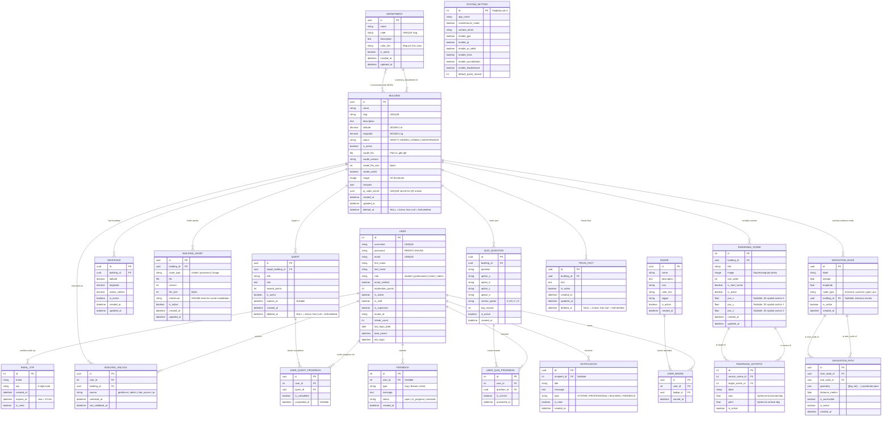

# ARQuest — Logical Database Design & Entity Relationship Diagram (ERD)

> **Research Paper Component:** Chapter 3 — Database Design / Logical Data Model (Crow's Foot Notation)  
> **System:** ARQuest: A Sensor-Assisted Campus Exploration and Accreditation Support System  
> **Institution:** Western Mindanao State University (WMSU)

---

## 1. Logical Entity Relationship Diagram (Crow's Foot Notation)

The database architecture of **ARQuest** is implemented on **PostgreSQL 16**, encompassing 20 relational entities structured across 8 Django domain applications.

```mermaid
erDiagram

    USER {
        int         id                  PK
        string      username            "UNIQUE"
        string      password            "PBKDF2 SHA256"
        string      email               "UNIQUE"
        string      first_name
        string      last_name
        string      role                "student | professional | visitor | admin"
        boolean     email_verified
        int         exploration_points
        boolean     is_active
        boolean     is_staff
        boolean     is_superuser
        string      avatar_id
        int         streak_count
        date        last_login_date
        datetime    date_joined
        datetime    last_login
    }

    EMAIL_OTP {
        int         id          PK
        string      email
        string      otp         "6-digit code"
        datetime    created_at
        datetime    expires_at  "now + 10 min"
        boolean     is_used
    }

    DEPARTMENT {
        uuid        id          PK
        string      name
        string      code        "UNIQUE slug"
        text        description
        string      color_hex   "Map pin hex color"
        boolean     is_active
        datetime    created_at
        datetime    updated_at
    }

    BUILDING {
        uuid        id                  PK
        string      name
        string      slug                "UNIQUE"
        text        description
        decimal     latitude            "WGS84 Lat"
        decimal     longitude           "WGS84 Lng"
        string      status              "DRAFT | HIDDEN | VISIBLE | MAINTENANCE"
        boolean     is_active
        file        model_file          "Path to .glb/.gltf"
        string      model_version
        int         model_file_size     "Bytes"
        boolean     model_active
        image       image               "2D thumbnail"
        json        hotspots
        uuid        qr_code_secret      "UNIQUE secret for QR unlock"
        datetime    created_at
        datetime    updated_at
        datetime    deleted_at          "NULL = Active; Non-null = Soft-deleted"
    }

    GEOFENCE {
        uuid        id              PK
        uuid        building_id     FK
        decimal     latitude
        decimal     longitude
        decimal     radius_meters
        boolean     is_active
        datetime    created_at
        datetime    updated_at
    }

    BUILDING_UNLOCK {
        uuid        id                  PK
        int         user_id             FK
        uuid        building_id         FK
        string      source              "geofence | admin | role_access | qr"
        datetime    unlocked_at
        datetime    last_validated_at
    }

    BUILDING_ASSET {
        uuid        id          PK
        uuid        building_id FK
        string      asset_type  "model | panorama | image"
        file        file
        int         version
        int         file_size   "Bytes"
        string      checksum    "SHA256 hash for cache invalidation"
        boolean     is_active
        datetime    created_at
        datetime    updated_at
    }

    NAVIGATION_NODE {
        uuid        id              PK
        string      label
        float       latitude
        float       longitude
        string      node_type       "entrance | junction | gate | poi"
        uuid        building_id     FK "Nullable; entrance anchor"
        boolean     is_active
        datetime    created_at
    }

    NAVIGATION_PATH {
        uuid        id              PK
        uuid        start_node_id   FK
        uuid        end_node_id     FK
        json        geometry        "[[lng, lat], ...] coordinate pairs"
        float       distance_meters
        boolean     is_accessible
        boolean     is_active
        datetime    created_at
    }

    PANORAMA_SCENE {
        int         id              PK
        uuid        building_id     FK
        string      title
        image       image           "Equirectangular photo"
        int         sort_order
        boolean     is_start_scene
        boolean     is_active
        float       pos_x           "Nullable; 3D spatial anchor X"
        float       pos_y           "Nullable; 3D spatial anchor Y"
        float       pos_z           "Nullable; 3D spatial anchor Z"
        datetime    created_at
        datetime    updated_at
    }

    PANORAMA_HOTSPOT {
        int         id              PK
        int         source_scene_id FK
        int         target_scene_id FK
        string      label
        float       yaw             "Spherical horizontal deg"
        float       pitch           "Spherical vertical deg"
        boolean     is_active
    }

    QUEST {
        uuid        id                  PK
        uuid        target_building_id  FK
        string      title
        text        hint
        int         reward_points
        boolean     is_active
        datetime    expires_at          "Nullable"
        datetime    created_at
        datetime    deleted_at          "NULL = Active; Non-null = Soft-deleted"
    }

    USER_QUEST_PROGRESS {
        uuid        id              PK
        int         user_id         FK
        uuid        quest_id        FK
        boolean     is_completed
        datetime    completed_at    "Nullable"
    }

    TRIVIA_FACT {
        uuid        id          PK
        uuid        building_id FK
        text        fact
        boolean     is_active
        datetime    created_at
        datetime    updated_at
        datetime    deleted_at  "NULL = Active; Non-null = Soft-deleted"
    }

    QUIZ_QUESTION {
        uuid        id              PK
        uuid        building_id     FK
        string      question
        string      option_a
        string      option_b
        string      option_c
        string      option_d
        string      correct_option  "A | B | C | D"
        int         exp_reward
        boolean     is_active
        datetime    created_at
    }

    USER_QUIZ_PROGRESS {
        int         id              PK
        int         user_id         FK
        uuid        question_id     FK
        boolean     is_correct
        datetime    answered_at
    }

    BADGE {
        uuid        id          PK
        string      name
        text        description
        string      icon
        string      color_hex
        string      trigger
        boolean     is_active
        datetime    created_at
    }

    USER_BADGE {
        uuid        id          PK
        int         user_id     FK
        uuid        badge_id    FK
        datetime    earned_at
    }

    SYSTEM_SETTING {
        int         id                      PK  "Singleton pk=1"
        string      app_name
        boolean     maintenance_mode
        string      contact_email
        boolean     enable_gps
        boolean     enable_qr
        boolean     enable_ar_selfie
        boolean     enable_trivia
        boolean     enable_accreditation
        boolean     enable_leaderboard
        int         default_quest_reward
    }

    FEEDBACK {
        int         id          PK
        int         user_id     FK "Nullable"
        string      type        "bug | feature | other"
        text        message
        string      status      "open | in_progress | resolved"
        datetime    created_at
    }

    NOTIFICATION {
        uuid        id          PK
        int         recipient_id FK "Nullable"
        string      title
        text        message
        string      type        "SYSTEM | PROFESSIONAL | BUILDING | FEEDBACK"
        boolean     is_read
        datetime    created_at
    }

    %% Relationships
    USER                ||--o{ EMAIL_OTP              : "verifies email via"
    USER                ||--o{ BUILDING_UNLOCK        : "unlocks"
    USER                ||--o{ USER_QUEST_PROGRESS    : "tracks progress via"
    USER                ||--o{ USER_QUIZ_PROGRESS     : "answers"
    USER                ||--o{ USER_BADGE             : "earns"
    USER                ||--o{ FEEDBACK               : "submits"
    USER                ||--o{ NOTIFICATION           : "receives"

    DEPARTMENT          ||--o{ BUILDING               : "is primary_department of"
    DEPARTMENT          }o--o{ BUILDING               : "is associated with (M2M)"

    BUILDING            ||--o{ GEOFENCE               : "has boundary"
    BUILDING            ||--o{ BUILDING_UNLOCK        : "unlocked via"
    BUILDING            ||--o{ BUILDING_ASSET         : "holds assets"
    BUILDING            ||--o{ QUEST                  : "target of"
    BUILDING            ||--o{ TRIVIA_FACT            : "hosts trivia"
    BUILDING            ||--o{ QUIZ_QUESTION          : "hosts quiz"
    BUILDING            ||--o{ PANORAMA_SCENE         : "contains scenes"
    BUILDING            ||--o{ NAVIGATION_NODE        : "anchors entrance node"

    NAVIGATION_NODE     ||--o{ NAVIGATION_PATH        : "is start_node of"
    NAVIGATION_NODE     ||--o{ NAVIGATION_PATH        : "is end_node of"

    PANORAMA_SCENE      ||--o{ PANORAMA_HOTSPOT       : "is source of"
    PANORAMA_SCENE      ||--o{ PANORAMA_HOTSPOT       : "is target of"

    QUEST               ||--o{ USER_QUEST_PROGRESS    : "tracks completion"
    QUIZ_QUESTION       ||--o{ USER_QUIZ_PROGRESS     : "tracks answer"
    BADGE               ||--o{ USER_BADGE             : "tracks awarded"
```

---

## 2. Relational Data Dictionary Specification

### 2.1 Authentication & Security Entities (`authentication`)
- **`USER`**: Extends Django's `AbstractUser`. Manages identity, RBAC authorization (`role`: `'student'`, `'professional'`, `'visitor'`, `'admin'`), gamification totals (`exploration_points`), streak telemetry (`streak_count`, `last_login_date`), and soft-deactivation status (`is_active`).
- **`EMAIL_OTP`**: Transient single-use 6-digit verification tokens expiring 10 minutes from creation (`expires_at`), verified prior to setting `email_verified = True`.

### 2.2 Campus Facilities & Geofencing Entities (`buildings`)
- **`DEPARTMENT`**: Organizational college entities (e.g., College of Computer Studies). Dictates the hex color palette (`color_hex`) for map markers.
- **`BUILDING`**: Central structural digital twin entity. Supports soft-deletion via `deleted_at`, 3D GLB model asset linking, publication lifecycle (`DRAFT`, `HIDDEN`, `VISIBLE`, `MAINTENANCE`), and anti-spoof QR secrets (`qr_code_secret`).
- **`GEOFENCE`**: GPS circular boundary zones (`latitude`, `longitude`, `radius_meters`) evaluated by server-side Haversine algorithms.
- **`BUILDING_UNLOCK`**: Audit log recording facility unlocks, enforcing composite uniqueness on `(user_id, building_id)`.
- **`BUILDING_ASSET`**: Versioned media asset repository tracking file size and SHA256 checksums for zero-overhead client cache invalidation.

### 2.3 Campus Pedestrian Navigation Entities (`navigation`)
- **`NAVIGATION_NODE`**: Topological waypoints representing building access doors (`entrance`), sidewalk turns and intersections (`junction`), perimeter gates (`gate`), or open-air landmarks (`poi`).
- **`NAVIGATION_PATH`**: Walkway edges connecting two nodes, storing multi-coordinate GeoJSON geometry arrays (`[[lng, lat], ...]`), calculated geodesic length (`distance_meters`), and wheelchair accessibility flags (`is_accessible`). Deletion of a node cascades to all attached paths via `on_delete=models.CASCADE`.

### 2.4 Panoramic & Spatial Linking Entities (`panorama`)
- **`PANORAMA_SCENE`**: Equirectangular 360° photo spheres. Features nullable 3D Cartesian doorway anchors (`pos_x`, `pos_y`, `pos_z`) bridging digital 3D models with photographic rooms. Exactly one scene per building can be `is_start_scene = True`.
- **`PANORAMA_HOTSPOT`**: Spherical coordinate markers (`yaw`, `pitch`) linking source scenes to target scenes. Model-level validation strictly prevents cross-facility linkages.

### 2.5 Gamification & Assessment Entities (`gamification`, `quizzes`)
- **`QUEST`**: Building exploration tasks rewarding `reward_points`. Soft-deletes upon parent building archive.
- **`USER_QUEST_PROGRESS`**: Per-user quest completion log with composite uniqueness on `(user_id, quest_id)`.
- **`TRIVIA_FACT`**: Building-specific trivia surfaced in AR overlays. Soft-deletes upon parent building archive.
- **`QUIZ_QUESTION` & `USER_QUIZ_PROGRESS`**: Multiple-choice assessment questions tied to facilities with per-user answer tracking.
- **`BADGE` & `USER_BADGE`**: Milestone achievement badges and user award timestamps.

### 2.6 System Utility & Audit Entities (`api`)
- **`SYSTEM_SETTING`**: Singleton configuration table (`pk = 1`) managing global feature toggles (maintenance mode, GPS/QR toggles).
- **`FEEDBACK`**: User-submitted issue tickets (`type`, `message`, `status`) feeding the admin Feedback Radar.
- **`NOTIFICATION`**: UUID-keyed system audit alerts and user dispatches.

---

## 3. Database Integrity Constraints & Cascading Architecture

| Constraint / Rule | Target Table & Field | Implementation Mechanism | System Purpose |
|:---|:---|:---|:---|
| **One Start Scene per Facility** | `PANORAMA_SCENE.is_start_scene` | `PanoramaScene.clean()` validation override | Prevents ambiguous initial viewpoint mounting in 360° tours. |
| **Intra-Building Hotspot Isolation** | `PANORAMA_HOTSPOT.target_scene` | `PanoramaHotspot.clean()` validation override | Prevents broken navigation links jumping between unrelated buildings. |
| **Coordinate Bounds Validation** | `BUILDING`, `GEOFENCE`, `NAVIGATION_NODE` | Lat: $[-90, 90]$, Lng: $[-180, 180]$ | Enforces valid WGS84 geographic coordinates. |
| **Path Geometry Minimum Vertices** | `NAVIGATION_PATH.geometry` | Serializer check: $\ge 2$ coordinate pairs | Ensures all walkway segments represent valid spatial line strings. |
| **Cascading Node Pruning** | `NAVIGATION_PATH.start_node / end_node` | `on_delete=models.CASCADE` | Automatically eliminates orphaned walkway paths when a node is deleted. |
| **Entrance Node Safety Unlink** | `NAVIGATION_NODE.building` | `on_delete=models.SET_NULL` | Preserves navigation nodes if a building record is deleted. |
| **Unique User Building Unlock** | `BUILDING_UNLOCK(user, building)` | `Meta.unique_together` constraint | Prevents duplicate reward/EXP exploits for the same facility. |
| **Singleton System Setting** | `SYSTEM_SETTING.id` | `save()` override enforcing `pk = 1` | Guarantees a single system-wide configuration record. |

---

## 4. Soft-Deletion Architecture (`SoftDeleteModel`)

To preserve academic audit trails and historical records, ARQuest implements a custom soft-deletion architecture:

| Model | Inherits `SoftDeleteModel` | Cascade Target | Operational Behavior |
|:---|:---|:---|:---|
| **`BUILDING`** | Yes | `QUEST`, `TRIVIA_FACT` | When archived, sets `deleted_at = now()`. Automatically cascades soft-deletion to all associated quests and trivia facts. Restoring a building restores child records. |
| **`QUEST`** | Yes | None | Preserves user historical quest completion logs (`USER_QUEST_PROGRESS`) even when a quest is retired. |
| **`TRIVIA_FACT`** | Yes | None | Preserves historical educational trivia records. |
| **All Other Models** | No | None | Standard **hard deletion** (`models.CASCADE` or `models.SET_NULL`). |
