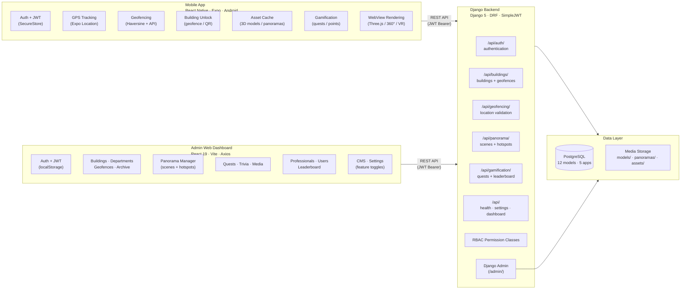
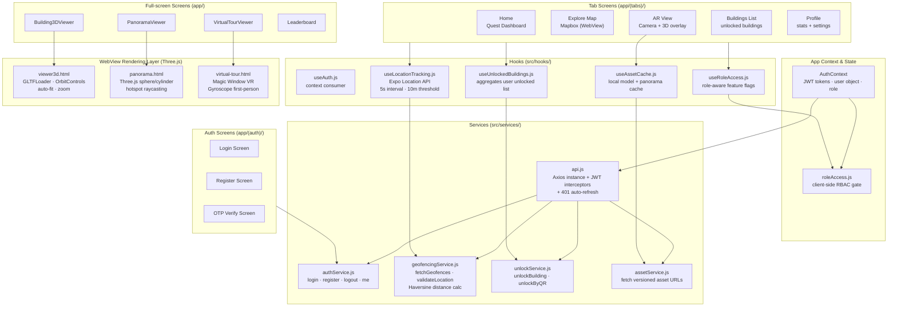
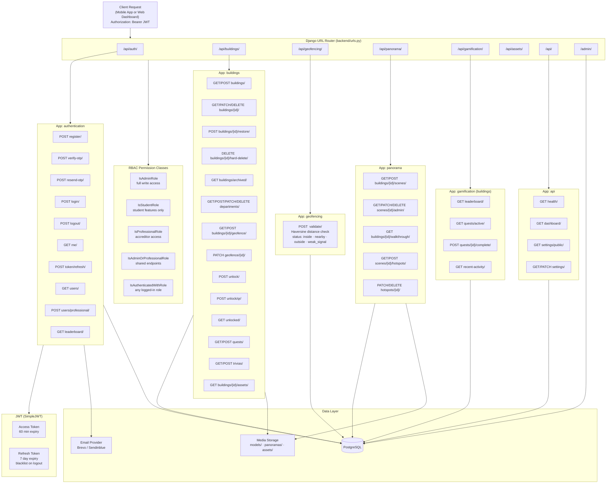
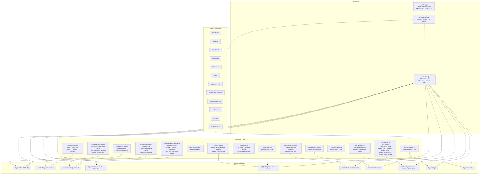

# ARQuest — System Architecture

> Last updated: 2026-06-20

---

## Diagram 1 — High-Level System Overview

The four major layers and how they connect. The Django backend is the single source
of truth. No critical decisions are made on the client.

---

## Diagram 2 — Mobile Application Layer

Internal structure of the React Native Expo app — services, hooks, screens, and WebView renderers.

---

## Diagram 3 — Backend API Layer

All Django apps, URL namespaces, endpoints, and their database/media interactions.

---

## Diagram 4 — Admin Web Dashboard Layer

React 19 + Vite SPA — pages, routing, and API surface used by each section.

---

## Diagram 5 — Data & Storage Layer

PostgreSQL table groups, soft-delete pattern, media storage, and JWT token lifecycle.

```mermaid
graph TD
    subgraph AUTH_TABLES ["authentication app tables"]
        T_USER["USER\nid · username · email · password\nrole · email_verified\nexploration_points · avatar_id\nstreak_count · last_login_date\nis_active · is_staff · is_superuser"]
        T_OTP["EMAIL_OTP\nid · email · otp\ncreated_at · expires_at · is_used"]
        T_JWT_BL["JWT Blacklist\n(simplejwt_blacklistedtoken)\nrevoked refresh tokens"]
    end

    subgraph BLDG_TABLES ["buildings app tables"]
        T_DEPT["DEPARTMENT\nid · name · code\ncolor_hex · is_active"]
        T_BLDG["BUILDING\nid · name · slug · description\nlatitude · longitude\nstatus · is_active\nmodel_file · model_active\nqr_code_secret\ncreated_at · updated_at\ndeleted_at ← soft delete"]
        T_GEO["GEOFENCE\nid · building_id\nlatitude · longitude\nradius_meters · is_active"]
        T_UNLOCK["BUILDING_UNLOCK\nid · user_id · building_id\nsource · unlocked_at\nlast_validated_at\nUNIQUE(user, building)"]
        T_ASSET["BUILDING_ASSET\nid · building_id · asset_type\nfile · version · file_size\nchecksum · is_active"]
        T_QUEST["QUEST\nid · target_building_id\ntitle · hint · reward_points\nis_active · created_at\ndeleted_at ← soft delete"]
        T_PROG["USER_QUEST_PROGRESS\nid · user_id · quest_id\nis_completed · completed_at\nUNIQUE(user, quest)"]
        T_TRIVIA["TRIVIA_FACT\nid · building_id\nfact · is_active\ncreated_at · deleted_at ← soft delete"]
    end

    subgraph PANO_TABLES ["panorama app tables"]
        T_SCENE["PANORAMA_SCENE\nid · building_id · title\nimage · sort_order\nis_start_scene · is_active"]
        T_HOTSPOT["PANORAMA_HOTSPOT\nid · source_scene_id · target_scene_id\nlabel · yaw · pitch · is_active"]
    end

    subgraph API_TABLE ["api app table"]
        T_SETTING["SYSTEM_SETTING\nid (always=1) · app_name\nmaintenance_mode · contact_email\nenable_gps · enable_qr\nenable_ar_selfie · enable_trivia\nenable_accreditation\nenable_leaderboard\ndefault_quest_reward"]
    end

    subgraph SOFT_DELETE ["Soft Delete Pattern\n(SoftDeleteModel)"]
        SD_MGR["SoftDeleteManager\n.objects → filters deleted_at IS NULL\n.all_objects → no filter"]
        SD_RESTORE["Building.restore()\nsets deleted_at = null\ncascades to Quests + Trivia"]
        SD_CASCADE["Building.delete()\nsets deleted_at = now()\ncascades to Quests + Trivia"]
    end

    subgraph MEDIA ["Media Storage  (Django MEDIA_ROOT)"]
        MEDIA_3D["media/models/\n.glb / .gltf files\n(served by Django or CDN)"]
        MEDIA_PANO["media/panoramas/\n360° equirectangular images"]
        MEDIA_ASSETS["media/assets/\ngeneral building files"]
    end

    subgraph JWT_LIFECYCLE ["JWT Token Lifecycle"]
        JWT_LOGIN["Login → issue\naccess (60 min)\nrefresh (7 days)"]
        JWT_USE["API call → attach\nAuthorization: Bearer <access>"]
        JWT_EXPIRE["Access expired\n→ POST /token/refresh/"]
        JWT_LOGOUT["Logout\n→ blacklist refresh token"]
    end

    T_USER -->|"1 to many"| T_OTP
    T_USER -->|"1 to many"| T_UNLOCK
    T_USER -->|"1 to many"| T_PROG
    T_DEPT -->|"FK primary_department"| T_BLDG
    T_DEPT -->|"M2M departments"| T_BLDG
    T_BLDG -->|"1 to many"| T_GEO
    T_BLDG -->|"1 to many"| T_UNLOCK
    T_BLDG -->|"1 to many"| T_ASSET
    T_BLDG -->|"1 to many"| T_QUEST
    T_BLDG -->|"1 to many"| T_TRIVIA
    T_BLDG -->|"1 to many"| T_SCENE
    T_SCENE -->|"source_scene"| T_HOTSPOT
    T_SCENE -->|"target_scene"| T_HOTSPOT
    T_QUEST -->|"1 to many"| T_PROG

    T_BLDG --> SD_CASCADE
    T_BLDG --> SD_RESTORE
    SD_MGR --> T_BLDG

    T_BLDG --> MEDIA_3D
    T_ASSET --> MEDIA_ASSETS
    T_SCENE --> MEDIA_PANO

    JWT_LOGIN --> JWT_USE
    JWT_USE --> JWT_EXPIRE
    JWT_EXPIRE --> JWT_LOGIN
    JWT_LOGIN --> JWT_LOGOUT
    JWT_LOGOUT --> T_JWT_BL
```

---

## Layer Summary Table

| Layer | Technology | Language | Hosted |
|---|---|---|---|
| Mobile App | React Native · Expo | JavaScript (JSX) | Android APK via EAS |
| Backend API | Django 5 · DRF | Python | Server / VPS |
| Admin Dashboard | React 19 · Vite | JavaScript (JSX) | Static host / VPS |
| Database | PostgreSQL | SQL | Same server as backend |
| Media Storage | Django Media / S3-compatible | — | Filesystem or cloud |
| Auth | SimpleJWT · Brevo SMTP | — | Embedded in backend |

---

## System Invariants

| # | Rule |
|---|---|
| 1 | Backend is the **single source of truth** — all business logic runs server-side |
| 2 | No hardcoded campus data in the mobile application |
| 3 | Role-based access is **always** enforced at the API endpoint level |
| 4 | Heavy assets (3D / 360°) are never bundled in the app — always loaded on demand |
| 5 | All 3D and 360° rendering happens inside **WebView** (no Unity, no ARCore) |
| 6 | Geofencing tolerates GPS drift (±5m–±30m); avoids strict binary lock |
| 7 | Admin updates reflect immediately via API — no app reinstall required |

---

## Documentation

### Overview

ARQuest is a four-layer distributed system. The four layers are the Android mobile application, the Django REST API backend, the React-based admin web dashboard, and the data layer made up of PostgreSQL and a media file store. Each layer has a specific responsibility and talks to adjacent layers through authenticated REST interfaces. This separation means each layer can change independently. The mobile UI can be redesigned, the admin dashboard can grow new pages, or the database schema can be updated without needing a coordinated release across everything at once.

The core design rule is that the backend is the single source of truth. Business logic, access control, geofence decisions, and data validation all run on the server. Client applications, both mobile and web, are treated as presentation layers that submit requests and show results. They are never trusted to make decisions that affect data integrity or security.

---

### Layer 1 - Mobile Application (React Native / Expo)

The mobile application uses React Native with the Expo managed workflow and targets Android devices. Expo was chosen because it cuts down build and deployment overhead compared to bare React Native while still giving access to native device capabilities through its SDK. The specific packages used are `expo-location` for GPS tracking, `expo-camera` for the AR camera feed, `expo-secure-store` for encrypted JWT storage, and `expo-media-library` for saving AR selfie photos to the device gallery.

Navigation uses `expo-router` with file-based routing. Screens are split into two route groups: `(auth)` for unauthenticated flows like login, register, and OTP verification, and `(tabs)` for the main app shell with bottom tab navigation. Full-screen feature screens such as the 3D viewer, panorama viewer, virtual tour, and leaderboard sit at the top level of the app directory and get pushed onto the navigation stack from tab screens.

The service layer keeps all HTTP communication behind dedicated modules. `api.js` sets up an Axios instance that attaches the JWT access token from SecureStore to every request header and handles token refresh on 401 responses. Individual services like `authService.js`, `geofencingService.js`, `unlockService.js`, and `assetService.js` wrap specific API endpoint groups so screen components do not contain raw HTTP calls.

Custom hooks sit between the services and the screens. `useLocationTracking` runs a background GPS watcher and gives screens the current coordinates and accuracy. `useUnlockedBuildings` keeps a live list of buildings the current user has access to. `useAssetCache` handles local caching of 3D model URLs and panorama data to avoid re-downloading files on repeated visits. `useRoleAccess` exposes boolean flags from the current user's role for conditional rendering.

The WebView rendering layer is a deliberate boundary in the architecture. All 3D and 360 degree visualization is handed off to standalone HTML pages that run Three.js inside a React Native `WebView`. This avoids the complexity and APK size cost of integrating a native 3D engine like Unity or a full ARCore SDK. Three.js handles interactive GLB model viewing, panoramic projection, and gyroscope-based virtual tours while staying within the JavaScript ecosystem. The WebView and React Native communicate through `postMessage` events in both directions. The native layer can tell the renderer to load a scene or change a model. The renderer can notify the native layer when loading is done, when a hotspot is tapped, or when an error occurs.

---

### Layer 2 - Backend API (Django 5 + Django REST Framework)

The backend is a Django 5 application using Django REST Framework to serve a JSON API. It is split into five Django applications, each with a separate domain responsibility.

The `authentication` app handles everything related to user identity: registration, OTP email verification, login, logout, JWT token issuance and refresh, role-based permission classes, and professional account creation. It uses SimpleJWT with access tokens set to 60 minutes and refresh tokens set to 7 days. Refresh tokens are blacklisted on logout so they cannot be reused after a session ends. Outbound email goes through the `django-anymail` library using Brevo SMTP.

The `buildings` app is the largest domain. It covers CRUD for buildings and departments, geofence setup, building unlock tracking, asset metadata, quest and trivia content, and the soft-delete archive system. The `SoftDeleteModel` abstract base class, used by `Building`, `Quest`, and `TriviaFact`, overrides Django's default `delete()` to write a `deleted_at` timestamp instead of running a SQL DELETE. A `SoftDeleteManager` filters those records out of all standard querysets so archived content is invisible to normal queries but still reachable through the archive management endpoints.

The `geofencing` app has no models. It provides one stateless POST endpoint that takes GPS coordinates and accuracy from the mobile app, queries active geofences from the buildings domain, and runs a Haversine calculation for each. The response includes a status label (inside, nearby, outside, or weak signal) and the distance to the nearest building. Keeping this logic in its own app means the detection algorithm can be changed without touching the building data management code.

The `panorama` app manages the two models that power 360 degree walkthroughs: `PanoramaScene` for individual panorama images and `PanoramaHotspot` for navigation links between scenes. Admin endpoints provide full CRUD on scenes and hotspots. Mobile endpoints return the full walkthrough graph for a building in a single response to keep round trips low during viewer startup.

The `api` app provides system-wide utility endpoints that do not fit other domains: a health check, a dashboard stats summary for the admin homepage, and the `SystemSetting` singleton with a public read endpoint for mobile and an authenticated write endpoint for admin.

All API endpoints use custom DRF permission classes for role-based access: `IsAdminRole`, `IsStudentRole`, `IsProfessionalRole`, `IsAdminOrProfessionalRole`, and `IsAuthenticatedWithRole`. These classes read the `role` field from the authenticated user object, which is parsed from the JWT token on every request. If the role does not match, the endpoint returns 403 Forbidden. Access control is always evaluated on the server regardless of what the client UI shows.

---

### Layer 3 - Admin Web Dashboard (React 19 + Vite)

The admin web dashboard is a single-page application built with React 19 and Vite. It gives administrators a content management interface for all campus data without requiring direct database access or code changes. It is kept separate from the mobile application so it is not constrained by small screen sizes, touch interaction patterns, or app store distribution requirements.

The dashboard authenticates with the same JWT tokens as the mobile app but stores them in `localStorage` instead of a hardware enclave. This is appropriate for a browser-based tool on trusted administrator machines. An Axios instance with request and response interceptors handles token attachment and automatic refresh on 401 errors, matching the mobile app's token behavior.

The navigation is a persistent left sidebar covering all functional areas: Buildings, Departments, Geofences, Panoramas, Media, Quests, Trivia, Professional Accounts, User Management, Leaderboard, Archive, and Settings. Each section maps to a specific part of the backend API.

The geofence editor is the most complex component. It embeds a Mapbox map restricted to the WMSU campus bounding box. Clicking the map places the geofence center marker and the radius circle updates live as the radius input changes. This gives immediate visual feedback on coverage area before saving, which reduces the chance of geofences being set too large or too small.

The Panorama Manager uses a three-column layout with the scene list on the left, scene image preview in the center, and hotspot management on the right. Hotspot positioning uses yaw and pitch angles in degrees, matching the spherical coordinate values Three.js uses to place hotspot markers in the panorama viewer.

---

### Layer 4 - Data Layer (PostgreSQL and Media Storage)

PostgreSQL is the relational database for all structured data. It was chosen for its relational integrity support, JSON field capability for future flexibility, and compatibility with Django's ORM. The database is only accessed through the Django ORM. No component issues raw SQL or connects directly to the database outside the backend process.

Media files including 3D models, panorama images, and building assets are stored separately from the database in a Django-managed media directory. In development this is a local filesystem path. In production it can be swapped out for an S3-compatible object store without changing application code, because all file access goes through Django's `FileField` and `ImageField` storage backends. Files are served either directly by Django in development or through a CDN or reverse proxy in production. The mobile app never bundles these files. They are always fetched on demand from URLs in API responses and cached locally by the asset cache layer.

---

### Cross-Cutting Concerns

**Security** is handled through JWT authentication on all non-public endpoints, server-side role checks on every API call, CORS configuration restricting API access to trusted origins, and OTP email verification to block fake account creation. The `qr_code_secret` UUID on each building prevents building unlock bypass through URL guessing.

**Performance** is managed through client-side asset caching to avoid re-downloading models, GPS polling throttling to reduce battery drain, lazy loading of WebView renderers so Three.js only loads when the user navigates to the 3D viewer, and a client-side Haversine pre-filter to cut the number of server-side validation requests.

**Maintainability** comes from separating domains into independent Django apps, using serializers as an explicit contract between the database and the API, and the context-file documentation system that keeps architectural decisions written down alongside the code.

**Scalability** is currently vertical. The backend scales by adding server resources. There are no obstacles to horizontal scaling in the future because all session state lives in JWT tokens on the client side or in the shared PostgreSQL database.
