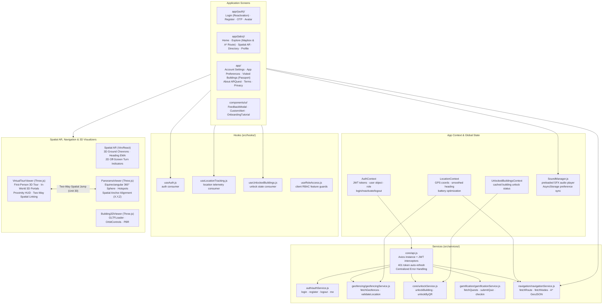
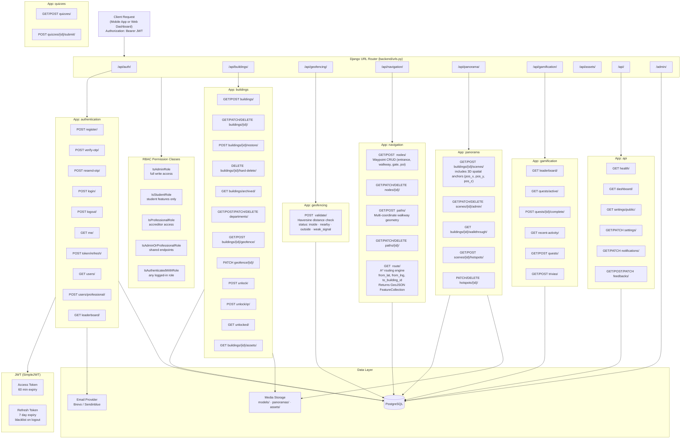

# ARQuest — System Architecture

> Last updated: 2026-09-01

---

## Diagram 1 — High-Level System Overview

The four major layers and how they connect. The Django backend is the single source
of truth. No critical decisions are made on the client.

```mermaid
graph LR
    subgraph MOBILE ["Mobile App\nReact Native · Expo · ViroReact"]
        M1["Auth & Self-Service Lifecycle\n(SecureStore / Token Refresh)"]
        M2["GPS & Sensor Telemetry\n(Location · Heading · Gyro)"]
        M3["Geofencing Engine\n(Haversine + Backend Validation)"]
        M4["Spatial AR Navigation\n(ViroReact Chevrons + Off-Screen Turn Indicators)"]
        M5["Custom Pedestrian Router\n(ARQuest Route Streamer · Mapbox Visualizer)"]
        M6["Asset & 3D Cache\n(Three.js · 360° VR Tours · Spatial Linking)"]
        M7["Gamification Arena\n(Quests · Badges · EXP · Streaks)"]
        M8["Settings, Preferences & Feedback\n(SoundManager · CustomAlert)"]
    end

    subgraph BACKEND ["Django Backend\nDjango 5 · DRF · SimpleJWT"]
        B1["/api/auth/\nauth · profile · password · deactivation"]
        B2["/api/buildings/\nfacilities · geofences · unlocks"]
        B3["/api/geofencing/\nlocation proximity validation"]
        B4["/api/navigation/\nNavigationNode · NavigationPath · A* Engine · GeoJSON Route"]
        B5["/api/panorama/\n360 scenes · hotspots · spatial anchors (X,Y,Z)"]
        B6["/api/gamification/\nquests · challenges · leaderboard · badges"]
        B7["/api/quizzes/\ntrivia · building quizzes"]
        B8["/api/feedback/ & /api/notifications/\nuser issues · audit stream"]
        B9["/api/dashboard/\nreal-time stats & foot traffic aggregations"]
        B10["RBAC Permission Engine\nIsStudent · IsAdmin · IsProfessional"]
    end

    subgraph DATA ["Data Layer"]
        DB[("PostgreSQL\n20 models · 8 domain apps")]
        MEDIA["Media Storage\nmodels/ · panoramas/ · assets/"]
    end

    subgraph WEB ["Admin Web Dashboard\nReact 19 · Vite · Tailwind · Recharts"]
        W1["Auth + JWT State\n(localStorage / useAuth)"]
        W2["Real-Time Dashboard Overview\n(KPIs · Foot Traffic Charts · Coverage)"]
        W3["Buildings · Departments · Geofences\nArchive & Soft-Delete"]
        W4["Walking Paths Network Editor\n(Satellite Node Dropper · Path Tracing · Disconnected Way Pruner)"]
        W5["Panorama Manager\n(360° scenes · interactive hotspots · 3D anchors)"]
        W6["CMS Gamification\n(quests · trivia · quizzes · badges)"]
        W7["User Management & Role Provisioning\n(Students · Accreditors · Admins)"]
        W8["Feedback Radar & System History Logs\n(mobile bug reports · audit trail)"]
        W9["System Settings & Feature Toggles"]
    end

    MOBILE -->|"REST API\n(JWT Bearer)"| BACKEND
    WEB    -->|"REST API\n(JWT Bearer)"| BACKEND
    BACKEND --> DATA
```

---

## Diagram 2 — Mobile Application Layer

Internal structure of the React Native Expo app — services, contexts, hooks, screens, spatial AR, and WebView renderers.

---

## Diagram 3 — Backend API Layer

All Django apps, URL namespaces, endpoints, and their database/media interactions.

---

## Diagram 4 — Admin Web Dashboard Layer

React 19 + Vite SPA — pages, routing, and API surface used by each section.

```mermaid
graph TD
    subgraph ENTRY ["Entry & Auth"]
        LOGIN_PG["LoginPage.jsx\nAdmin role verification\nJWT stored in localStorage"]
        PROTECTED["Protected Route\nredirects to /login if no token"]
        AXIOS["api.js  (Axios)\nJWT auto-attach\n401 → token refresh → retry"]
    end

    subgraph SIDEBAR ["Sidebar Navigation"]
        NAV_DASH["Dashboard"]
        NAV_BLDG["Buildings"]
        NAV_DEPT["Departments"]
        NAV_GEO["Geofences"]
        NAV_WALK["Walking Paths"]
        NAV_PANO["Panoramas"]
        NAV_MEDIA["Media"]
        NAV_QUESTS["Quests & Trivia"]
        NAV_PROF["Professional Accounts"]
        NAV_USERS["User Management"]
        NAV_LEAD["Leaderboard"]
        NAV_ARCH["Archive"]
        NAV_SET["CMS / Settings"]
        NAV_HIST["History & Logs"]
    end

    subgraph PAGES ["Dashboard Pages"]
        PG_DASH["DashboardPage.jsx\nBuilding stats overview"]
        PG_BLDG["BuildingsPage.jsx\nTable + status filter\n(DRAFT · HIDDEN · VISIBLE)"]
        PG_EDIT["BuildingEditorPage.jsx\nFull CRUD + 3D model upload\nDual department selectors\nPublish status control"]
        PG_DEPT["DepartmentsPage.jsx\nCollege CRUD\nMap pin color picker"]
        PG_GEO["GeofencesPage.jsx\nMapbox map\nClick-to-place center marker\nRadius circle overlay"]
        PG_NAV["NavigationPage.jsx\nInteractive Mapbox satellite editor\nWaypoint nodes · Walkway tracing\nDynamic connection centering\nDisconnected way auto-pruning"]
        PG_PANO["PanoramasPage.jsx\nBuilding list view"]
        PG_PANO_M["PanoramaManagerPage.jsx\n3-column layout:\nScenes · Preview · Hotspots\nyaw / pitch coordinate inputs"]
        PG_MEDIA["MediaPage.jsx\n3D model + asset file upload\nCloudinary integration"]
        PG_QUESTS["QuestsPage.jsx\nCreate / edit quests per building\nreward_points auto-fill"]
        PG_TRIVIA["TriviaPage.jsx\nBuilding trivia CRUD"]
        PG_PROF["ProfessionalsPage.jsx\nCreate professional accounts\nbypasses OTP flow"]
        PG_USERS["UserManagement.jsx\nView all users + roles"]
        PG_LEAD["LeaderboardPage.jsx\nStudent rankings view"]
        PG_ARCH["ArchivePage.jsx\nSoft-deleted buildings\nRestore · Hard Delete actions"]
        PG_SET["SettingsPage.jsx\nCMS toggles:\nmaintenance_mode\nenable_gps · enable_qr\nenable_trivia · enable_accreditation\ndefault_quest_reward"]
        PG_HIST["HistoryPage.jsx\nSystem notifications\nFeedback logs"]
    end

    subgraph API_CALLS ["API Surface Used"]
        AC1["/api/buildings/  (CRUD)"]
        AC2["/api/buildings/departments/"]
        AC3["/api/buildings/{id}/geofence/"]
        AC4["/api/panorama/scenes/  +  hotspots/"]
        AC5["/api/buildings/quests/  +  trivias/"]
        AC6["/api/auth/users/professional/"]
        AC7["/api/auth/leaderboard/"]
        AC8["/api/buildings/archived/  ·  restore/  ·  hard-delete/"]
        AC9["/api/settings/"]
        AC10["/api/dashboard/"]
        AC11["/api/notifications/  +  /api/feedbacks/"]
        AC12["/api/navigation/nodes/  ·  paths/"]
    end

    LOGIN_PG --> PROTECTED
    PROTECTED --> AXIOS
    PROTECTED --> SIDEBAR

    SIDEBAR --> PAGES

    PG_BLDG  --> AC1
    PG_EDIT  --> AC1
    PG_DEPT  --> AC2
    PG_GEO   --> AC3
    PG_NAV   --> AC12
    PG_PANO_M --> AC4
    PG_QUESTS --> AC5
    PG_TRIVIA --> AC5
    PG_PROF  --> AC6
    PG_LEAD  --> AC7
    PG_ARCH  --> AC8
    PG_SET   --> AC9
    PG_DASH  --> AC10
    PG_HIST  --> AC11

    AXIOS --> AC1
    AXIOS --> AC2
    AXIOS --> AC3
    AXIOS --> AC4
    AXIOS --> AC5
    AXIOS --> AC6
    AXIOS --> AC7
    AXIOS --> AC8
    AXIOS --> AC9
    AXIOS --> AC10
    AXIOS --> AC11
    AXIOS --> AC12
```

---

## Diagram 5 — Data & Storage Layer

PostgreSQL table groups, soft-delete pattern, media storage, and JWT token lifecycle.

```mermaid
graph TD
    subgraph AUTH_TABLES ["authentication app tables"]
        T_USER["USER\nid · username · email · password\nrole · email_verified\nexploration_points · avatar_id\nstreak_count · last_login_date\nis_active · is_staff · is_superuser"]
        T_OTP["EMAIL_OTP\nid · email · otp\ncreated_at · expires_at · is_used"]
        T_JWT_BL["JWT Blacklist\n(simplejwt_blacklistedtoken)\nrevoked refresh tokens"]
    end

    subgraph BLDG_TABLES ["buildings app tables"]
        T_DEPT["DEPARTMENT\nid · name · code\ncolor_hex · is_active"]
        T_BLDG["BUILDING\nid · name · slug · description\nlatitude · longitude\nstatus · is_active\nmodel_file · model_active\nqr_code_secret\ncreated_at · updated_at\ndeleted_at ← soft delete"]
        T_GEO["GEOFENCE\nid · building_id\nlatitude · longitude\nradius_meters · is_active"]
        T_UNLOCK["BUILDING_UNLOCK\nid · user_id · building_id\nsource · unlocked_at\nlast_validated_at\nUNIQUE(user, building)"]
        T_ASSET["BUILDING_ASSET\nid · building_id · asset_type\nfile · version · file_size\nchecksum · is_active"]
    end

    subgraph GAME_TABLES ["gamification app tables"]
        T_QUEST["QUEST\nid · target_building_id\ntitle · hint · reward_points\nis_active · created_at\ndeleted_at ← soft delete"]
        T_PROG["USER_QUEST_PROGRESS\nid · user_id · quest_id\nis_completed · completed_at\nUNIQUE(user, quest)"]
        T_TRIVIA["TRIVIA_FACT\nid · building_id\nfact · is_active\ncreated_at · deleted_at ← soft delete"]
    end

    subgraph QUIZ_TABLES ["quizzes app tables"]
        T_QUIZ["QUIZ_QUESTION\nid · building_id\nquestion · options\ncreated_at"]
    end

    subgraph PANO_TABLES ["panorama app tables"]
        T_SCENE["PANORAMA_SCENE\nid · building_id · title\nimage · sort_order\nis_start_scene · is_active\npos_x · pos_y · pos_z ← spatial anchor"]
        T_HOTSPOT["PANORAMA_HOTSPOT\nid · source_scene_id · target_scene_id\nlabel · yaw · pitch · is_active"]
    end

    subgraph NAV_TABLES ["navigation app tables"]
        T_NODE["NAVIGATION_NODE\nid (UUID) · label · latitude · longitude\nnode_type (entrance/walkway/gate/poi)\nbuilding_id (FK nullable)\nis_active · created_at"]
        T_PATH["NAVIGATION_PATH\nid (UUID) · start_node_id (FK)\nend_node_id (FK) · geometry (JSON)\ndistance_meters · is_accessible\nis_active · created_at"]
    end

    subgraph API_TABLE ["api app table"]
        T_SETTING["SYSTEM_SETTING\nid (always=1) · app_name\nmaintenance_mode · contact_email\nenable_gps · enable_qr\nenable_ar_selfie · enable_trivia\nenable_accreditation\nenable_leaderboard\ndefault_quest_reward"]
        T_NOTIF["NOTIFICATION\nid · recipient_id · title\nmessage · type\nis_read · created_at"]
        T_FDBK["FEEDBACK\nid · user_id · type\nmessage · status · created_at"]
    end

    subgraph SOFT_DELETE ["Soft Delete Pattern\n(SoftDeleteModel)"]
        SD_MGR["SoftDeleteManager\n.objects → filters deleted_at IS NULL\n.all_objects → no filter"]
        SD_RESTORE["Building.restore()\nsets deleted_at = null\ncascades to Quests + Trivia"]
        SD_CASCADE["Building.delete()\nsets deleted_at = now()\ncascades to Quests + Trivia"]
    end

    subgraph MEDIA ["Media Storage  (Django MEDIA_ROOT)"]
        MEDIA_3D["media/models/\n.glb / .gltf files\n(served by Django or CDN)"]
        MEDIA_PANO["media/panoramas/\n360° equirectangular images"]
        MEDIA_ASSETS["media/assets/\ngeneral building files"]
    end

    subgraph JWT_LIFECYCLE ["JWT Token Lifecycle"]
        JWT_LOGIN["Login → issue\naccess (60 min)\nrefresh (7 days)"]
        JWT_USE["API call → attach\nAuthorization: Bearer <access>"]
        JWT_EXPIRE["Access expired\n→ POST /token/refresh/"]
        JWT_LOGOUT["Logout\n→ blacklist refresh token"]
    end

    T_USER -->|"1 to many"| T_OTP
    T_USER -->|"1 to many"| T_UNLOCK
    T_USER -->|"1 to many"| T_PROG
    T_DEPT -->|"FK primary_department"| T_BLDG
    T_DEPT -->|"M2M departments"| T_BLDG
    T_BLDG -->|"1 to many"| T_GEO
    T_BLDG -->|"1 to many"| T_UNLOCK
    T_BLDG -->|"1 to many"| T_ASSET
    T_BLDG -->|"1 to many"| T_QUEST
    T_BLDG -->|"1 to many"| T_TRIVIA
    T_BLDG -->|"1 to many"| T_SCENE
    T_BLDG -->|"1 to many"| T_NODE
    T_NODE -->|"start_node (CASCADE)"| T_PATH
    T_NODE -->|"end_node (CASCADE)"| T_PATH
    T_SCENE -->|"source_scene"| T_HOTSPOT
    T_SCENE -->|"target_scene"| T_HOTSPOT
    T_QUEST -->|"1 to many"| T_PROG
    
    T_USER -->|"1 to many"| T_NOTIF
    T_USER -->|"1 to many"| T_FDBK

    T_BLDG --> SD_CASCADE
    T_BLDG --> SD_RESTORE
    SD_MGR --> T_BLDG

    T_BLDG --> MEDIA_3D
    T_ASSET --> MEDIA_ASSETS
    T_SCENE --> MEDIA_PANO

    JWT_LOGIN --> JWT_USE
    JWT_USE --> JWT_EXPIRE
    JWT_EXPIRE --> JWT_LOGIN
    JWT_LOGIN --> JWT_LOGOUT
    JWT_LOGOUT --> T_JWT_BL
```

---

## Layer Summary Table

| Layer | Technology | Language | Hosted |
|---|---|---|---|
| Mobile App | React Native · Expo | JavaScript (JSX) | Android APK via EAS |
| Backend API | Django 5 · DRF | Python | Server / VPS |
| Admin Dashboard | React 19 · Vite | JavaScript (JSX) | Static host / VPS |
| Database | PostgreSQL | SQL | Same server as backend |
| Media Storage | Django Media / S3-compatible | — | Filesystem or cloud |
| Auth | SimpleJWT · Brevo SMTP | — | Embedded in backend |

---

## System Invariants

| # | Rule |
|---|---|
| 1 | Backend is the **single source of truth** — all business logic runs server-side |
| 2 | No hardcoded campus data in the mobile application |
| 3 | Role-based access is **always** enforced at the API endpoint level |
| 4 | Heavy assets (3D / 360°) are never bundled in the app — always loaded on demand |
| 5 | All 3D and 360° rendering happens inside **WebView** (no Unity, no ARCore) |
| 6 | Geofencing tolerates GPS drift (±5m–±30m); avoids strict binary lock |
| 7 | Admin updates reflect immediately via API — no app reinstall required |

---

## Documentation

### Overview

ARQuest is a four-layer distributed system. The four layers are the Android mobile application, the Django REST API backend, the React-based admin web dashboard, and the data layer made up of PostgreSQL and a media file store. Each layer has a specific responsibility and talks to adjacent layers through authenticated REST interfaces. This separation means each layer can change independently. The mobile UI can be redesigned, the admin dashboard can grow new pages, or the database schema can be updated without needing a coordinated release across everything at once.

The core design rule is that the backend is the single source of truth. Business logic, access control, geofence decisions, and data validation all run on the server. Client applications, both mobile and web, are treated as presentation layers that submit requests and show results. They are never trusted to make decisions that affect data integrity or security.

---

### Layer 1 - Mobile Application (React Native / Expo)

The mobile application uses React Native with the Expo managed workflow and targets Android devices. Expo was chosen because it cuts down build and deployment overhead compared to bare React Native while still giving access to native device capabilities through its SDK. The specific packages used are `expo-location` for GPS tracking, `expo-camera` for the AR camera feed, `expo-secure-store` for encrypted JWT storage, and `expo-media-library` for saving AR selfie photos to the device gallery.

Navigation uses `expo-router` with file-based routing. Screens are split into two route groups: `(auth)` for unauthenticated flows like login, register, and OTP verification, and `(tabs)` for the main app shell with bottom tab navigation. Full-screen feature screens such as the 3D viewer, panorama viewer, virtual tour, and leaderboard sit at the top level of the app directory and get pushed onto the navigation stack from tab screens.

The service layer keeps all HTTP communication behind dedicated modules. `api.js` sets up an Axios instance that attaches the JWT access token from SecureStore to every request header and handles token refresh on 401 responses. Dedicated services wrap specific API endpoint groups: `authService.js`, `geofencingService.js`, `unlockService.js`, `assetService.js`, and `navigationService.js`. Specifically, `navigationService.js` queries the custom `/api/navigation/route/` endpoint to stream optimal campus pedestrian paths calculated via server-side A* pathfinding, passing the resulting GeoJSON directly to the Mapbox route layer.

Custom hooks sit between the services and the screens. `useLocationTracking` runs a background GPS watcher and gives screens the current coordinates and accuracy. `useUnlockedBuildings` keeps a live list of buildings the current user has access to. `useAssetCache` handles local caching of 3D model URLs and panorama data to avoid re-downloading files on repeated visits. `useRoleAccess` exposes boolean flags from the current user's role for conditional rendering.

The WebView rendering layer is a deliberate boundary in the architecture. All 3D and 360 degree visualization is handed off to standalone HTML pages that run Three.js inside a React Native `WebView`. This avoids the complexity and APK size cost of integrating a native 3D engine like Unity or a full ARCore SDK. Three.js handles interactive GLB model viewing, panoramic projection, and gyroscope-based virtual tours while staying within the JavaScript ecosystem. Under Unit 30, the First-Person 3D Virtual Tour (`virtual-tour-viewer`) and 360° Photo Sphere Walkthrough (`panorama-viewer`) feature **Hybrid Spatial Linking**: in-world 3D portal badges floating at eye-level ($Y \approx 1.6\text{m}$) and real-time proximity sensing trigger direct transitions between 3D rooms and high-resolution panoramic spheres with two-way position restoration.

---

### Layer 2 - Backend API (Django 5 + Django REST Framework)

The backend is a Django 5 application using Django REST Framework to serve a JSON API. It is split into eight domain applications:

1. The `authentication` app handles identity: registration, OTP email verification, login, logout, JWT token issuance and refresh, role-based permission classes, and professional account creation. SimpleJWT manages 60-minute access tokens and 7-day refresh tokens (blacklisted upon logout).
2. The `buildings` app covers CRUD for buildings and departments, geofence setup, building unlock tracking, asset metadata, quest and trivia content, and the soft-delete archive system.
3. The `geofencing` app provides stateless proximity evaluation via the Haversine formula, calculating distance to nearest buildings and emitting `inside`, `nearby`, or `outside` status flags.
4. The `navigation` app (Unit 31) implements an internal, self-sovereign WMSU campus pedestrian routing graph. It manages `NavigationNode` (fixed GPS waypoints categorized as entrances, walkways, campus gates, or POIs) and `NavigationPath` (two-way pedestrian walkways with multi-coordinate line geometries). A server-side **A\* pathfinding engine** traverses this graph to compute the shortest walking distance and generates GeoJSON `LineString` routes for the mobile app, eliminating third-party routing dependencies.
5. The `panorama` app manages 360° walkthroughs via `PanoramaScene` and `PanoramaHotspot`. Under Unit 30, scenes incorporate 3D spatial anchor coordinates (`pos_x`, `pos_y`, `pos_z`) to bridge physical photo spheres with digital 3D virtual tour models.
6. The `gamification` app manages quests, limited challenges, user progress, streak counts, and tiered badges.
7. The `quizzes` app powers building-specific trivia quiz banks and EXP reward calculation.
8. The `api` app provides platform-wide utilities: operational health checks, aggregated foot-traffic metrics, notification dispatches, user feedback processing, and `SystemSetting` flags.

All API endpoints use custom DRF permission classes for role-based access: `IsAdminRole`, `IsStudentRole`, `IsProfessionalRole`, `IsAdminOrProfessionalRole`, and `IsAuthenticatedWithRole`.

---

### Layer 3 - Admin Web Dashboard (React 19 + Vite)

The admin web dashboard is a single-page application built with React 19 and Vite. It gives administrators a content management interface for all campus data without requiring direct database access or code changes.

The navigation is a persistent left sidebar covering: Dashboard, Buildings, Departments, Geofences, **Walking Paths**, Panoramas, Media, Quests & Trivia, Professional Accounts, User Management, Leaderboard, Archive, and Settings.

The **Walking Paths Network Editor** (`NavigationPage.jsx`, Unit 31) allows administrators to construct and maintain the entire campus pedestrian network directly from their laptop using high-resolution Mapbox satellite imagery:
- Waypoint nodes can be positioned with a click, linked to campus buildings, and categorized (Building Entrance, Walkway, Campus Gate, Point of Interest).
- Walkway segments are drawn interactively between waypoints, capturing true multi-point sidewalk geometries and curve bends.
- Features real-time visual connection centering (dead-center bullseye alignment) and automatic pruning of disconnected ways when waypoints are removed.
- Allows administrators to inspect pathway lengths, estimated walking paces, and network connectivity without walking campus paths physically.

---

### Layer 4 - Data Layer (PostgreSQL and Media Storage)

PostgreSQL is the relational database for all structured data. It manages 20 core models across 8 domain applications, maintaining full relational integrity with `CASCADE` foreign keys on connected pathway segments and `SET_NULL` bindings on building associations. Path coordinates are stored as native JSON geometry arrays for microdegree precision.

Media files including 3D models (`.glb/.gltf`), 360° equirectangular panoramas, and building assets are stored separately in Django's media storage pipeline, easily swappable for S3-compatible cloud storage in production.

---

### Cross-Cutting Concerns

**Security** is handled through JWT authentication on all non-public endpoints, server-side role checks on every API call, CORS configuration restricting API access to trusted origins, and OTP email verification to block fake account creation. The `qr_code_secret` UUID on each building prevents building unlock bypass through URL guessing.

**Performance** is managed through client-side asset caching to avoid re-downloading models, GPS polling throttling to reduce battery drain, lazy loading of WebView renderers so Three.js only loads when the user navigates to the 3D viewer, and a client-side Haversine pre-filter to cut the number of server-side validation requests.

**Maintainability** comes from separating domains into independent Django apps, using serializers as an explicit contract between the database and the API, and the context-file documentation system that keeps architectural decisions written down alongside the code.

**Scalability** is currently vertical. The backend scales by adding server resources. There are no obstacles to horizontal scaling in the future because all session state lives in JWT tokens on the client side or in the shared PostgreSQL database.
