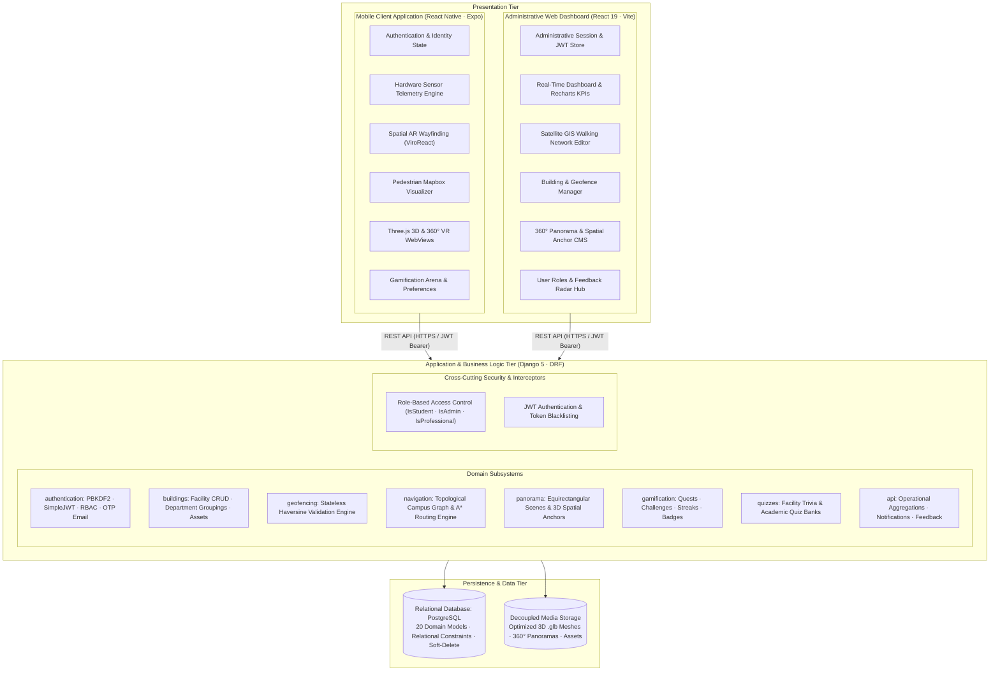
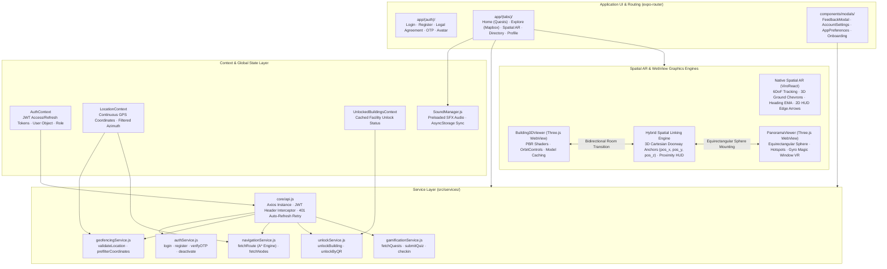
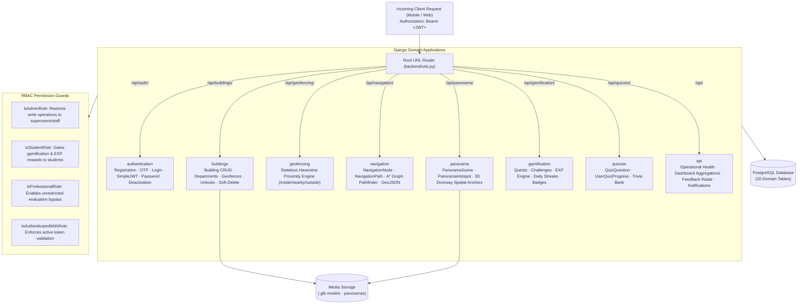
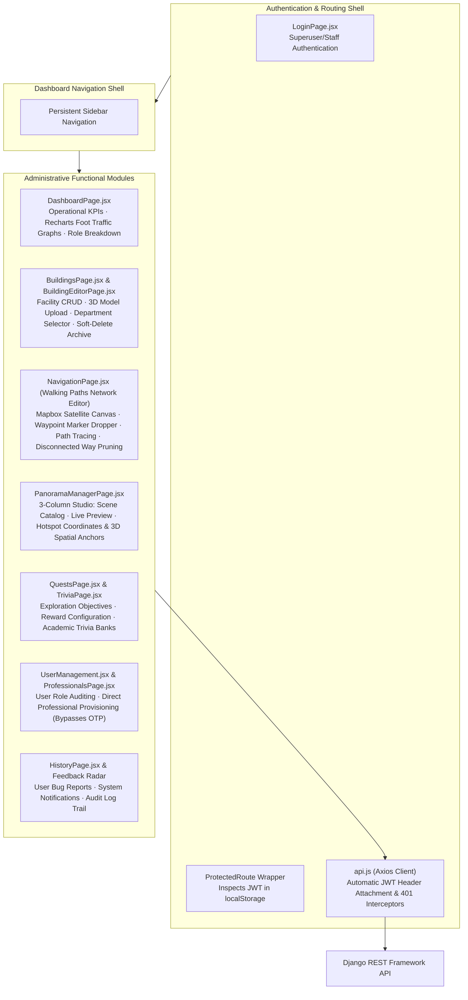

# ARQuest — System Architecture & Subsystem Design

> **Research Paper Component:** Chapter 3 — System Architecture & Methodology  
> **System:** ARQuest: A Sensor-Assisted Campus Exploration and Accreditation Support System  
> **Institution:** Western Mindanao State University (WMSU)

---

## 1. High-Level Multi-Tier System Architecture

The architecture of **ARQuest** is structured as an enterprise multi-tier distributed system. The **Django REST Framework backend** acts as the single authoritative source of truth: all spatial validation, graph pathfinding, access control, and gamification transactions execute server-side, treating both mobile and web clients as secured presentation layers.

```mermaid
graph TB
    subgraph PRESENTATION ["Presentation Tier"]
        subgraph MOBILE_APP ["Mobile Client Application (React Native · Expo)"]
            M1["Authentication & Identity State"]
            M2["Hardware Sensor Telemetry Engine"]
            M3["Spatial AR Wayfinding (ViroReact)"]
            M4["Pedestrian Mapbox Visualizer"]
            M5["Three.js 3D & 360° VR WebViews"]
            M6["Gamification Arena & Preferences"]
        end
        subgraph ADMIN_WEB ["Administrative Web Dashboard (React 19 · Vite)"]
            W1["Administrative Session & JWT Store"]
            W2["Real-Time Dashboard & Recharts KPIs"]
            W3["Satellite GIS Walking Network Editor"]
            W4["Building & Geofence Manager"]
            W5["360° Panorama & Spatial Anchor CMS"]
            W6["User Roles & Feedback Radar Hub"]
        end
    end

    subgraph APPLICATION ["Application & Business Logic Tier (Django 5 · DRF)"]
        subgraph APPS ["Domain Subsystems"]
            B1["authentication: PBKDF2 · SimpleJWT · RBAC · OTP Email"]
            B2["buildings: Facility CRUD · Department Groupings · Assets"]
            B3["geofencing: Stateless Haversine Validation Engine"]
            B4["navigation: Topological Campus Graph & A* Routing Engine"]
            B5["panorama: Equirectangular Scenes & 3D Spatial Anchors"]
            B6["gamification: Quests · Challenges · Streaks · Badges"]
            B7["quizzes: Facility Trivia & Academic Quiz Banks"]
            B8["api: Operational Aggregations · Notifications · Feedback"]
        end
        subgraph SECURITY ["Cross-Cutting Security & Interceptors"]
            SEC1["Role-Based Access Control (IsStudent · IsAdmin · IsProfessional)"]
            SEC2["JWT Authentication & Token Blacklisting"]
        end
    end

    subgraph DATA_TIER ["Persistence & Data Tier"]
        DB[("Relational Database: PostgreSQL<br/>20 Domain Models · Relational Constraints · Soft-Delete")]
        MEDIA[("Decoupled Media Storage<br/>Optimized 3D .glb Meshes · 360° Panoramas · Assets")]
    end

    MOBILE_APP -->|"REST API (HTTPS / JWT Bearer)"| APPLICATION
    ADMIN_WEB  -->|"REST API (HTTPS / JWT Bearer)"| APPLICATION
    APPLICATION --> DB
    APPLICATION --> MEDIA
```

---

## 2. Mobile Client Subsystem Architecture

The mobile client is built on **React Native** utilizing the **Expo Managed Workflow**, targeting Android devices. To maximize performance and prevent native runtime bloat, all 3D architectural rendering and 360° photo spheres are isolated within decoupled Three.js WebViews.

```mermaid
graph TD
    subgraph STATE ["Context & Global State Layer"]
        AUTH_CTX["AuthContext<br/>JWT Access/Refresh Tokens · User Object · Role"]
        LOC_CTX["LocationContext<br/>Continuous GPS Coordinates · Filtered Azimuth"]
        UNLOCK_CTX["UnlockedBuildingsContext<br/>Cached Facility Unlock Status"]
        SOUND_MGR["SoundManager.js<br/>Preloaded SFX Audio · AsyncStorage Sync"]
    end

    subgraph SERVICES ["Service Layer (src/services/)"]
        API_CORE["core/api.js<br/>Axios Instance · JWT Header Interceptor · 401 Auto-Refresh Retry"]
        AUTH_SVC["authService.js<br/>login · register · verifyOTP · deactivate"]
        GEO_SVC["geofencingService.js<br/>validateLocation · prefilterCoordinates"]
        NAV_SVC["navigationService.js<br/>fetchRoute (A* Engine) · fetchNodes"]
        UNLOCK_SVC["unlockService.js<br/>unlockBuilding · unlockByQR"]
        GAME_SVC["gamificationService.js<br/>fetchQuests · submitQuiz · checkin"]
    end

    subgraph UI_SCREENS ["Application UI & Routing (expo-router)"]
        AUTH_SCREENS["app/(auth)/<br/>Login · Register · Legal Agreement · OTP · Avatar"]
        TAB_SCREENS["app/(tabs)/<br/>Home (Quests) · Explore (Mapbox) · Spatial AR · Directory · Profile"]
        FEATURE_MODALS["components/modals/<br/>FeedbackModal · AccountSettings · AppPreferences · Onboarding"]
    end

    subgraph GRAPHICS_ENGINE ["Spatial AR & WebView Graphics Engines"]
        VIRO_AR["Native Spatial AR (ViroReact)<br/>6DoF Tracking · 3D Ground Chevrons · Heading EMA · 2D HUD Edge Arrows"]
        WV_3D["Building3DViewer (Three.js WebView)<br/>PBR Shaders · OrbitControls · Model Caching"]
        WV_PANO["PanoramaViewer (Three.js WebView)<br/>Equirectangular Sphere · Hotspots · Gyro Magic Window VR"]
        WV_LINK["Hybrid Spatial Linking Engine<br/>3D Cartesian Doorway Anchors (pos_x, pos_y, pos_z) · Proximity HUD"]
    end

    AUTH_CTX --> API_CORE
    API_CORE --> AUTH_SVC
    API_CORE --> GEO_SVC
    API_CORE --> NAV_SVC
    API_CORE --> UNLOCK_SVC
    API_CORE --> GAME_SVC

    LOC_CTX --> GEO_SVC
    LOC_CTX --> NAV_SVC
    UNLOCK_CTX --> UNLOCK_SVC

    TAB_SCREENS --> SERVICES
    TAB_SCREENS --> GRAPHICS_ENGINE
    TAB_SCREENS --> SOUND_MGR
    FEATURE_MODALS --> SERVICES

    WV_3D <-->|"Bidirectional Room Transition"| WV_LINK
    WV_LINK <-->|"Equirectangular Sphere Mounting"| WV_PANO
```

---

## 3. Backend Application Architecture & Domain Deconstruction

The backend is developed in **Django 5** and **Django REST Framework (DRF)**. The system is partitioned into eight modular domain applications, exposing versioned JSON REST endpoints governed by custom RBAC permission classes.

```mermaid
graph TD
    REQUEST["Incoming Client Request (Mobile / Web)<br/>Authorization: Bearer &lt;JWT&gt;"]
    ROUTER["Root URL Router (backend/urls.py)"]

    REQUEST --> ROUTER

    subgraph APPS ["Django Domain Applications"]
        ROUTER -->|"/api/auth/"| APP_AUTH["authentication<br/>Registration · OTP · Login · SimpleJWT · Password · Deactivation"]
        ROUTER -->|"/api/buildings/"| APP_BLDG["buildings<br/>Building CRUD · Departments · Geofences · Unlocks · Soft-Delete"]
        ROUTER -->|"/api/geofencing/"| APP_GEO["geofencing<br/>Stateless Haversine Proximity Engine (inside/nearby/outside)"]
        ROUTER -->|"/api/navigation/"| APP_NAV["navigation<br/>NavigationNode · NavigationPath · A* Graph Pathfinder · GeoJSON"]
        ROUTER -->|"/api/panorama/"| APP_PANO["panorama<br/>PanoramaScene · PanoramaHotspot · 3D Doorway Spatial Anchors"]
        ROUTER -->|"/api/gamification/"| APP_GAME["gamification<br/>Quests · Challenges · EXP Engine · Daily Streaks · Badges"]
        ROUTER -->|"/api/quizzes/"| APP_QUIZ["quizzes<br/>QuizQuestion · UserQuizProgress · Trivia Bank"]
        ROUTER -->|"/api/"| APP_API["api<br/>Operational Health · Dashboard Aggregations · Feedback Radar · Notifications"]
    end

    subgraph RBAC_ENGINE ["RBAC Permission Guards"]
        GUARD_ADMIN["IsAdminRole: Restricts write operations to superusers/staff"]
        GUARD_STUDENT["IsStudentRole: Gates gamification & EXP rewards to students"]
        GUARD_PROF["IsProfessionalRole: Enables unrestricted evaluation bypass"]
        GUARD_ANY["IsAuthenticatedWithRole: Enforces active token validation"]
    end

    APPS --> RBAC_ENGINE
    APPS --> PG[("PostgreSQL Database<br/>(20 Domain Tables)")]
    APP_BLDG --> MEDIA_S[("Media Storage<br/>(.glb models · panoramas)")]
    APP_PANO --> MEDIA_S
```

---

## 4. Admin Web Dashboard Architecture

The Administrative Dashboard is a Single-Page Application (SPA) built using **React 19**, **Vite**, and **Tailwind CSS**. It provides institutional operators with full GIS network authoring, facility curation, and operational analytics capabilities.

```mermaid
graph TD
    subgraph ENTRY_AUTH ["Authentication & Routing Shell"]
        LOGIN_PAGE["LoginPage.jsx<br/>Superuser/Staff Authentication"]
        AUTH_ROUTER["ProtectedRoute Wrapper<br/>Inspects JWT in localStorage"]
        AXIOS_CLIENT["api.js (Axios Client)<br/>Automatic JWT Header Attachment & 401 Interceptors"]
    end

    subgraph NAVIGATION_SIDEBAR ["Dashboard Navigation Shell"]
        SIDEBAR["Persistent Sidebar Navigation"]
    end

    subgraph CORE_MODULES ["Administrative Functional Modules"]
        MOD_OVERVIEW["DashboardPage.jsx<br/>Operational KPIs · Recharts Foot Traffic Graphs · Role Breakdown"]
        MOD_FACILITIES["BuildingsPage.jsx & BuildingEditorPage.jsx<br/>Facility CRUD · 3D Model Upload · Department Selector · Soft-Delete Archive"]
        MOD_GIS["NavigationPage.jsx (Walking Paths Network Editor)<br/>Mapbox Satellite Canvas · Waypoint Marker Dropper · Path Tracing · Disconnected Way Pruning"]
        MOD_PANO["PanoramaManagerPage.jsx<br/>3-Column Studio: Scene Catalog · Live Preview · Hotspot Coordinates & 3D Spatial Anchors"]
        MOD_CMS["QuestsPage.jsx & TriviaPage.jsx<br/>Exploration Objectives · Reward Configuration · Academic Trivia Banks"]
        MOD_USERS["UserManagement.jsx & ProfessionalsPage.jsx<br/>User Role Auditing · Direct Professional Provisioning (Bypasses OTP)"]
        MOD_RADAR["HistoryPage.jsx & Feedback Radar<br/>User Bug Reports · System Notifications · Audit Log Trail"]
    end

    ENTRY_AUTH --> NAVIGATION_SIDEBAR
    NAVIGATION_SIDEBAR --> CORE_MODULES
    CORE_MODULES --> AXIOS_CLIENT
    AXIOS_CLIENT --> BACKEND_API["Django REST Framework API"]
```

---

## 5. System Architectural Specifications & Invariants

### 5.1 Technology Stack Matrix

| Tier / Subsystem | Technology | Language | Hosting / Target Runtime |
|:---|:---|:---|:---|
| **Mobile Client** | React Native (Expo SDK 52) · ViroReact · Three.js | JavaScript (ES6+ / JSX) | Android APK (Distributed via EAS) |
| **Backend API** | Django 5.x · Django REST Framework (DRF) | Python 3.12 | Linux Server / Containerized VPS |
| **Admin Dashboard** | React 19 · Vite · Tailwind CSS · Recharts | JavaScript (ES6+ / JSX) | Cloud Static Host / Nginx Reverse Proxy |
| **Database** | PostgreSQL 16 | Relational SQL | Managed Cloud Database / VPS Instance |
| **Spatial / Maps** | Mapbox GL JS / Mapbox React Native | Vector Tiles / GeoJSON | Cloud Mapbox CDN Services |
| **Authentication** | SimpleJWT · Brevo SMTP Provider | Python / HTTPS | Backend Embedded Token Service |

---

### 5.2 Architectural Invariants & Design Principles

| # | Architectural Rule | Technical Rationale & Enforcement Mechanism |
|:---|:---|:---|
| **1** | **Backend Single Source of Truth** | All critical decision-making—geofence entry validation, EXP calculations, route graph searches, and role permissions—executes authoritatively on Django. Clients are untrusted presentation layers. |
| **2** | **Self-Sovereign Campus Routing** | Third-party routing APIs (e.g., Mapbox Directions) are replaced with ARQuest's internal server-side $A^*$ engine, ensuring paths strictly traverse verified WMSU campus sidewalks. |
| **3** | **Decoupled 3D/360° WebView Boundary** | To avoid the massive memory footprint and compilation overhead of native game engines (e.g., Unity, ARCore), 3D GLB inspection and 360° panoramas run inside lightweight Three.js WebViews. |
| **4** | **Two-Stage Battery-Optimized Geofencing** | Mobile clients run a local Haversine pre-filter ($>75\text{m}$) to eliminate 95% of unnecessary network transmissions, invoking authoritative server validation only when in physical proximity. |
| **5** | **Strict Zero-Downtime Graph Integrity** | Administrative deletion of navigation waypoint nodes cascades in PostgreSQL (`models.CASCADE`) and triggers synchronous client-side pruning, eliminating orphaned walkway segments. |
| **6** | **Self-Service Soft-Deactivation** | Account deactivation marks `is_active = False` and blacklists refresh tokens while safely preserving all historical EXP, badges, and passport stamps in PostgreSQL for self-service restoration. |
| **7** | **Zero Hardcoded Campus Data** | All building coordinates, walkway geometries, geofences, and media asset URLs are dynamically streamed from the REST API, allowing campus layout updates without mobile app redeployment. |

---

## 6. Narrative Architectural Analysis

### 6.1 Multi-Tier Separation of Concerns
ARQuest separates its architectural responsibilities across four distinct tiers: Presentation, Application/Business Logic, Services/Algorithms, and Data Persistence. This structural isolation guarantees that modifications to the mobile user interface or administrative web pages do not impact backend business logic or database integrity.

### 6.2 Graphics & Spatial AR Architecture
A paramount consideration in developing mobile augmented reality applications is managing device thermal load, memory consumption, and battery life:
- **ViroReact AR Engine**: Runs 6DoF coordinate tracking using the device camera and magnetometer, implementing Exponential Moving Average (EMA) and deadband azimuth filtering ($2.5^\circ$) to deliver stable 60 FPS ground chevrons without micro-jitter.
- **Three.js WebViews**: Architectural GLB models and equirectangular photo spheres are rendered inside dedicated WebView sandboxes. This prevents native crashes, allows dynamic asset cache invalidation via SHA256 checksums, and enables the **Hybrid Spatial Linking Subsystem**—which bridges 3D models with 360° rooms through eye-level 3D portal badges ($Y \approx 1.6\text{m}$) and 5m proximity detection.

### 6.3 Self-Sovereign Navigation & Graph Architecture
Unlike generic commercial navigation tools that struggle with unmapped university pathways, ARQuest implements an autonomous walking network architecture:
- Physical campus sidewalks are modeled as a topological graph composed of `NavigationNode` records (Entrances, Junctions, Gates, POIs) and `NavigationPath` records (multi-point coordinate line strings).
- When a user requests directions, the backend $A^*$ algorithm calculates the optimal path along verified campus walkways using geodesic distance metrics, streaming the resulting GeoJSON directly to the client's Mapbox rendering canvas.
- The Admin Web Dashboard features an interactive satellite walking network editor with real-time disconnected way pruning, guaranteeing zero broken routes across the university.
