# ARQuest — Use Case Diagram

> Last updated: 2026-08-28

---

## 1. System Use Cases

```mermaid
flowchart TB
    %% Actors
    Student(("Student"))
    Visitor(("Visitor / Guest"))
    Professional(("Professional / Accreditor"))
    Admin(("Administrator"))

    %% System Boundary
    subgraph System ["ARQuest System"]
        
        subgraph MobileApp ["Mobile Application"]
            UC1(["Register, Accept Terms & Verify OTP"])
            UC2(["Explore Campus via GPS & 2D Map"])
            UC3(["Navigate via Spatial AR Ground Chevrons"])
            UC4(["Unlock Facility via Geofence / QR"])
            UC5(["View 3D Model & 360° Walkthrough"])
            UC6(["Complete Quests, Challenges & Earn Badges"])
            UC7(["Take Building Trivia Quiz"])
            UC8(["View Campus Passport / Visited Checklist"])
            UC9(["Manage Account, Password & Deactivation"])
            UC10(["Configure App Preferences (SFX/Units/Map)"])
            UC11(["Submit In-App Bug Report / Feedback"])
            UC12(["Access Magic Window VR Virtual Tour"])
            UC13(["Replay Role-Based Interactive User Manual"])
        end

        subgraph WebApp ["Admin Web Dashboard"]
            UC14(["View Real-Time Dashboard & Foot Traffic"])
            UC15(["Manage Campus Facilities & Departments"])
            UC16(["Calibrate Geofence Boundaries"])
            UC17(["Manage 360° Panoramas & Hotspots"])
            UC18(["Author Quests, Trivia & Quizzes (CMS)"])
            UC19(["Manage User Accounts & Accreditors"])
            UC20(["Review & Resolve Mobile Feedback/Issues"])
            UC21(["Configure System Flags & Audit Logs"])
        end
    end

    %% Student Connections
    Student --- UC1
    Student --- UC2
    Student --- UC3
    Student --- UC4
    Student --- UC5
    Student --- UC6
    Student --- UC7
    Student --- UC8
    Student --- UC9
    Student --- UC10
    Student --- UC11
    Student --- UC13

    %% Visitor Connections
    Visitor --- UC2
    Visitor --- UC3
    Visitor --- UC5
    Visitor --- UC10
    Visitor --- UC13

    %% Professional Connections
    Professional --- UC2
    Professional --- UC5
    Professional --- UC8
    Professional --- UC9
    Professional --- UC10
    Professional --- UC11
    Professional --- UC12
    Professional --- UC13

    %% Admin Connections
    Admin --- UC14
    Admin --- UC15
    Admin --- UC16
    Admin --- UC17
    Admin --- UC18
    Admin --- UC19
    Admin --- UC20
    Admin --- UC21
```

---

## Documentation

### Overview

The Use Case Diagram defines the functional scope of ARQuest across its four distinct user roles within the mobile client and the administrative web dashboard.

### Actor: Student
- **Registration & Legal Acceptance**: Creates an account, reviews and accepts the Terms & Conditions and Privacy Policy, and verifies email via 6-digit OTP.
- **Campus Exploration & Spatial AR**: Explores campus using 2D Mapbox maps and follows 3D glowing ground chevrons with off-screen turn indicators to reach facilities.
- **Building Unlocks & Passport**: Automatically unlocks buildings upon entering geofence perimeters and records stamp milestones in their Campus Passport.
- **Gamification Arena**: Completes daily missions, maintains login streaks, passes building quizzes, earns tiered badges, and checks leaderboard rankings.
- **Account & Preferences**: Customizes WMSU avatars, updates profile name, updates passwords, toggles SFX audio and haptics, submits bug reports, or deactivates their account with self-service reactivation on next login.

### Actor: Visitor / Guest
- **Public Navigation**: Accesses public campus directories, 2D exploration maps, and AR wayfinding without mandatory registration.
- **Interactive Manual**: Replays the dedicated Visitor Campus Guide tutorial on demand.

### Actor: Professional / Accreditor
- **Institutional Evaluation**: Bypasses student gamification constraints to inspect all campus facilities without physical geofencing locks.
- **360° Virtual Tours & Magic Window VR**: Conducts remote room-to-room inspections utilizing the device's gyroscope in full first-person VR mode.
- **Visited Facilities Checklist**: Tracks evaluation inspection status across academic buildings.

### Actor: Administrator
- **Operational Dashboard**: Monitors real-time KPIs, daily foot traffic graphs (Recharts), content coverage matrix, role composition, and live activity feeds.
- **Content Management**: Manages campus facilities, geofence polygons, 3D glTF models, 360° panoramic scenes, hotspot links, and quest/trivia CMS.
- **User & Security Management**: Provisions Accreditor accounts, monitors user roles, resolves user bug reports, and configures global feature flags.
