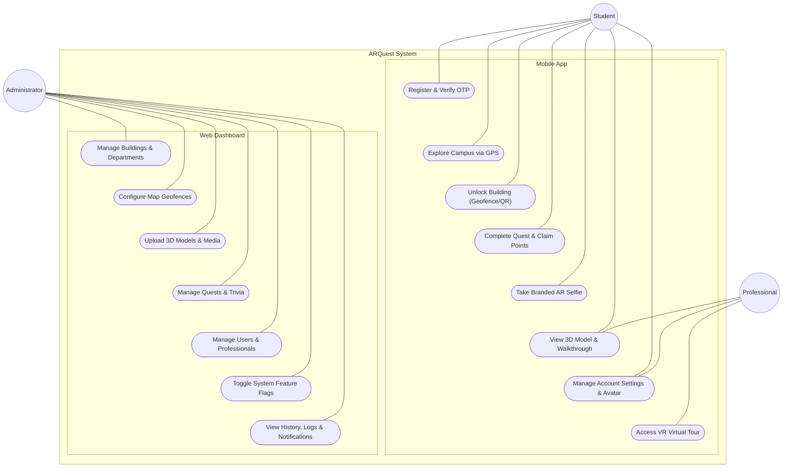

# ARQuest — Use Case Diagram

> Last updated: 2026-06-22

---

## 1. System Use Cases

---

## Documentation

### Overview

The Use Case Diagram defines the functional requirements of the ARQuest system from the perspective of its primary actors. It outlines what each user role is permitted to do within the mobile application and the administrative web dashboard.

### Actor: Student / Visitor

The Student (or Visitor) interacts exclusively with the mobile application to explore the campus and engage with the gamification system.
- **Register & Verify OTP**: Students create accounts and verify their identity using a One-Time Password sent to their email.
- **Explore Campus via GPS**: Students view their real-time location on the campus map and see nearby building geofences.
- **Unlock Building**: By physically entering a geofence or scanning a fallback QR code, students unlock access to a building's digital content.
- **View 3D Model & 360° Walkthrough**: Once unlocked, students can manipulate 3D architectural models and navigate through panoramic indoor walkthroughs.
- **Complete Quest & Claim Points**: Students receive directions to specific buildings. Upon arrival, they use the AR camera to claim exploration points and maintain their daily login streaks.
- **Take Branded AR Selfie**: Students can overlay the 3D model onto their live camera feed, take a picture with a branded frame, and save it to their device.
- **Manage Account Settings & Avatar**: Students can customize their profile by choosing from a set of generated WMSU-themed avatars.

### Actor: Professional

The Professional is a specialized role, typically an accreditor, who requires remote access to building layouts for inspection purposes.
- **Access VR Virtual Tour**: Professionals bypass the geofence restrictions. They can directly access any building's "Magic Window VR" mode, utilizing their device's gyroscope to look around the virtual space as if they were physically present.
- **View 3D Model & 360° Walkthrough**: Like students, professionals can view all standard 3D and 360° content without needing to unlock the building via GPS.

### Actor: Administrator

The Administrator manages the entire platform through the secure web dashboard.
- **Manage Buildings & Departments**: Admins create, edit, soft-delete, and publish building records, assigning them to specific campus departments.
- **Configure Map Geofences**: Admins visually draw and size circular geofence boundaries on a map for each building.
- **Upload 3D Models & Panoramas**: Admins upload the raw `.glb` files and equirectangular images that power the mobile visualizers.
- **Manage Quests & Trivia**: Admins author the gamification content, setting quest targets, hints, reward values, and educational trivia facts.
- **Manage Users & Professionals**: Admins view the user base, manage roles, and manually provision accounts for Professional users.
- **Toggle System Feature Flags**: Admins can instantly enable or disable system-wide features (like GPS requirements, QR scanning, or Maintenance Mode) without requiring a mobile app update.
- **View History, Logs & Notifications**: Admins can view system, professional, building, and feedback notifications, managing read statuses and staying updated on system events.
