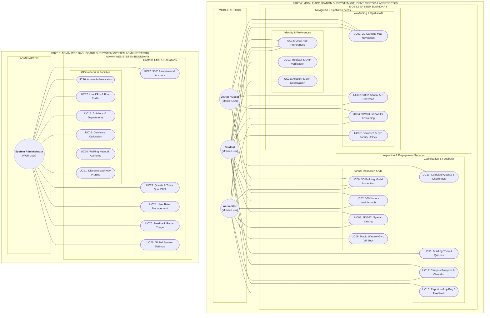

# ARQuest — Use Case Diagram & Functional Specifications

> **Research Paper Component:** Chapter 3 — System Analysis & Design / Use Case Specifications  
> **System:** ARQuest: A Sensor-Assisted Campus Exploration and Accreditation Support System  
> **Institution:** Western Mindanao State University (WMSU)  
> **Document Format:** Standard A4 Bond Paper (Portrait Orientation: 210mm × 297mm)

---

## 1. System Use Case Diagram

The Use Case Diagram defines the functional boundary of **ARQuest**, modeling the interactions between the four primary actors (**Student**, **Visitor / Guest**, **Professional / Accreditor**, and **System Administrator**) and the two major subsystems: the **Mobile Client Application Subsystem** and the **Admin Web Dashboard Subsystem**.

The diagram is organized in a balanced **Vertical Portrait Layout** with actors clustered on the left and use cases structured into clear functional domains inside the system boundary, ensuring high legibility and eliminating horizontal stretching.

```mermaid
flowchart TD
    %% ==========================================
    %% PART A: MOBILE APPLICATION SUBSYSTEM
    %% ==========================================
    subgraph MOBILE_PANEL ["PART A: MOBILE APPLICATION SUBSYSTEM (STUDENT, VISITOR & ACCREDITOR)"]
        direction LR
        subgraph M_ACTORS ["MOBILE ACTORS"]
            direction TB
            Visitor(("<b>Visitor / Guest</b><br/>(Mobile User)"))
            Student(("<b>Student</b><br/>(Mobile User)"))
            Prof(("<b>Accreditor</b><br/>(Mobile User)"))
        end

        subgraph M_SYSTEM ["MOBILE SYSTEM BOUNDARY"]
            direction TB
            subgraph COL_NAV ["Navigation & Spatial Services"]
                direction TB
                subgraph G1 ["Identity & Preferences"]
                    UC01(["UC01: Register & OTP Verification"])
                    UC13(["UC13: Account & Soft-Deactivation"])
                    UC14(["UC14: Local App Preferences"])
                end
                subgraph G2 ["Wayfinding & Spatial AR"]
                    UC02(["UC02: 2D Campus Map Navigation"])
                    UC03(["UC03: Native Spatial AR Chevrons"])
                    UC04(["UC04: WMSU Sidewalks A* Routing"])
                    UC05(["UC05: Geofence & QR Facility Unlock"])
                end
                G1 ~~~ G2
            end

            subgraph COL_EXP ["Inspection & Engagement Services"]
                direction TB
                subgraph G3 ["Virtual Inspection & VR"]
                    UC06(["UC06: 3D Building Model Inspection"])
                    UC07(["UC07: 360° Indoor Walkthrough"])
                    UC08(["UC08: 3D/360° Spatial Linking"])
                    UC09(["UC09: Magic Window Gyro VR Tour"])
                end
                subgraph G4 ["Gamification & Feedback"]
                    UC10(["UC10: Complete Quests & Challenges"])
                    UC11(["UC11: Building Trivia & Quizzes"])
                    UC12(["UC12: Campus Passport & Checklist"])
                    UC15(["UC15: Report In-App Bug / Feedback"])
                end
                G3 ~~~ G4
            end
            COL_NAV ~~~ COL_EXP
        end

        Visitor --- UC02
        Visitor --- UC03
        Visitor --- UC04
        Visitor --- UC06
        Visitor --- UC07
        Visitor --- UC14

        Student --- UC01
        Student --- UC02
        Student --- UC03
        Student --- UC04
        Student --- UC05
        Student --- UC06
        Student --- UC07
        Student --- UC08
        Student --- UC10
        Student --- UC11
        Student --- UC12
        Student --- UC13
        Student --- UC14
        Student --- UC15

        Prof --- UC02
        Prof --- UC04
        Prof --- UC06
        Prof --- UC07
        Prof --- UC08
        Prof --- UC09
        Prof --- UC12
        Prof --- UC14
        Prof --- UC15
    end

    %% ==========================================
    %% PART B: ADMIN WEB DASHBOARD SUBSYSTEM
    %% ==========================================
    subgraph WEB_PANEL ["PART B: ADMIN WEB DASHBOARD SUBSYSTEM (SYSTEM ADMINISTRATOR)"]
        direction LR
        subgraph W_ACTORS ["ADMIN ACTOR"]
            direction TB
            Admin(("<b>System Administrator</b><br/>(Web User)"))
        end

        subgraph W_SYSTEM ["ADMIN WEB SYSTEM BOUNDARY"]
            direction TB
            subgraph W_G1 ["GIS Network & Facilities"]
                direction TB
                UC16(["UC16: Admin Authentication"])
                UC17(["UC17: Live KPIs & Foot Traffic"])
                UC18(["UC18: Buildings & Departments"])
                UC19(["UC19: Geofence Calibration"])
                UC20(["UC20: Walking Network Authoring"])
                UC21(["UC21: Disconnected Way Pruning"])
            end
            subgraph W_G2 ["Content, CMS & Operations"]
                direction TB
                UC22(["UC22: 360° Panoramas & Anchors"])
                UC23(["UC23: Quests & Trivia Quiz CMS"])
                UC24(["UC24: User Role Management"])
                UC25(["UC25: Feedback Radar Triage"])
                UC26(["UC26: Global System Settings"])
            end
            W_G1 ~~~ W_G2
        end

        Admin --- UC16
        Admin --- UC17
        Admin --- UC18
        Admin --- UC19
        Admin --- UC20
        Admin --- UC21
        Admin --- UC22
        Admin --- UC23
        Admin --- UC24
        Admin --- UC25
        Admin --- UC26
    end

```

> **Figure 3.3:** *System Use Case Diagram (Mobile & Web Subsystems in Standard A4 Portrait Format).*  
> High-Resolution Print Asset: [`diagrams/03-use-case/03-system-use-case-diagram.png`](diagrams/03-use-case/03-system-use-case-diagram.png)

---

## 2. Actor Profiles

| Actor | Target Interface | Authentication Requirement | Functional Scope & Responsibility |
|:---|:---|:---|:---|
| **Student** | Android Mobile App | Authenticated (JWT) with verified email OTP | Primary user engaged in spatial exploration, gamified quests, trivia quizzes, Campus Passport collection, and native Spatial AR wayfinding. |
| **Visitor / Guest** | Android Mobile App | Unauthenticated (Guest Session) | Prospective students and visitors who require quick access to public campus maps, facility information, and pedestrian wayfinding without mandatory registration. |
| **Professional (Accreditor)** | Android Mobile App | Authenticated (Provisioned Account) | Institutional accreditors and faculty evaluating campus facilities. Bypasses physical geofencing locks; uses 3D models, 360° tours, Magic Window VR, and evaluation checklists. |
| **System Administrator** | Admin Web Dashboard | Authenticated (Superuser / Staff JWT) | Institutional administrators responsible for maintaining digital campus twins, authoring walking network graphs, managing geofences, and monitoring live operational analytics. |

---

## 3. Comprehensive Use Case Catalog

| Use Case ID | Use Case Name | Primary Actor(s) | Subsystem | Brief Description |
|:---|:---|:---|:---|:---|
| **UC01** | Register, Accept Terms & Verify OTP | Student | Mobile | Registers user account, enforces legal agreement compliance, and verifies institutional email via 6-digit OTP. |
| **UC02** | Explore Campus via 2D Vector Map | All Roles | Mobile | Renders high-performance Mapbox vector map with interactive pins for all campus facilities. |
| **UC03** | Navigate via Native Spatial AR | Student, Visitor | Mobile | Projects 3D ground chevrons and 2D off-screen HUD turn arrows using 6DoF ViroReact AR and EMA-smoothed compass telemetry. |
| **UC04** | Navigate via Custom WMSU Walkways | Student, Visitor, Prof | Mobile | Streams optimal pedestrian routes computed by backend A* pathfinding over real WMSU sidewalk geometries. |
| **UC05** | Unlock Facility via Geofence / QR | Student | Mobile | Unlocks campus buildings upon physical geofence entry (validated server-side) or via emergency QR code scan. |
| **UC06** | Inspect 3D Building Models | All Roles | Mobile | Renders interactive, touch-manipulated `.glb` architectural models via Three.js WebViews with PBR materials. |
| **UC07** | Explore 360° Panoramic Walkthroughs | All Roles | Mobile | Provides indoor spherical photo walkthroughs with clickable hotspot markers connecting rooms. |
| **UC08** | Spatial Linking (3D Tour $\leftrightarrow$ 360° Rooms) | Student, Prof | Mobile | Enables bidirectional jumps between 3D building exploration and photographic 360° interior rooms using spatial doorway anchors. |
| **UC09** | Magic Window VR Virtual Tour | Professional | Mobile | Synchronizes Three.js panoramic camera with device gyroscope for hands-free first-person physical room inspection. |
| **UC10** | Complete Quests & Challenges | Student | Mobile | Directs students to visit specific buildings, rewarding EXP points and updating consecutive login streaks. |
| **UC11** | Take Trivia & Academic Quizzes | Student | Mobile | Presents facility-specific trivia questions to students for institutional knowledge acquisition and EXP bonuses. |
| **UC12** | View Campus Passport / Checklist | Student, Prof | Mobile | Displays unlocked facility stamps for students, and an evaluation inspection checklist for accreditors. |
| **UC13** | Manage Account & Deactivation | Student, Prof | Mobile | Allows users to edit profile names, select avatars, update passwords, or self-deactivate their account with full data preservation. |
| **UC14** | Configure App Preferences | All Roles | Mobile | Persists local toggles for SFX audio muting (`SoundManager`), haptics, distance units (meters/feet), and compass auto-rotation. |
| **UC15** | Submit Bug Reports & Feedback | Student, Prof | Mobile | Submits categorized user feedback (Bug, Feature, Other) directly to the administrative Feedback Radar. |
| **UC16** | Authenticate & Access Admin Overview | Administrator | Web | Authenticates administrative users and grants access to protected dashboard routes. |
| **UC17** | Monitor Live KPIs & Foot Traffic | Administrator | Web | Visualizes real-time foot traffic trends (Recharts Bar/Area graphs), content coverage, and demographic role distributions. |
| **UC18** | Manage Buildings & Departments | Administrator | Web | Supports CRUD operations for campus facilities, college departments, 3D model uploads, and soft-delete archiving. |
| **UC19** | Calibrate Geofence Boundaries | Administrator | Web | Configures circular GPS geofence radiuses and polygon bounds on interactive satellite maps. |
| **UC20** | Author Walking Network Graph | Administrator | Web | Places waypoint nodes (entrances, junctions, gates, POIs) and traces multi-coordinate sidewalk paths on Mapbox satellite imagery. |
| **UC21** | Inspect & Prune Disconnected Ways | Administrator | Web | Automatically purges orphan walkway segments and attached paths upon node deletion to preserve graph integrity. |
| **UC22** | Manage 360° Panoramas & Anchors | Administrator | Web | Uploads equirectangular scenes, configures navigation hotspots, and calibrates 3D Cartesian doorway spatial anchors $(X, Y, Z)$. |
| **UC23** | Author Quests & Quiz CMS | Administrator | Web | Creates and updates building exploration quests, hint texts, reward point allocations, and trivia quiz questions. |
| **UC24** | Provision Accounts & User Roles | Administrator | Web | Creates professional accounts (bypassing OTP) and manages student role permissions. |
| **UC25** | Review & Resolve Feedback Radar | Administrator | Web | Tunnels mobile user issue submissions to an admin radar; reviews, investigates, and marks tickets resolved. |
| **UC26** | Configure Feature Flags & Audit Logs | Administrator | Web | Manages singleton `SystemSetting` toggles (maintenance mode, GPS/QR toggles) and inspects system event audit logs. |

---

## 4. Key Representative Use Case Specifications

### Use Case Specification: UC03 — Navigate via Native Spatial AR Ground Chevrons
- **Primary Actor:** Student, Visitor
- **Pre-conditions:** Device location (GPS) and camera permissions granted; target building selected.
- **Main Flow:**
  1. The user selects a facility and initiates Spatial AR Navigation.
  2. The system activates the optical camera feed and polls GPS and magnetometer compass telemetry.
  3. The mathematical engine calculates the geodesic target bearing and relative azimuth, applying an Exponential Moving Average (EMA) smoothing filter.
  4. If the destination is within the camera's $45^\circ$ field of view, the system projects animated glowing 3D ground chevrons along the ground plane accompanied by a floating tactical distance HUD.
  5. If the destination is outside the active viewing frustum, the system suppresses ground chevrons and renders 2D perimeter edge arrows (`◀ TURN LEFT` / `TURN RIGHT ▶`).
  6. Upon arrival within $\le 25\text{m}$, the system latches into Arrival Mode with a 20m hysteresis buffer, displaying a rotating 3D building miniature on a hologram pedestal.
- **Post-conditions:** User is visually guided to the target building without sensor micro-jitter.

### Use Case Specification: UC04 — Navigate via Custom WMSU Walkways (A* Routing Engine)
- **Primary Actor:** Student, Visitor, Professional
- **Pre-conditions:** Device GPS is enabled; network connection to Django backend is active.
- **Main Flow:**
  1. The user requests walking directions to a designated campus facility.
  2. The mobile app queries `GET /api/navigation/route/` with user coordinates and destination building ID.
  3. The backend $A^*$ routing engine snaps origin coordinates to the nearest active walkway node and retrieves the target entrance node.
  4. The algorithm computes the shortest obstacle-free pedestrian path over verified sidewalk line strings using geodesic edge weights.
  5. The backend compiles the stitched multi-coordinate geometry into an optimized GeoJSON `FeatureCollection`.
  6. The mobile app renders the route on the Mapbox vector canvas in Electric Cyan with real-time walking distance and estimated time.
- **Post-conditions:** User receives an accurate pedestrian route adhering strictly to campus sidewalks without third-party routing dependencies.

### Use Case Specification: UC08 — Transition between 3D Model & 360° Rooms via Spatial Linking
- **Primary Actor:** Student, Professional (Accreditor)
- **Pre-conditions:** Building 3D model is loaded in Three.js WebView; building has active panorama scenes with spatial anchors.
- **Main Flow:**
  1. The user traverses the building interior in the First-Person 3D Virtual Tour.
  2. The spatial proximity engine tracks camera Cartesian coordinates $(X, Y, Z)$ at 10 FPS against stored `PanoramaScene` anchor coordinates.
  3. When the user approaches within 5 meters of a doorway anchor, the system renders an in-world 3D portal badge floating at eye level ($Y \approx 1.6\text{m}$) and updates the top HUD button to indicate the specific room name.
  4. The user taps the portal badge or HUD button; the system caches the current 3D camera position and orientation.
  5. The system transitions into the 360° Panorama Viewer displaying the high-resolution interior photo sphere of the room.
  6. Upon closing the panorama, the system unmounts the photo sphere and seamlessly restores the 3D tour with preserved camera coordinates.
- **Post-conditions:** User transitions fluidly between digital 3D blueprints and real-world photographic spherical environments.

### Use Case Specification: UC21 — Inspect Network Topology & Prune Disconnected Ways
- **Primary Actor:** Administrator
- **Pre-conditions:** Administrator is authenticated and accessing the Walking Paths page on the Web Dashboard.
- **Main Flow:**
  1. The administrator inspects the satellite walking network overlay.
  2. The administrator selects an obsolete or misplaced waypoint node and clicks Delete.
  3. The system dispatches `DELETE /api/navigation/nodes/{id}/` to the Django API.
  4. In PostgreSQL, database foreign keys cascade deletion across all connected `NavigationPath` segments.
  5. Simultaneously, the web client performs synchronous state pruning, immediately removing the node marker and all attached walkway line strings from the canvas.
- **Post-conditions:** Database and map display maintain flawless topological integrity, preventing broken routes in the backend $A^*$ engine.
