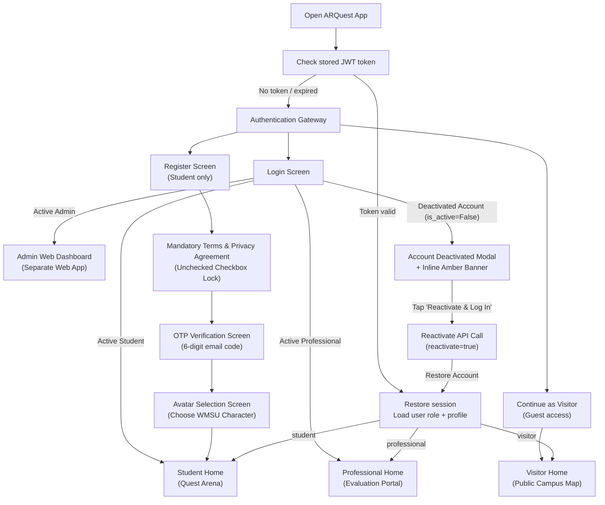
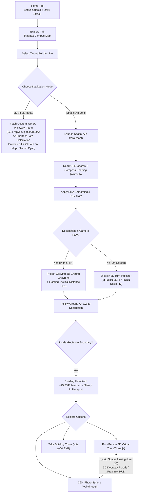
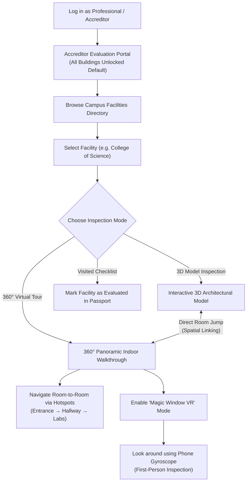
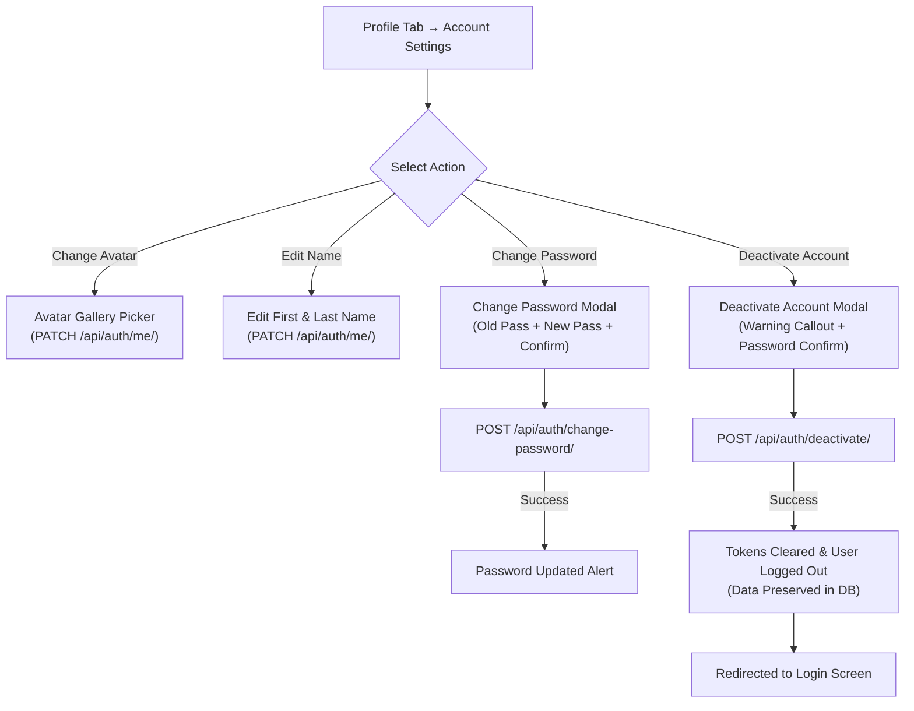
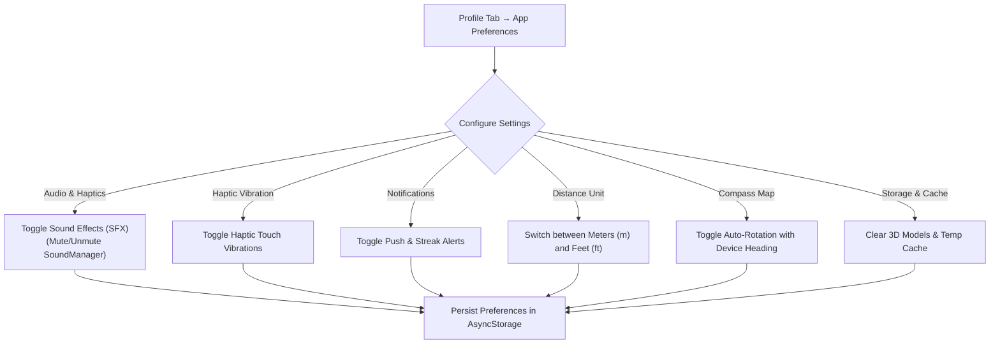
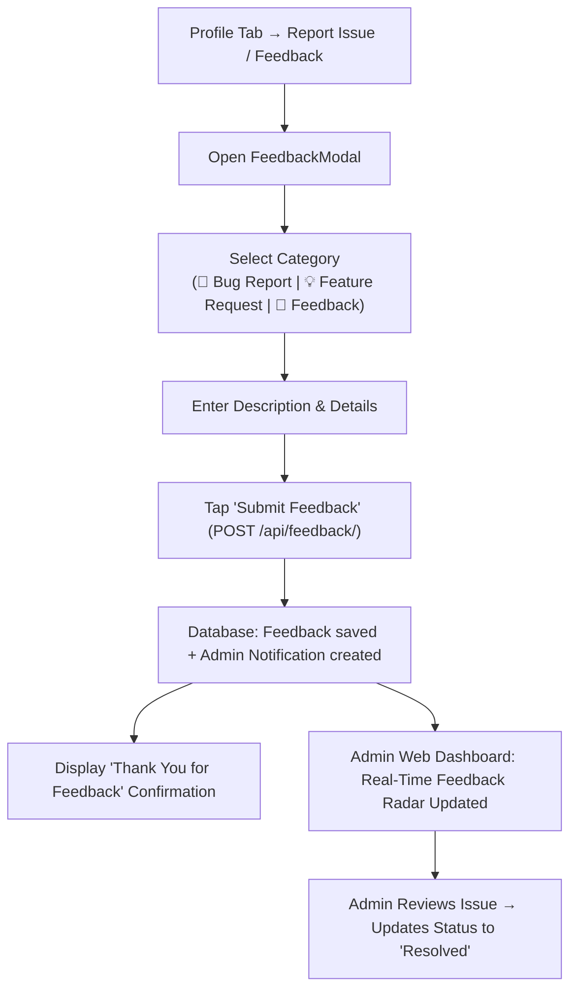
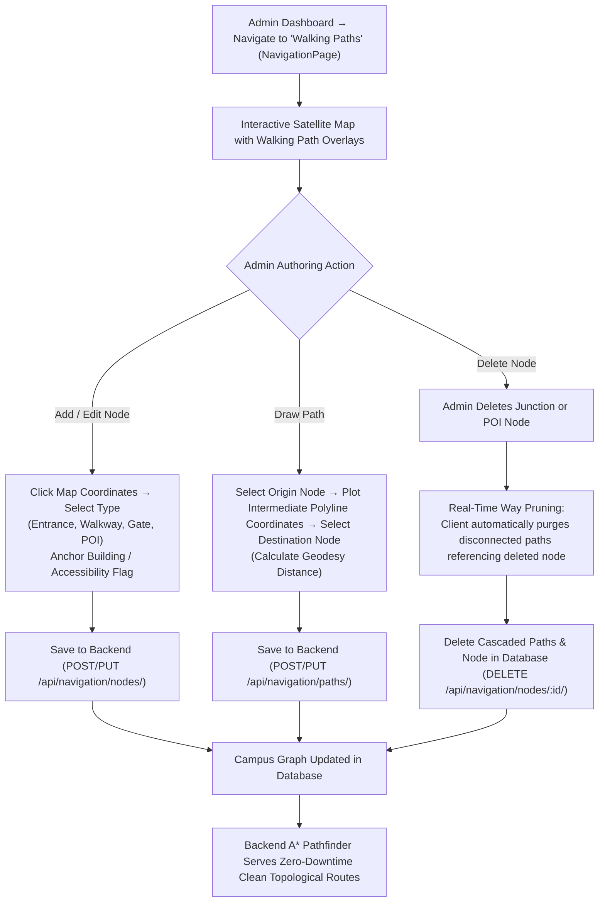

# ARQuest — User Flow

> Last updated: 2026-09-01
> Covers all four user roles: Student, Professional (Accreditor), Admin, and Visitor.

---

## Flow 1 — App Entry, Legal Onboarding & Role Routing

---

## Flow 2 — Student: Exploration & Native Spatial AR Navigation

---

## Flow 3 — Professional (Accreditor): Remote Evaluation & VR

---

## Flow 4 — Account Settings, Password Management & Deactivation

---

## Flow 5 — App Preferences & Audio Control

---

## Flow 6 — Mobile Feedback & Issue Reporting

---

## Flow 7 — Admin Walking Network Authoring & Disconnected Way Pruning

---

## Documentation

### Overview

The User Flow diagrams chart the end-to-end navigational journeys, decision bifurcations, and interaction logic across all four supported system roles in ARQuest: **Student**, **Professional (Accreditor)**, **Visitor (Guest)**, and **Administrator**.

The architecture adheres to a strict principle of **Role-Driven UI Separation**: while all user types interact with the campus digital twin, their functional capabilities, constraints, and interface complexity expand or simplify dynamically according to their institutional responsibilities.

---

### Flow 1 — App Entry, Legal Onboarding & Role Routing

This flow governs application initialization, identity authentication, legal compliance, and initial landing screen dispatch:

1. **Session Token Validation**: Upon cold launch, the application reads the encrypted JWT Access Token from `Expo SecureStore`.
   - If the token is cryptographically valid and unexpired, the session restores automatically, querying user profile metadata and routing directly to the appropriate home dashboard based on `user.role`.
   - If the token is missing, corrupted, or expired (and cannot be refreshed via the refresh token), the user is directed to the unauthenticated **Authentication Gateway**.
2. **Gateway Pathways**:
   - **Student Registration**: Leads to the Register screen. The student provides personal details and password. Proceeding requires an explicit check of the mandatory Terms & Conditions and Privacy Policy agreement. Submission triggers a 6-digit OTP email verification screen; once verified, the user chooses their custom WMSU avatar character before landing in the Student Quest Arena.
   - **User Login**: Accommodates registered students, professionals, and administrators.
   - **Visitor / Guest Entry**: Bypasses authentication entirely, creating an ephemeral visitor session that immediately mounts the public Campus Map and Directory without requiring credentials.
3. **Deactivated Account Detection & Self-Service Reactivation**: If a user submits valid credentials for an account that was previously soft-deactivated (`is_active = False`), the API returns error code `"account_deactivated"`. The mobile app catches this and presents a recovery modal with an inline amber notice. Tapping "Reactivate & Log In" resubmits the request with `reactivate: true`, instantly setting `is_active = True` on the backend, restoring active JWT tokens, and transitioning seamlessly to the home dashboard with all historic EXP, achievements, and unlocked facilities preserved.
4. **Role-Based Destination Routing**:
   - `student` $\rightarrow$ **Student Home (Quest Arena)** with active quests, streak cards, and recent achievements.
   - `professional` $\rightarrow$ **Professional Home (Accreditation Portal)** with direct facility evaluations and documentation checklists.
   - `visitor` $\rightarrow$ **Visitor Home (Public Campus Directory)** with read-only facility guides.
   - `admin` $\rightarrow$ Displayed a notice directing them to the administrative **Web Dashboard**.

---

### Flow 2 — Student: Exploration & Native Spatial AR Navigation

This flow models the primary student gamification and navigation loop:

1. **Mission Briefing & Campus Exploration**: The student starts on the Home tab, reviewing active daily missions and streak progress, before transitioning to the Explore tab. The interactive Mapbox vector map displays campus facility markers.
2. **Navigation Mode Selection**: Selecting a building pin opens a bottom command sheet offering two distinct navigation paradigms:
   - **2D Visual Route**: The app queries the ARQuest Django routing API (`GET /api/navigation/route/`). The backend A* algorithm calculates the optimal path along verified WMSU campus sidewalks. The resulting GeoJSON `LineString` is drawn onto the map in Electric Cyan with white casing, displaying geodesic distance and walking time estimates.
   - **Spatial AR Lens**: The app launches native ViroReact 6DoF AR mode (`ARQuestScene`).
3. **Sensor-Driven AR Wayfinding**: The AR engine continuously evaluates device GPS telemetry and magnetometer compass heading:
   - **Target within Camera FOV ($\le 45^\circ$)**: Glowing 3D crimson and gold chevrons are projected directly onto the ground plane, accompanied by a floating 3D tactical HUD billboard indicating building name and real-time distance.
   - **Target outside Camera FOV ($> 45^\circ$)**: 3D ground arrows are hidden, and responsive 2D edge indicators (`◀ TURN LEFT` / `TURN RIGHT ▶`) appear on the screen perimeter to guide the student toward the destination without visual clutter.
4. **Arrival & Geofence Unlock**: As the student enters the facility's physical geofence boundary ($\le 25\text{m}$ radius), the app issues a server validation request. Upon confirmation:
   - The building unlocks permanently.
   - The user is awarded $+25\text{ EXP}$ and a celebratory sound plays via `SoundManager`.
   - The facility's stamp is marked in the student's Campus Passport.
   - The AR view transitions into **Arrival Mode**, featuring a ground hologram pedestal and a continuously rotating 3D building miniature.
5. **Interactive Facility Exploration**: The student can now engage with multiple content modalities:
   - **First-Person 3D Virtual Tour**: Interactive Three.js model inspection with joystick controls.
   - **360° Photo Sphere Walkthrough**: Indoor spherical photo inspection.
   - **Hybrid Spatial Linking (Unit 30)**: Inside the 3D tour, floating in-world 3D portal badges and top proximity HUD buttons detect doorway boundaries within 5 meters, allowing immediate jumps into 360° panoramic rooms and seamless returns.
   - **Trivia Quizzes**: Students can test their knowledge on building-specific trivia to earn an additional $+50\text{ EXP}$.

---

### Flow 3 — Professional (Accreditor): Remote Evaluation & VR

This flow defines the institutional facility inspection workflow designed specifically for accreditors and academic evaluators:

1. **Accreditation Portal Access**: Evaluators log into their assigned Professional account. Unlike students, accreditors bypass physical geofencing requirements; all campus facilities are unlocked by default to facilitate remote or on-site evaluations.
2. **Facility Directory Selection**: The accreditor browses the campus directory, filtering facilities by department or academic unit, and selects a target building (e.g., College of Science).
3. **Multi-Modal Inspection Suite**: The evaluator selects their inspection mode based on their evaluation criteria:
   - **360° Panoramic Indoor Walkthrough**: High-resolution equirectangular photo spheres allow room-to-room navigation via directional hotspots (e.g., Entrance $\rightarrow$ Hallway $\rightarrow$ Laboratories).
   - **Magic Window VR Mode**: Tapping the VR toggle activates device gyroscope tracking. The accreditor can physically look around the room in first-person perspective without wearing a bulky VR headset.
   - **Interactive 3D Architectural Model**: Evaluators inspect CAD/BIM building models, zooming and rotating to evaluate building layout.
   - **Spatial Portal Bridging**: From the 3D model, accreditors can tap doorway portal badges to jump directly into photographic interior rooms, bridging digital blueprints with physical reality.
4. **Evaluation Progress Tracking**: Accreditors mark inspected facilities in their Visited Checklist to maintain an audit trail of evaluated campus infrastructure.

---

### Flow 4 — Account Settings, Password Management & Deactivation

This flow outlines identity and profile management actions accessible from the Profile tab:

1. **Account Settings Menu**: Users navigate to Profile $\rightarrow$ Account Settings to review their member-since timestamp, verified email, assigned role, and unique username.
2. **Avatar Selection**: Opens a bottom sheet gallery where students can choose from 6 custom WMSU character avatars, dispatching `PATCH /api/auth/me/` with the selected `avatar_id`.
3. **Name Editing**: Allows users to update their first and last name via `PATCH /api/auth/me/`.
4. **Password Change Flow**:
   - Opens the Change Password modal, prompting for current password, new password, and password confirmation.
   - Submits `POST /api/auth/change-password/`.
   - The backend validates the old password hash and enforces password complexity before committing the new hash.
5. **Account Deactivation Flow**:
   - Selecting "Deactivate Account" presents a warning callout explaining that personal data, EXP, and badges will be preserved while revoking active access.
   - The user confirms identity by entering their password.
   - The app posts `POST /api/auth/deactivate/`. Django marks `is_active = False` and blacklists the refresh token.
   - The client flushes stored credentials and redirects to the unauthenticated gateway.

---

### Flow 5 — App Preferences & Audio Control

This flow models local client customization options accessible from Profile $\rightarrow$ App Preferences:

1. **Configuration Categories**:
   - **Audio & Haptics**: Toggle SFX sound effects (synchronously updating `SoundManager` to mute/unmute audio playback) and toggle Haptic vibration feedback.
   - **Notifications**: Toggle push notifications and daily login streak reminders.
   - **Device Permissions**: Live status indicators for Location (GPS) and Camera permissions, with direct links to system device settings.
   - **Map & Display**: Switch between metric (`Meters`) and imperial (`Feet`) distance units, and toggle compass-oriented auto-rotation on the map.
   - **Storage & Cache**: View cached 3D model footprint and trigger local cache clearance.
2. **Persistence**: All preference toggles write immediately to local `AsyncStorage`, persisting across app restarts without requiring backend network calls.

---

### Flow 6 — Mobile Feedback & Issue Reporting

This flow standardizes user issue reporting and bug resolution:

1. **Modal Engagement**: Users tap "Report an Issue / Feedback" within Profile support settings.
2. **Category Selection & Details**: The user selects a category chip (`🐛 Bug Report`, `💡 Feature Request`, or `💬 General Feedback`) and enters a descriptive explanation.
3. **Submission & Ingestion**: Submitting posts `POST /api/feedback/`. The backend writes a `Feedback` record (`status='open'`) and generates an administrative `Notification`. The mobile user receives a confirmation toast.
4. **Administrative Radar & Resolution**: The ticket appears on the Admin Web Dashboard Feedback Radar. Administrators review the issue, coordinate fixes, and update the ticket status to `'resolved'` via `PATCH /api/feedback/{id}/`.

---

### Flow 7 — Admin Walking Network Authoring & Disconnected Way Pruning

This flow models the administrative tooling that creates and maintains the custom campus navigation graph:

1. **Workspace Navigation**: Administrators open the "Walking Paths" page on the Web Dashboard (`NavigationPage.jsx`), which loads Mapbox high-resolution satellite imagery overlaid with all existing campus nodes and pathways.
2. **Interactive Authoring Actions**:
   - **Drop Waypoint**: Administrators click on satellite terrain to position a `NavigationNode`. A modal configures the node label, linked building, and role: Entrance, Walkway Junction, Campus Gate, or POI. Saving dispatches `POST /api/navigation/nodes/`.
   - **Draw Path**: Administrators click an origin node, trace intermediate coordinate vertices along the real sidewalk curves, and snap to a destination node. Saving posts `POST /api/navigation/paths/`, with the backend auto-calculating geodesic distance in meters.
3. **Deletion & Real-Time Disconnected Way Pruning**:
   - When an administrator deletes an obsolete waypoint node, the dashboard posts `DELETE /api/navigation/nodes/{id}/`.
   - PostgreSQL cascades deletion across all connected pathway segments.
   - Simultaneously, the web client performs real-time client-side pruning, immediately removing the node marker and all attached walkway line strings from the map canvas without requiring a page refresh.
4. **Topological Routing Reliability**: The updated graph is immediately available to the backend A* router, ensuring that mobile walking directions calculate zero-downtime, obstacle-free pedestrian routes across campus.

