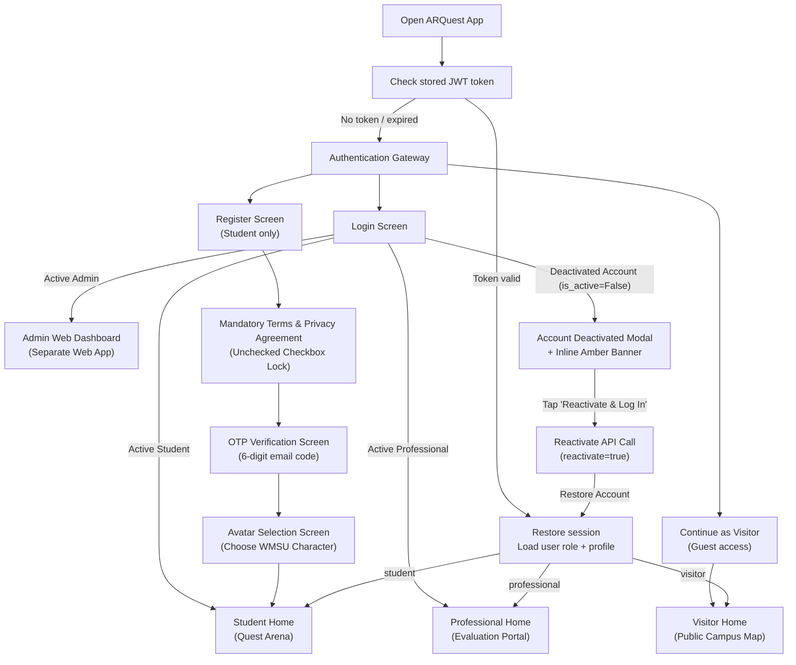
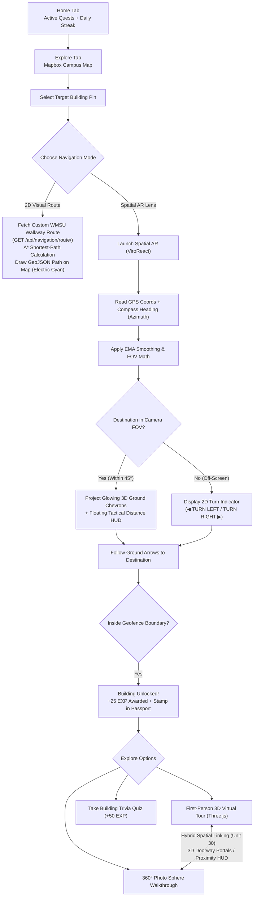
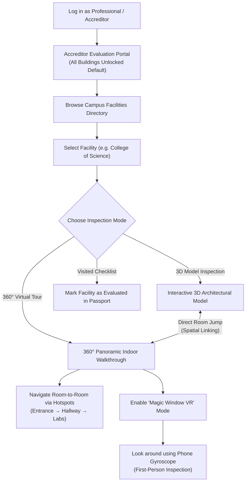
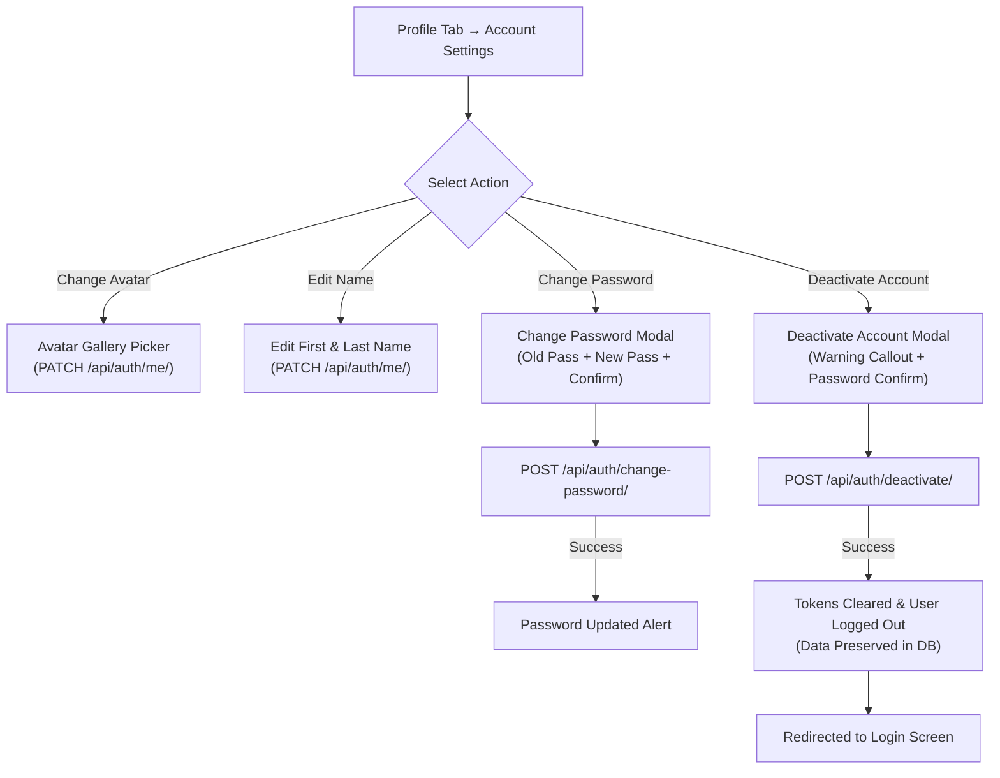
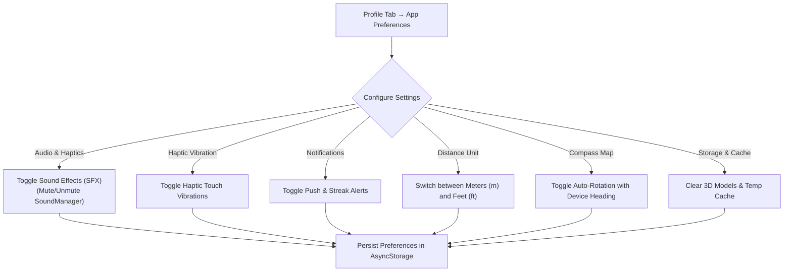
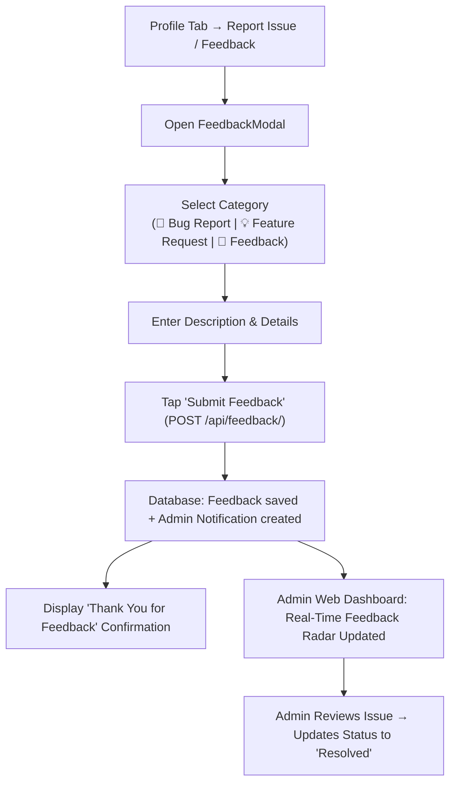
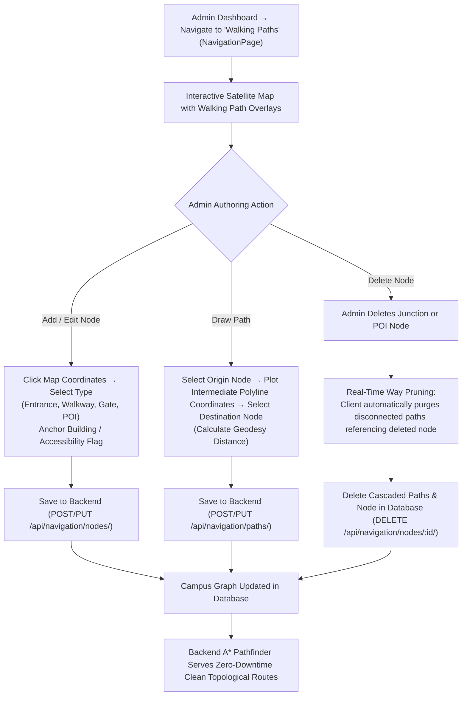

# ARQuest — User Flow

> Last updated: 2026-09-01
> Covers all four user roles: Student, Professional (Accreditor), Admin, and Visitor.

---

## Flow 1 — App Entry, Legal Onboarding & Role Routing

---

## Flow 2 — Student: Exploration & Native Spatial AR Navigation

---

## Flow 3 — Professional (Accreditor): Remote Evaluation & VR

---

## Flow 4 — Account Settings, Password Management & Deactivation

---

## Flow 5 — App Preferences & Audio Control

---

## Flow 6 — Mobile Feedback & Issue Reporting

---

## Flow 7 — Admin Walking Network Authoring & Disconnected Way Pruning

