# ARQuest — User Flow

> Last updated: 2026-06-20
> Covers all four user roles: Student, Professional (Accreditor), Admin, and Visitor.

---

## Flow 1 - App Entry and Role Routing

The first decision every user hits when opening the app.

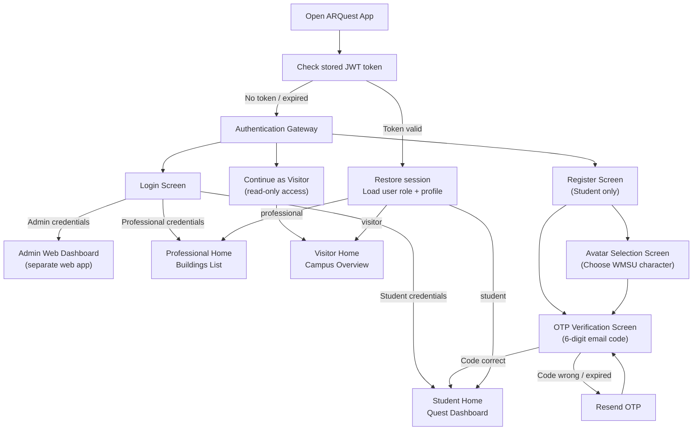

---

## Flow 2 - Student: Full Exploration Flow

The main journey for a student from opening the app to completing a quest.

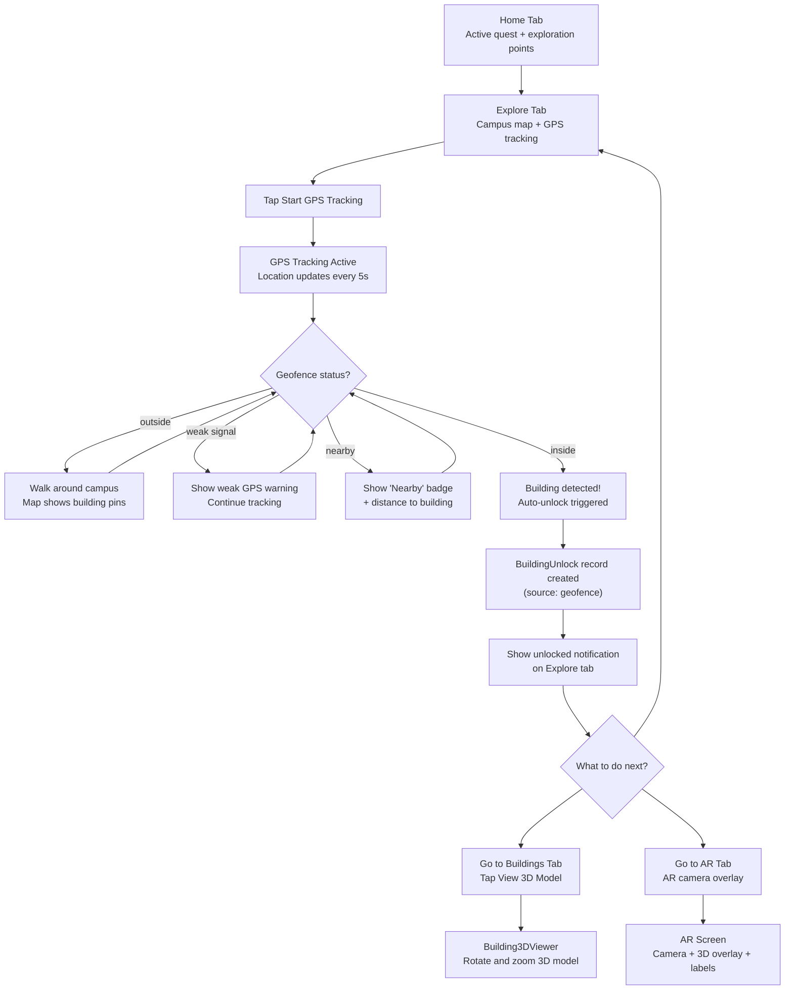

---

## Flow 3 - Student: AR Camera and Quest Completion

What happens inside the AR view when a student is physically inside a building zone.

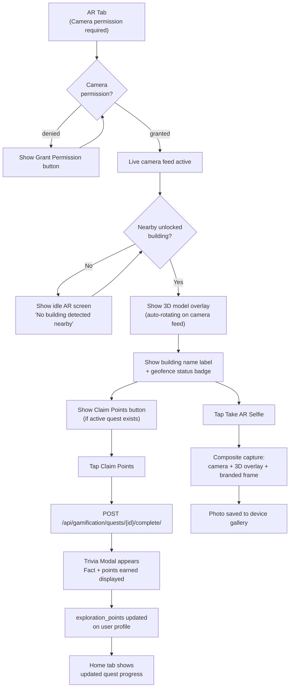

---

## Flow 4 - Student: 360 Degree Panorama Walkthrough

A student navigates a building's virtual walkthrough from the Buildings tab.

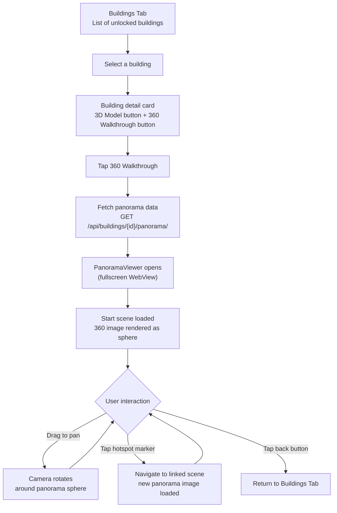

---

## Flow 5 - Student: Leaderboard and Rankings

How a student checks their standing and sees others' progress.

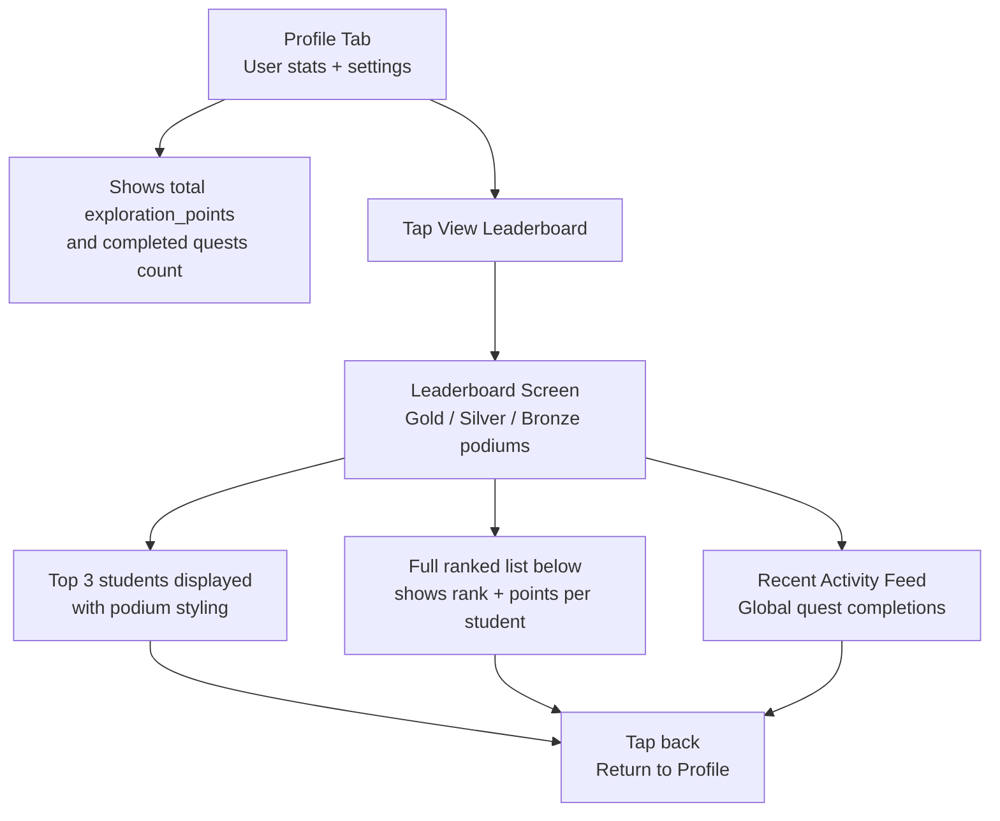

---

## Flow 6 - Professional: Building Access and Virtual Tour

Professionals bypass geofencing and access all buildings directly for evaluation.

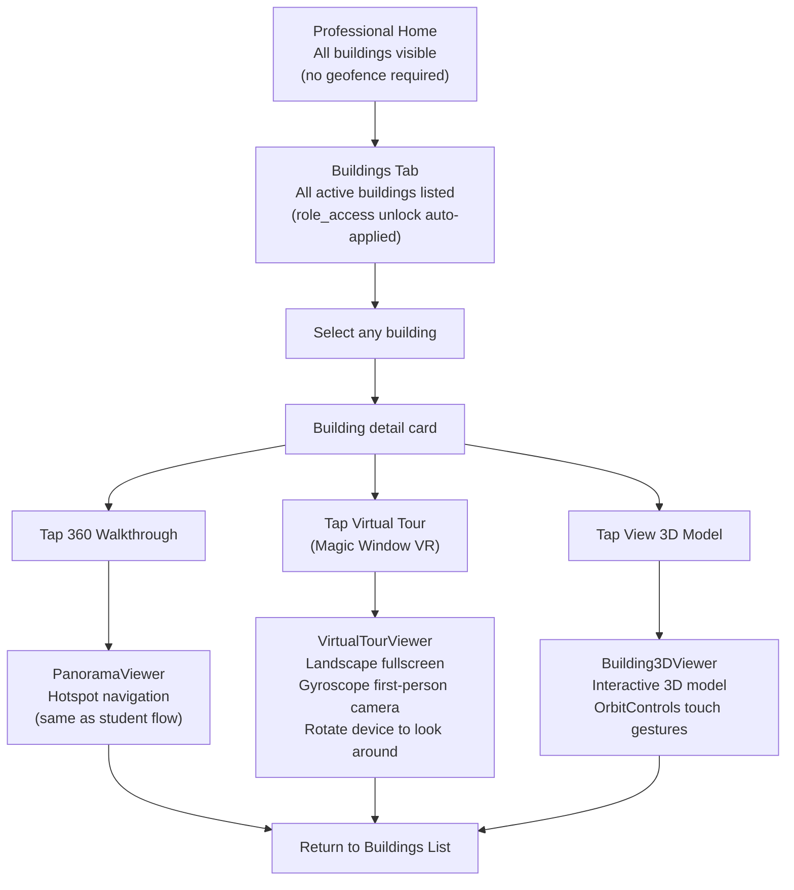

---

## Flow 7 - Visitor: Limited Campus Overview

Visitors have read-only access to published building information without any unlocking mechanism.

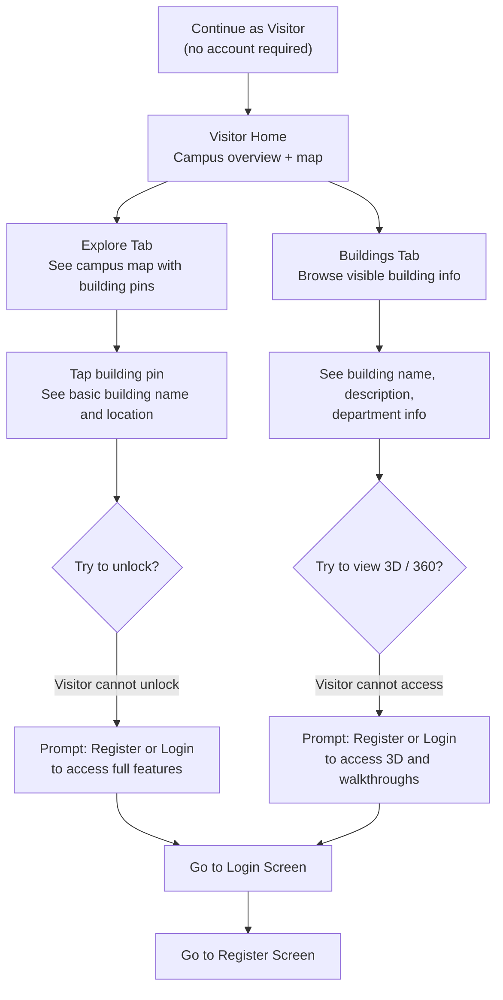

---

## Flow 8 - Admin: Building Creation and Publishing

The full admin workflow for creating a building from scratch to live on the mobile app.

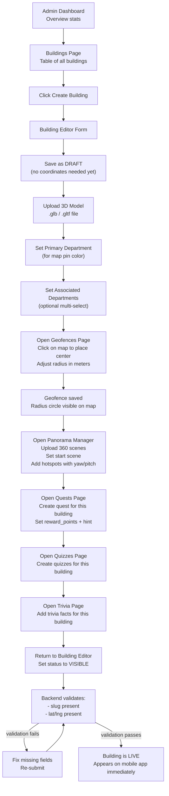

---

## Flow 9 - Admin: Managing Professionals

How an admin creates and manages professional (accreditor) accounts.

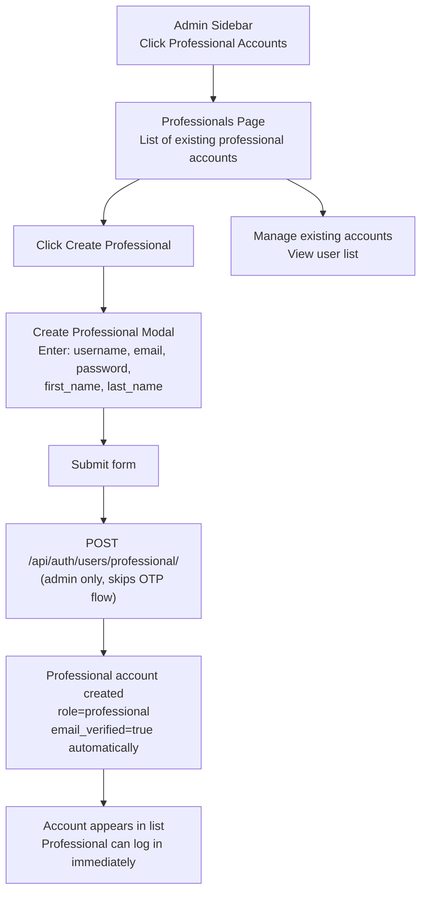

---

## Flow 10 - Admin: Archive and Restore Buildings

How admins safely remove and recover building content.

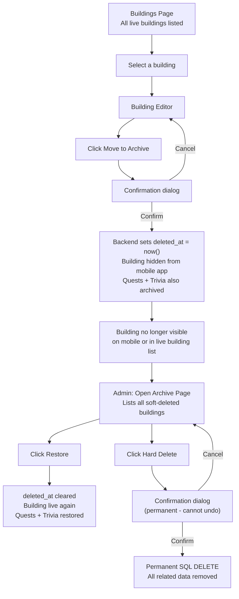

---

## Flow 11 - Admin: System Settings and Feature Toggles

How an admin controls global system behavior from the CMS settings page.

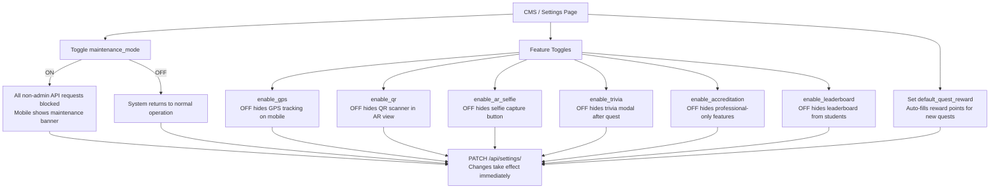

---

## Flow 12 - Admin: History & Logs

How an admin reviews system notifications and feedback logs.

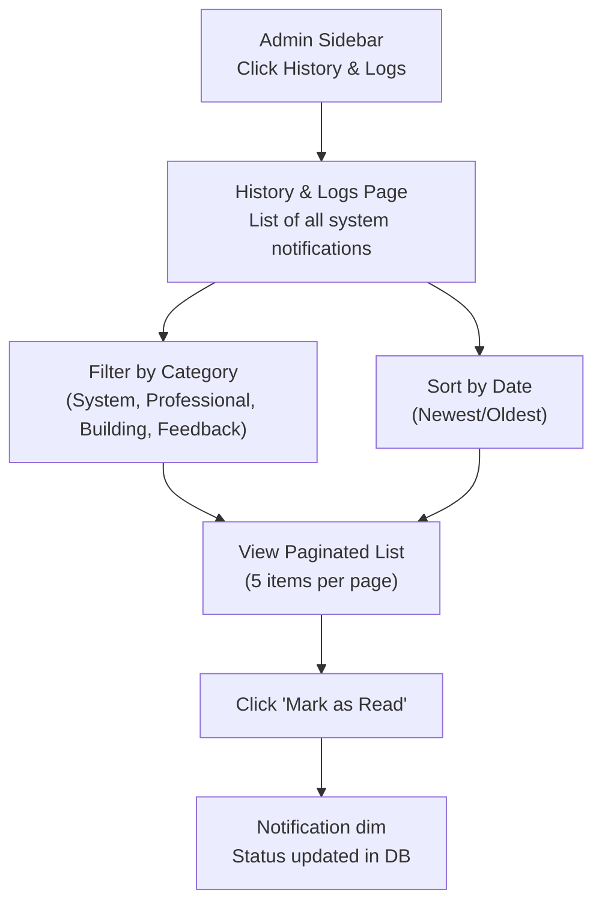

---

## Role Access Summary

| Feature | Student | Professional | Visitor | Admin |
|---|---|---|---|---|
| Register / Login | Yes | Admin-created | No account | Yes |
| GPS tracking | Yes | Yes | No | No |
| Geofence unlock | Yes | Auto (role) | No | No |
| QR unlock | Yes | Yes | No | No |
| View 3D model | Yes (unlocked only) | Yes (all) | No | Yes |
| 360 walkthrough | Yes (unlocked only) | Yes (all) | No | Yes |
| Magic Window VR tour | No | Yes | No | No |
| AR camera overlay | Yes | Yes | No | No |
| Quest completion | Yes | No | No | No |
| Trivia modal | Yes | No | No | No |
| Take quizzes | Yes | No | No | No |
| AR selfie | Yes | Yes | No | No |
| Leaderboard | Yes | No | No | View only |
| Browse buildings (info) | Yes | Yes | Yes (limited) | Yes |
| Create / edit buildings | No | No | No | Yes |
| Manage geofences | No | No | No | Yes |
| Upload 3D / panorama | No | No | No | Yes |
| Create quests / quizzes / trivia | No | No | No | Yes |
| Manage professionals | No | No | No | Yes |
| Archive / restore | No | No | No | Yes |
| System settings | No | No | No | Yes |
| History & Logs | No | No | No | Yes |

---

## Documentation

### Overview

The user flow diagrams in this document map out what each type of user can do inside ARQuest and the exact steps they go through to complete each action. Unlike the data-flow diagrams which show how the system processes requests internally, these diagrams focus on the user's perspective: what they see, what they tap, and where they end up. There are four user roles in the system: Student, Professional (Accreditor), Visitor, and Admin. Each role has a different scope of access and a different set of goals when using the application.

---

### Flow 1 - App Entry and Role Routing

Every user starts at the same point: opening the app. The system immediately checks whether a valid JWT token is stored in SecureStore. If a valid token exists, the user's session is restored and they are routed to the correct home screen based on their role. If no token exists or it has expired, the user lands on the authentication gateway.

From the gateway, students can log in or register a new account. Professionals log in using credentials created by an admin. Visitors skip authentication entirely and get read-only access to the campus overview. This entry point is the primary role-routing junction in the entire application.

---

### Flow 2 - Student: Full Exploration Flow

The student exploration flow is built around physical presence on campus. A student opens the Explore tab and starts GPS tracking. The app polls location updates every five seconds and checks them against all campus geofences. The map shows building pins so the student knows where to walk.

When the student enters a geofence, the app automatically sends a building unlock request to the backend. The student does not need to tap anything for the unlock to happen. After the unlock is confirmed, the student can choose between opening the 3D viewer, going to the AR camera view, or continuing to explore the map.

---

### Flow 3 - Student: AR Camera and Quest Completion

The AR camera view is where the gamification and exploration features converge. When a student opens the AR tab and is physically inside a building's geofence, the screen shows the live camera feed with a 3D model of the building overlaid on top. A building name label and status badge appear in the overlay.

If the building has an active quest, a Claim Points button appears. Tapping it sends a quest completion request to the backend. The backend returns the reward points and a random trivia fact for that building. The trivia modal shows both pieces of information before dismissing. The student's exploration points total is updated on the profile tab.

The branded selfie feature is also available from this screen. The app captures a composite image of the camera feed, the 3D overlay, and a branded frame showing the building name and date, then saves it to the device gallery.

---

### Flow 4 - Student: 360 Degree Panorama Walkthrough

Students with an unlocked building can access its 360 degree walkthrough from the Buildings tab. The app fetches the full panorama graph for that building in one request, then opens the PanoramaViewer in fullscreen. The viewer renders the start scene as a panoramic sphere and places hotspot markers at their configured yaw and pitch positions.

The student can drag to pan around the scene and tap hotspot markers to move to connected scenes. Each transition loads the new panorama image without any page reload. The student can exit the viewer at any point using the back button in the top corner.

---

### Flow 5 - Student: Leaderboard and Rankings

Students can check their exploration points and see how they rank against other students from the Profile tab. Tapping View Leaderboard opens the Leaderboard screen, which shows the top three students on a podium with gold, silver, and bronze styling. Below the podium is the full ranked list showing each student's rank number and total points. A recent activity feed shows global quest completions in real time.

---

### Flow 6 - Professional: Building Access and Virtual Tour

Professional accounts have access to all campus buildings regardless of physical location. When a professional logs in, the Buildings tab shows all active buildings with an automatic role-based unlock applied. The professional does not need GPS, does not need to be on campus, and does not go through the geofence detection flow.

For each building, the professional can open the 360 degree walkthrough, launch the Magic Window VR tour, or view the 3D model. The Magic Window VR tour is exclusive to professionals. It renders the building's 3D model in landscape fullscreen and uses the device gyroscope for first-person camera control, letting the professional look around the model by rotating their physical device. This mode is designed for remote accreditation review where the professional needs to inspect building layouts without visiting in person.

---

### Flow 7 - Visitor: Limited Campus Overview

Visitors enter the app without an account. They can see the campus map with building pins and browse basic building information including name, description, and department. They cannot unlock buildings, view 3D models, enter 360 walkthroughs, complete quests, or access the AR camera.

When a visitor tries to take an action that requires authentication, the app shows a prompt directing them to register or log in. This makes the visitor experience a natural funnel toward student registration rather than a dead end.

---

### Flow 8 - Admin: Building Creation and Publishing

The admin workflow for getting a building live on the mobile app is a multi-step process managed entirely through the web dashboard. The admin starts by creating a building record in DRAFT status, which has no coordinate or slug requirement. This allows incomplete records to be saved at any stage without triggering validation errors.

From there, the admin uploads a 3D model file, configures interactive 3D hotspots via the raycaster web editor, sets the primary and associated departments, configures the geofence on the interactive Mapbox map, uploads panorama scenes and hotspots in the Panorama Manager, creates quests, quizzes, and trivia facts for the building, and finally sets the status to VISIBLE. The backend validates that all required fields are present when the status changes to VISIBLE. Once it passes, the building appears on the mobile app immediately without any app update.

---

### Flow 9 - Admin: Managing Professionals

Professional accounts are not self-registered. An admin creates them through the Professionals page in the dashboard. The creation modal takes the user's basic information and submits it to a restricted endpoint that only admin tokens can reach. The resulting account is created with `role=professional` and `email_verified=true` set automatically, so the professional can log in immediately without going through the OTP email flow.

---

### Flow 10 - Admin: Archive and Restore Buildings

Deleting a building in ARQuest does not permanently remove it by default. The admin clicks Move to Archive on a building, which triggers a soft delete. The backend sets `deleted_at` on the building and cascades the same to its associated quests and trivia facts. The building disappears from the mobile app, the live building list, and all geofence validation immediately.

The Archive page shows all soft-deleted buildings. The admin can restore a building, which clears the `deleted_at` timestamps and brings the building and its content back to live status. If the admin is certain the content should be permanently removed, they can hard delete it from the Archive page. Hard delete is permanent and cannot be undone.

---

### Flow 11 - Admin: System Settings and Feature Toggles

The CMS / Settings page gives the admin direct control over which features are active across the entire application. Changes made here take effect immediately because the mobile app reads the settings from the backend on startup and the backend enforces them on every API request.

The most important toggle is `maintenance_mode`. Turning it on blocks all non-admin API requests and the mobile app shows a maintenance banner. This is used when the team needs to run a database migration or server update without disrupting users with error messages.

Individual feature flags let the admin disable subsystems without touching code. GPS tracking, QR scanning, AR selfie capture, trivia modals, professional accreditation features, and the leaderboard can all be turned off independently. The `default_quest_reward` field sets the default points value that auto-fills when a new quest is created in the dashboard.

---

### Flow 12 - Admin: History & Logs

The History & Logs page gives the admin oversight into what is happening within the system. The admin navigates to the page and can see a paginated list of notifications, grouped by badges like System, Professional, Building, and Feedback.

The admin can sort these notifications by date and filter them to find specific events. The admin can also mark unread notifications as read, providing a continuous workflow for acknowledging system activity.
