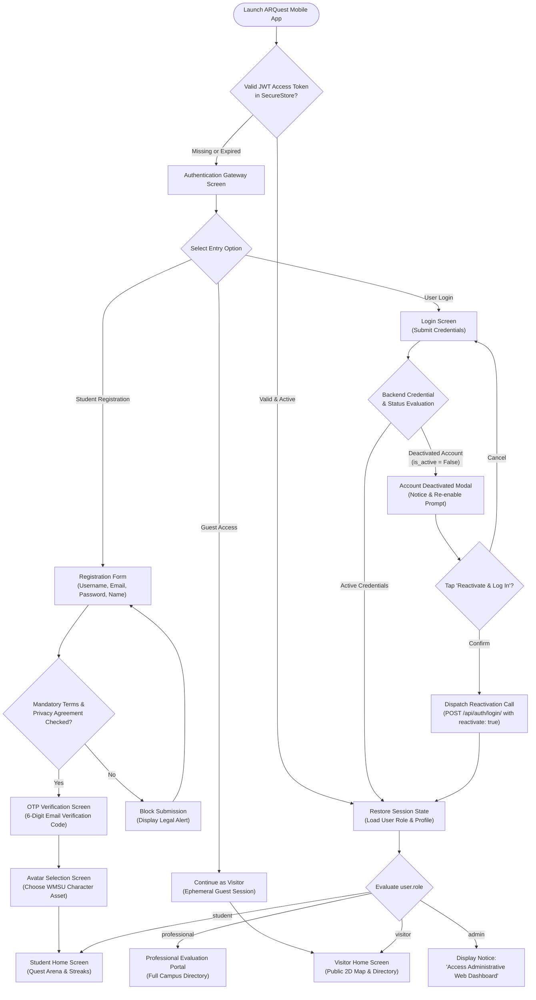
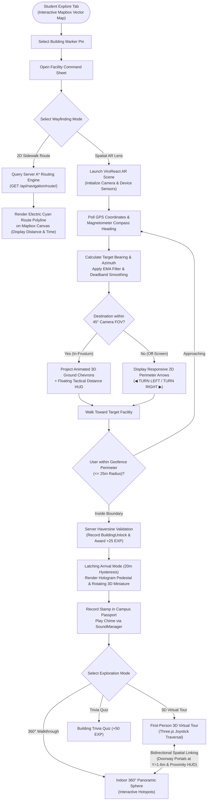
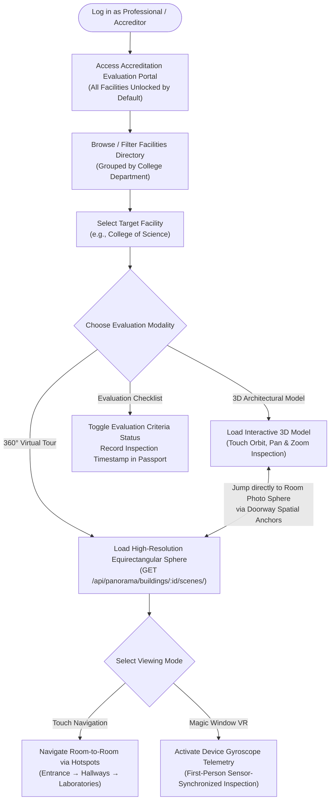
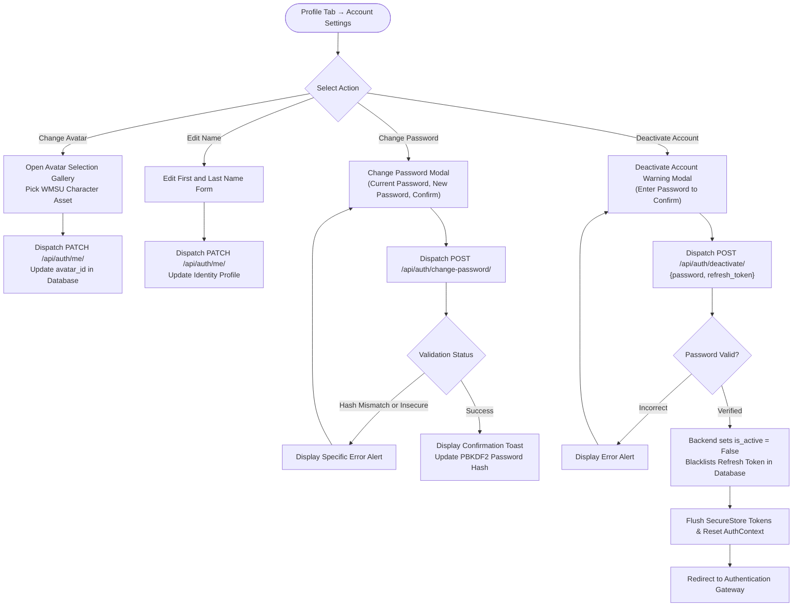
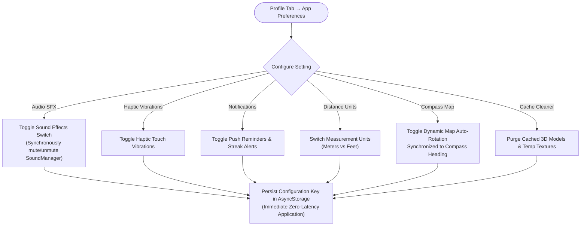
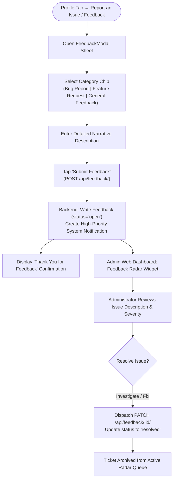
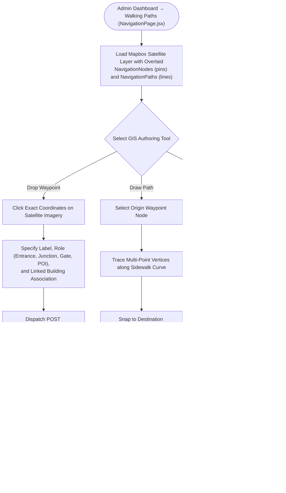

# ARQuest — User Flow & Activity Workflows

> **Research Paper Component:** Chapter 3 — System Design / User Interaction & Activity Workflows  
> **System:** ARQuest: A Sensor-Assisted Campus Exploration and Accreditation Support System  
> **Institution:** Western Mindanao State University (WMSU)

---

## 1. Flowchart 1: Application Entry, Legal Onboarding & Role Routing

This workflow governs application startup, cryptographic session validation, mandatory legal consent, self-service account restoration, and role-based landing screen dispatch.

```mermaid
flowchart TD
    START(["Launch ARQuest Mobile App"])
    CHECK_TOKEN{"Valid JWT Access Token<br/>in SecureStore?"}

    START --> CHECK_TOKEN

    CHECK_TOKEN -->|"Valid & Active"| RESTORE["Restore Session State<br/>(Load User Role & Profile)"]
    CHECK_TOKEN -->|"Missing or Expired"| GATEWAY["Authentication Gateway Screen"]

    GATEWAY --> CHOICE{"Select Entry Option"}
    CHOICE -->|"Student Registration"| REG_FORM["Registration Form<br/>(Username, Email, Password, Name)"]
    CHOICE -->|"User Login"| LOGIN_FORM["Login Screen<br/>(Submit Credentials)"]
    CHOICE -->|"Guest Access"| GUEST_ENTRY["Continue as Visitor<br/>(Ephemeral Guest Session)"]

    %% Registration Sub-flow
    REG_FORM --> LEGAL_CHECK{"Mandatory Terms &<br/>Privacy Agreement Checked?"}
    LEGAL_CHECK -->|"No"| REG_LOCK["Block Submission<br/>(Display Legal Alert)"]
    REG_LOCK --> REG_FORM
    LEGAL_CHECK -->|"Yes"| OTP_SCREEN["OTP Verification Screen<br/>(6-Digit Email Verification Code)"]
    OTP_SCREEN --> AVATAR_SELECT["Avatar Selection Screen<br/>(Choose WMSU Character Asset)"]
    AVATAR_SELECT --> STUDENT_HOME["Student Home Screen<br/>(Quest Arena & Streaks)"]

    %% Login Sub-flow & Reactivation
    LOGIN_FORM --> AUTH_CHECK{"Backend Credential<br/>& Status Evaluation"}
    AUTH_CHECK -->|"Active Credentials"| RESTORE
    AUTH_CHECK -->|"Deactivated Account<br/>(is_active = False)"| DEACT_MODAL["Account Deactivated Modal<br/>(Notice & Re-enable Prompt)"]
    
    DEACT_MODAL --> REACT_CHOICE{"Tap 'Reactivate & Log In'?"}
    REACT_CHOICE -->|"Cancel"| LOGIN_FORM
    REACT_CHOICE -->|"Confirm"| REACT_API["Dispatch Reactivation Call<br/>(POST /api/auth/login/ with reactivate: true)"]
    REACT_API --> RESTORE

    %% Guest Routing
    GUEST_ENTRY --> VISITOR_HOME["Visitor Home Screen<br/>(Public 2D Map & Directory)"]

    %% Role Dispatching
    RESTORE --> ROLE_BRANCH{"Evaluate user.role"}
    ROLE_BRANCH -->|"student"| STUDENT_HOME
    ROLE_BRANCH -->|"professional"| PROF_HOME["Professional Evaluation Portal<br/>(Full Campus Directory)"]
    ROLE_BRANCH -->|"visitor"| VISITOR_HOME
    ROLE_BRANCH -->|"admin"| ADMIN_PROMPT["Display Notice:<br/>'Access Administrative Web Dashboard'"]
```

---

## 2. Flowchart 2: Student Campus Exploration & Native Spatial AR Navigation

This workflow models the core student navigation loop: selecting campus facilities, choosing between 2D walkway routes or 3D Spatial AR, arriving at geofence perimeters, and engaging with multi-modal facility content.

```mermaid
flowchart TD
    START_NAV(["Student Explore Tab<br/>(Interactive Mapbox Vector Map)"])
    SELECT_PIN["Select Building Marker Pin"]
    MODAL_OPEN["Open Facility Command Sheet"]

    START_NAV --> SELECT_PIN --> MODAL_OPEN

    MODAL_OPEN --> MODE_CHOICE{"Select Wayfinding Mode"}

    %% 2D Route Branch
    MODE_CHOICE -->|"2D Sidewalk Route"| REQ_ASTAR["Query Server A* Routing Engine<br/>(GET /api/navigation/route/)"]
    REQ_ASTAR --> DRAW_MAP["Render Electric Cyan Route Polyline<br/>on Mapbox Canvas (Display Distance & Time)"]

    %% 3D Spatial AR Branch
    MODE_CHOICE -->|"Spatial AR Lens"| LAUNCH_AR["Launch ViroReact AR Scene<br/>(Initialize Camera & Device Sensors)"]
    LAUNCH_AR --> READ_SENSORS["Poll GPS Coordinates &<br/>Magnetometer Compass Heading"]
    READ_SENSORS --> EMA_MATH["Calculate Target Bearing & Azimuth<br/>Apply EMA Filter & Deadband Smoothing"]

    EMA_MATH --> FOV_CHECK{"Destination within<br/>45° Camera FOV?"}
    FOV_CHECK -->|"Yes (In-Frustum)"| DRAW_CHEVRONS["Project Animated 3D Ground Chevrons<br/>+ Floating Tactical Distance HUD"]
    FOV_CHECK -->|"No (Off-Screen)"| DRAW_HUD_ARROWS["Display Responsive 2D Perimeter Arrows<br/>(◀ TURN LEFT / TURN RIGHT ▶)"]

    DRAW_CHEVRONS --> APPROACH["Walk Toward Target Facility"]
    DRAW_HUD_ARROWS --> APPROACH

    %% Arrival & Unlock
    APPROACH --> GEOFENCE_CHECK{"User within Geofence Perimeter<br/>(<= 25m Radius)?"}
    GEOFENCE_CHECK -->|"Approaching"| READ_SENSORS
    GEOFENCE_CHECK -->|"Inside Boundary"| UNLOCK_TRANSACTION["Server Haversine Validation<br/>(Record BuildingUnlock & Award +25 EXP)"]

    UNLOCK_TRANSACTION --> ARRIVAL_AR["Latching Arrival Mode (20m Hysteresis)<br/>Render Hologram Pedestal & Rotating 3D Miniature"]
    ARRIVAL_AR --> PASSPORT_STAMP["Record Stamp in Campus Passport<br/>Play Chime via SoundManager"]

    %% Multi-Modal Content
    PASSPORT_STAMP --> EXPLORE_CHOICE{"Select Exploration Mode"}
    EXPLORE_CHOICE -->|"3D Virtual Tour"| THREE_3D["First-Person 3D Virtual Tour<br/>(Three.js Joystick Traversal)"]
    EXPLORE_CHOICE -->|"360° Walkthrough"| THREE_PANO["Indoor 360° Panoramic Sphere<br/>(Interactive Hotspots)"]
    EXPLORE_CHOICE -->|"Trivia Quiz"| QUIZ_MODAL["Building Trivia Quiz (+50 EXP)"]

    THREE_3D <-->|"Bidirectional Spatial Linking<br/>(Doorway Portals at Y=1.6m & Proximity HUD)"| THREE_PANO
```

---

## 3. Flowchart 3: Professional (Accreditor) Remote Facility Evaluation

This workflow outlines the institutional inspection pipeline designed for accreditors and academic evaluators, featuring unrestricted building access, 3D architectural inspection, and gyroscope-assisted Magic Window VR tours.

```mermaid
flowchart TD
    START_PROF(["Log in as Professional / Accreditor"])
    PORTAL["Access Accreditation Evaluation Portal<br/>(All Facilities Unlocked by Default)"]

    START_PROF --> PORTAL

    PORTAL --> FILTER_DEPT["Browse / Filter Facilities Directory<br/>(Grouped by College Department)"]
    FILTER_DEPT --> SELECT_BLDG["Select Target Facility<br/>(e.g., College of Science)"]

    SELECT_BLDG --> INSPECT_CHOICE{"Choose Evaluation Modality"}

    %% 360 Walkthrough Branch
    INSPECT_CHOICE -->|"360° Virtual Tour"| LOAD_PANO["Load High-Resolution Equirectangular Sphere<br/>(GET /api/panorama/buildings/:id/scenes/)"]
    LOAD_PANO --> PANO_INTERACT{"Select Viewing Mode"}
    PANO_INTERACT -->|"Touch Navigation"| HOTSPOT_NAV["Navigate Room-to-Room via Hotspots<br/>(Entrance → Hallways → Laboratories)"]
    PANO_INTERACT -->|"Magic Window VR"| ENABLE_GYRO["Activate Device Gyroscope Telemetry<br/>(First-Person Sensor-Synchronized Inspection)"]

    %% 3D Model Branch
    INSPECT_CHOICE -->|"3D Architectural Model"| LOAD_3D["Load Interactive 3D Model<br/>(Touch Orbit, Pan & Zoom Inspection)"]
    LOAD_3D <-->|"Jump directly to Room Photo Sphere<br/>via Doorway Spatial Anchors"| LOAD_PANO

    %% Checklist Branch
    INSPECT_CHOICE -->|"Evaluation Checklist"| MARK_CHECKLIST["Toggle Evaluation Criteria Status<br/>Record Inspection Timestamp in Passport"]
```

---

## 4. Flowchart 4: Account Settings, Password Governance & Deactivation

This workflow models profile customization, cryptographic password updates, and self-service account deactivation with preserved user historical records.

```mermaid
flowchart TD
    START_SETTINGS(["Profile Tab → Account Settings"])
    MENU{"Select Action"}

    START_SETTINGS --> MENU

    MENU -->|"Change Avatar"| AVATAR_MODAL["Open Avatar Selection Gallery<br/>Pick WMSU Character Asset"]
    AVATAR_MODAL --> PATCH_AVATAR["Dispatch PATCH /api/auth/me/<br/>Update avatar_id in Database"]

    MENU -->|"Edit Name"| NAME_MODAL["Edit First and Last Name Form"]
    NAME_MODAL --> PATCH_NAME["Dispatch PATCH /api/auth/me/<br/>Update Identity Profile"]

    MENU -->|"Change Password"| PWD_FORM["Change Password Modal<br/>(Current Password, New Password, Confirm)"]
    PWD_FORM --> PWD_SUBMIT["Dispatch POST /api/auth/change-password/"]
    PWD_SUBMIT --> PWD_CHECK{"Validation Status"}
    PWD_CHECK -->|"Hash Mismatch or Insecure"| PWD_ERR["Display Specific Error Alert"]
    PWD_ERR --> PWD_FORM
    PWD_CHECK -->|"Success"| PWD_OK["Display Confirmation Toast<br/>Update PBKDF2 Password Hash"]

    MENU -->|"Deactivate Account"| DEACT_MODAL["Deactivate Account Warning Modal<br/>(Enter Password to Confirm)"]
    DEACT_MODAL --> DEACT_SUBMIT["Dispatch POST /api/auth/deactivate/<br/>{password, refresh_token}"]
    DEACT_SUBMIT --> DEACT_CHECK{"Password Valid?"}
    DEACT_CHECK -->|"Incorrect"| DEACT_ERR["Display Error Alert"]
    DEACT_ERR --> DEACT_MODAL
    DEACT_CHECK -->|"Verified"| DEACT_EXEC["Backend sets is_active = False<br/>Blacklists Refresh Token in Database"]
    DEACT_EXEC --> FLUSH_STORAGE["Flush SecureStore Tokens & Reset AuthContext"]
    FLUSH_STORAGE --> REDIRECT_GATE["Redirect to Authentication Gateway"]
```

---

## 5. Flowchart 5: Local Client Preferences & Audio Management

This workflow illustrates local client configuration, haptic and audio feedback toggles, and offline persistence via hardware storage.

```mermaid
flowchart TD
    START_PREF(["Profile Tab → App Preferences"])
    PREF_MENU{"Configure Setting"}

    START_PREF --> PREF_MENU

    PREF_MENU -->|"Audio SFX"| SFX_TOGGLE["Toggle Sound Effects Switch<br/>(Synchronously mute/unmute SoundManager)"]
    PREF_MENU -->|"Haptic Vibrations"| HAP_TOGGLE["Toggle Haptic Touch Vibrations"]
    PREF_MENU -->|"Notifications"| NOTIF_TOGGLE["Toggle Push Reminders & Streak Alerts"]
    PREF_MENU -->|"Distance Units"| UNIT_TOGGLE["Switch Measurement Units<br/>(Meters vs Feet)"]
    PREF_MENU -->|"Compass Map"| COMPASS_TOGGLE["Toggle Dynamic Map Auto-Rotation<br/>Synchronized to Compass Heading"]
    PREF_MENU -->|"Cache Cleaner"| CACHE_CLEAR["Purge Cached 3D Models & Temp Textures"]

    SFX_TOGGLE --> ASYNC_WRITE["Persist Configuration Key in AsyncStorage<br/>(Immediate Zero-Latency Application)"]
    HAP_TOGGLE --> ASYNC_WRITE
    NOTIF_TOGGLE --> ASYNC_WRITE
    UNIT_TOGGLE --> ASYNC_WRITE
    COMPASS_TOGGLE --> ASYNC_WRITE
    CACHE_CLEAR --> ASYNC_WRITE
```

---

## 6. Flowchart 6: In-App User Feedback & Administrative Resolution

This workflow details end-user issue reporting and administrative triage via the dashboard Feedback Radar.

```mermaid
flowchart TD
    USER_START(["Profile Tab → Report an Issue / Feedback"])
    OPEN_MODAL["Open FeedbackModal Sheet"]
    USER_START --> OPEN_MODAL

    OPEN_MODAL --> SELECT_TYPE["Select Category Chip<br/>(Bug Report | Feature Request | General Feedback)"]
    SELECT_TYPE --> INPUT_TEXT["Enter Detailed Narrative Description"]
    INPUT_TEXT --> SUBMIT_FDBK["Tap 'Submit Feedback'<br/>(POST /api/feedback/)"]

    SUBMIT_FDBK --> DB_INSERT["Backend: Write Feedback (status='open')<br/>Create High-Priority System Notification"]
    DB_INSERT --> TOAST["Display 'Thank You for Feedback' Confirmation"]

    %% Administrative Triage
    DB_INSERT --> ADMIN_POLL["Admin Web Dashboard: Feedback Radar Widget"]
    ADMIN_POLL --> ADMIN_REVIEW["Administrator Reviews Issue Description & Severity"]
    ADMIN_REVIEW --> ADMIN_ACTION{"Resolve Issue?"}
    ADMIN_ACTION -->|"Investigate / Fix"| PATCH_RESOLVE["Dispatch PATCH /api/feedback/:id/<br/>Update status to 'resolved'"]
    PATCH_RESOLVE --> DB_UPDATE["Ticket Archived from Active Radar Queue"]
```

---

## 7. Flowchart 7: Admin Walking Network Authoring & Real-Time Pruning

This workflow models GIS authoring of campus navigation topology on satellite imagery and real-time self-healing pruning of disconnected ways.

```mermaid
flowchart TD
    ADMIN_START(["Admin Dashboard → Walking Paths (NavigationPage.jsx)"])
    LOAD_MAP["Load Mapbox Satellite Layer with Overlaid<br/>NavigationNodes (pins) and NavigationPaths (lines)"]
    ADMIN_START --> LOAD_MAP

    LOAD_MAP --> ACTION_CHOICE{"Select GIS Authoring Tool"}

    %% Waypoint Creation
    ACTION_CHOICE -->|"Drop Waypoint"| CLICK_TERRAIN["Click Exact Coordinates on Satellite Imagery"]
    CLICK_TERRAIN --> MODAL_NODE["Specify Label, Role (Entrance, Junction, Gate, POI),<br/>and Linked Building Association"]
    MODAL_NODE --> SAVE_NODE["Dispatch POST /api/navigation/nodes/"]
    SAVE_NODE --> INSERT_NODE["Persist NavigationNode in Database<br/>Render Bullseye Waypoint Marker on Map"]

    %% Pathway Drawing
    ACTION_CHOICE -->|"Draw Path"| CLICK_ORIGIN["Select Origin Waypoint Node"]
    CLICK_ORIGIN --> TRACE_POLY["Trace Multi-Point Vertices along Sidewalk Curve"]
    TRACE_POLY --> SNAP_DEST["Snap to Destination Waypoint Node"]
    SNAP_DEST --> SAVE_PATH["Dispatch POST /api/navigation/paths/<br/>(Backend Computes Geodesic Distance in Meters)"]
    SAVE_PATH --> INSERT_PATH["Persist NavigationPath in Database<br/>Render Connected Cyan Pathway Polyline"]

    %% Node Deletion & Cascade Pruning
    ACTION_CHOICE -->|"Delete Node"| SELECT_DEL["Select Obsolete Waypoint Node & Confirm Deletion"]
    SELECT_DEL --> DISPATCH_DEL["Dispatch DELETE /api/navigation/nodes/:id/"]
    DISPATCH_DEL --> CASCADE_DB["PostgreSQL: Foreign Key CASCADE<br/>Purges all Dependent NavigationPath Segments"]
    CASCADE_DB --> PRUNE_CLIENT["Synchronous Client-Side Pruning:<br/>Filter deleted node from nodes state AND<br/>instantly remove all attached paths from map canvas"]
    PRUNE_CLIENT --> TOPOLOGY_READY["Campus Graph Topological Integrity Preserved<br/>Server-Side A* Router Serves Zero-Downtime Clean Routes"]
```

---

## 8. Narrative Summary of User Interaction Architecture

The interaction workflows of ARQuest enforce **Role-Driven Interface Separation**:
1. **Student Workflows (Flows 1 & 2)** emphasize motivation through gamification, location-aware AR overlays, and progressive milestone discovery (Campus Passport).
2. **Professional Workflows (Flow 3)** eliminate exploratory constraints and gamification friction, optimizing the interface for rapid, multi-modal architectural and panoramic inspection.
3. **Governance & Utility Workflows (Flows 4, 5, & 6)** ensure enterprise-grade user lifecycle management—enabling seamless self-service restoration of deactivated accounts and direct feedback channels.
4. **Administrative GIS Workflows (Flow 7)** equip university operators with full visual control over campus pedestrian connectivity, ensuring graph integrity through automated pruning without requiring manual database intervention.
